# Mission scripting for C-RAM CIWS Simulator

Every game mode in C-RAM CIWS Simulator is a JavaScript file. The built-in
quick-play modes, the missions you build in the in-game Mission Editor, and the
missions shared on mod.io all run through the same pipeline. That pipeline is
open to you: a mission script can place units on any map, set the rules for
winning, react to physics and frame events, draw its own HUD, and reach the
whole Unity engine.

<!-- screenshot: home-gallery.jpg -->
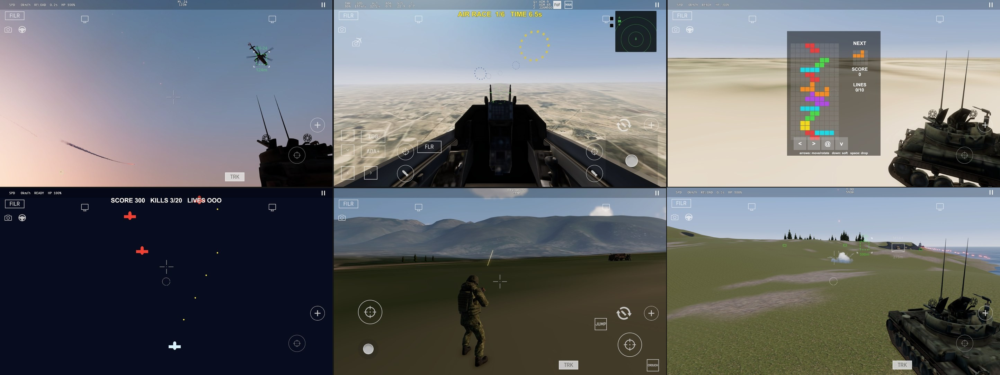

*Scenario missions, wave defense, an air race, Tetris and a top-down shooter, all written as mission scripts.*

## Contents

**Start here**
- [A complete mission in 25 lines](#a-complete-mission-in-25-lines)
- [Your first mission](#your-first-mission)

**Examples**
- [Examples](#examples)
- [Built-in Ground vs Air](#built-in-ground-vs-air)
- [Common.js helpers](#commonjs-helpers)
- [Ace Combat (1 vs 4)](#ace-combat-1-vs-4)
- [Gulf War 1991](#gulf-war-1991)
- [Combined Arms](#combined-arms)
- [Ground battle](#ground-battle)
- [Cinematic intro](#cinematic-intro)
- [Drone Defense](#drone-defense)
- [Infantry 20 vs 20](#infantry-20-vs-20)
- [Play as infantry](#play-as-infantry)
- [FPV Operator](#fpv-operator)
- [Air Race](#air-race)
- [Tetris](#tetris)
- [Flappy Jet](#flappy-jet)
- [C-RAM Golf](#c-ram-golf)
- [1942 Shooter](#1942-shooter)

**Cookbook**
- [Recipes](#recipes)

**API reference**
- [mission.* API](#mission-api)
- [JsEventRelay: events and the game loop](#jseventrelay-events-and-the-game-loop)
- [Engine access: the CS.* global](#engine-access-the-cs-global)
- [Drawing UI](#drawing-ui)
- [Cutscenes: CinematicManager](#cutscenes-cinematicmanager)

**Data reference**
- [Maps and spawn points](#maps-and-spawn-points)
- [Time and weather](#time-and-weather)
- [Objects and spawners](#objects-and-spawners)
- [Enums and constants](#enums-and-constants)
- [Quick reference](#quick-reference)

**Under the hood**
- [How a mission runs](#how-a-mission-runs)
- [Loading, saving, sharing](#loading-saving-sharing)
- [Pitfalls and FAQ](#pitfalls-and-faq)

## What a mission script can do

| Layer | Provided by | What it gives you |
|-------|-------------|-------------------|
| `mission.*` | the game | Map, time, weather, player type, win condition, spawning units and objects, spawn points, terrain queries. See [mission.* API](#mission-api). |
| `CS.JsEventRelay` | the game | Unity messages delivered to plain JS functions: trigger enter/exit, collisions, and a per-frame `onUpdate`. See [JsEventRelay](#jseventrelay-events-and-the-game-loop). |
| `CS.*` | PuerTS | The complete engine: create GameObjects, cameras, materials, UI, read input, control units directly. See [Engine access](#engine-access-the-cs-global). |

With those three layers you can build anything from a scripted dogfight to a
game that has nothing to do with air defense. The [examples](#examples)
include an air race, Tetris, Flappy Jet, C-RAM Golf and a 1942-style shooter,
each written entirely as a mission script.

## A complete mission in 25 lines

```js
// MissionFormatVersion: 1
// Description: Dawn raid on Kuwait. Four jets and a gunship against your C-RAM.

const TEAM_GROUND = 1;   // you and your allies
const TEAM_AIR = 2;      // the raid

async function Init() {
    mission.setPlayerType("Ground", TEAM_GROUND);
    mission.setWinCondition("EliminateAllEnemies");
    mission.setTime(5, 40);
    mission.setWeather("Clear Sky");
    await mission.loadMap("Kuwait");
}

function SpawnUnits() {
    const raid = ["mig-29", "mig-29", "su-25", "su-25"];
    const sp = mission.getAirSpawnPoint();
    const rotY = mission.getAirSpawnPointRotY();
    for (let i = 0; i < raid.length; i++) {
        const x = sp.x + i * 120;
        const z = sp.z + i * 800;
        const y = Math.max(sp.y, mission.getTerrainHeight(x, z) + 250);
        mission.spawnUnit(raid[i], x, y, z, rotY, TEAM_AIR);
    }
    const heli = mission.getHeliSpawnPoint();
    mission.spawnUnit("mi-24", heli.x, heli.y, heli.z, mission.getHeliSpawnPointRotY(), TEAM_AIR);
}
```

Copy that into the game and you have a playable mission. The
[Getting started](#your-first-mission) page walks through loading it.

## Where to go next

If you are new, read in this order:

- [Your first mission](#your-first-mission): write, load, play, iterate.
- [Examples](#examples): fifteen complete missions, from scenarios to Tetris. Pick one close to what you want and change it.
- [Recipes](#recipes): timers, waves, polling units, teleports, input, overlay cameras.
- [mission.* API](#mission-api) and [Engine access](#engine-access-the-cs-global): what the two layers give you.
- [How a mission runs](#how-a-mission-runs) and [Pitfalls and FAQ](#pitfalls-and-faq): the parse pass, the gameplay pass, and the mistakes everyone makes once.

> [!NOTE]
> **Status of this documentation**
>
> The API described here is the one shipped in the current game build and is
> taken directly from the engine source. Screenshots were captured in the
> editor at 1920x1080 on the Ultra preset (2026-09-17).
> Missions declare `// MissionFormatVersion: 1`; a newer game may bump that
> number when the format changes, and older game builds will mark such
> missions as requiring an update instead of loading them.


---

## Your first mission

### Write it

A mission is one JavaScript file with two functions: `Init()` picks the map
and the rules, `SpawnUnits()` places the units.

```js
// MissionFormatVersion: 1
// Description: Three MiG-29s against your C-RAM on Mostar.

async function Init() {
    mission.setPlayerType("Ground", 1);          // you sit in a ground unit, team 1
    mission.setWinCondition("EliminateAllEnemies");
    mission.setTime(14, 0);
    mission.setWeather("Cloudy 1");
    await mission.loadMap("Mostar");
}

function SpawnUnits() {
    const sp = mission.getAirSpawnPoint();
    const rotY = mission.getAirSpawnPointRotY();
    for (let i = 0; i < 3; i++) {
        mission.spawnUnit("mig-29", sp.x + i * 150, sp.y, sp.z + i * 900, rotY, 2);
    }
}
```

Keep the two header comments (`MissionFormatVersion` first, `Description` is
the blurb in the mission list), name a real map in `loadMap`, and write
`setPlayerType` / `setWinCondition` with literal arguments. Map names and unit
IDs are in the [data reference](#maps-and-spawn-points).

### Load it

Copy the whole file, open the Mission Editor from the mode select screen, then
**Load** and **Paste from clipboard**. The editor shows every `spawnUnit` as a
placed unit. **Save** it under a name and it is in the custom mission list,
ready to play.

<!-- screenshot: editor-load-paste.jpg -->
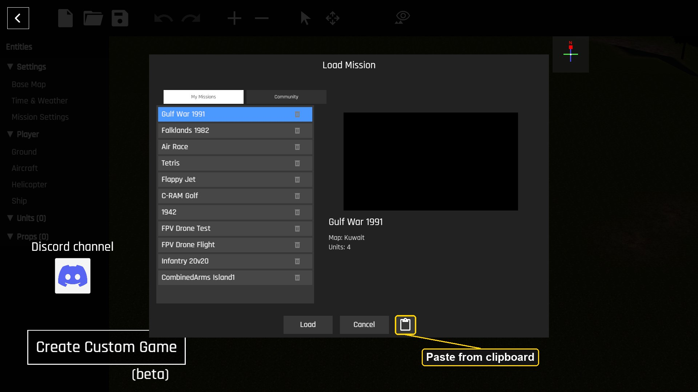

*The Load popup. The marked button loads a script from the clipboard.*

### Next

- [Examples](#examples) are complete, working missions to copy from.
- [Recipes](#recipes) cover timers, waves, input and the other things every mission needs.
- [mission.* API](#mission-api) lists every call with its parameters.
- [How a mission runs](#how-a-mission-runs) and [Pitfalls and FAQ](#pitfalls-and-faq) when something behaves oddly.


---

## Examples

Complete missions, each a single file you can paste into the game. They are
the same scripts the game's developers use to exercise the scripting system,
so they are kept working with every release. Every page has the full source;
the raw `.js` files are in [`src/`](examples/src/).

### Built-in

The scripts the game itself ships with. Start here to see what a real mode looks like.

- [Built-in Ground vs Air](#built-in-ground-vs-air) — the real quick-play script
- [Common.js helpers](#commonjs-helpers) — the prelude every mission gets

### Scenarios

Historical and fictional battles built from `spawnUnit` calls.

- [Ace Combat (1 vs 4)](#ace-combat-1-vs-4) — dogfight AI mode
- [Gulf War 1991](#gulf-war-1991) — dawn raid on Kuwait, the classic scenario shape
- [Combined Arms](#combined-arms) — armour, SAMs, jets, gunships and warships on one island
- [Ground battle](#ground-battle) — tank column, weighted unit pools
- [Cinematic intro](#cinematic-intro) — cutscene before combat

### Infantry and drones

- [Drone Defense](#drone-defense) — waves, hold position, polling units
- [Infantry 20 vs 20](#infantry-20-vs-20) — line formations
- [Play as infantry](#play-as-infantry) — the smallest infantry mission
- [FPV Operator](#fpv-operator) — fly kamikaze drones

### Mini-games

Proof that a mission does not have to be about air defence.

- [Air Race](#air-race) — ring checkpoints, time trial, JsEventRelay + HUD
- [Tetris](#tetris) — a full game on a UGUI board, keyboard and touch
- [Flappy Jet](#flappy-jet) — take over the player's jet
- [C-RAM Golf](#c-ram-golf) — physics ball, power meter, camera aiming
- [1942 Shooter](#1942-shooter) — overlay camera, JS-only collisions


---

## Built-in Ground vs Air

The script behind the game's own Ground vs Air quick-play mode, unchanged.

<!-- screenshot: example-classic-ground2air.jpg -->
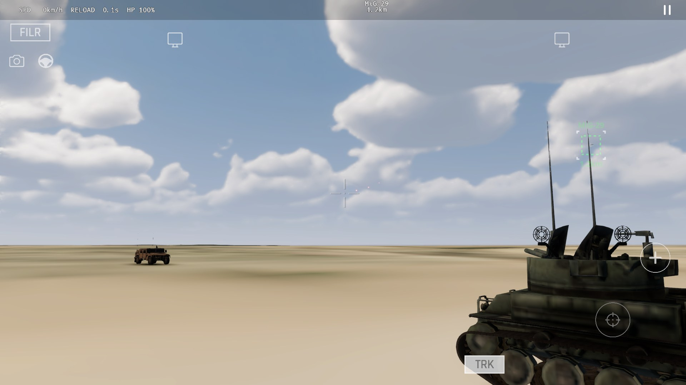

- Random map, weighted time and weather from Common.js.
- Two spawn modes (jets plus helicopters, or drones) chosen with `playCount()` and `wasLastDrone()`.
- Enemies staggered in depth, allies spread around the player, `LOADOUT.AIR_TO_GROUND` for the raid.

Everything the built-in modes do is available to your missions.

### Source

Raw file: [`src/Classic_Ground2Air_Easy.js`](examples/src/Classic_Ground2Air_Easy.js). Copy the whole file into the game (Mission Editor, Load, Paste from clipboard).

<details>
<summary>Full source</summary>

<!-- source: examples/src/Classic_Ground2Air_Easy.js -->
```js
// ============================================
// Mission Script v0.1
// ============================================
//
// --- Callbacks ---
// async function Init()      : Setup map, time, weather, playerType (required)
// function SpawnUnits()       : Spawn enemies and allies (required)
// function SpawnBoss()        : Boss variant spawn (optional)
// function OnUnitDead(unit)   : Called when any unit dies (optional)
// function OnGameEnd(won)     : Called on game end (optional)
//
// --- Init APIs ---
// await mission.loadMap("mapName")             : "random" for random map
// mission.setTime(hour, minute)                : hour 0-23, minute 0-59
// mission.setWeather("weatherName")
// mission.setPlayerType("type", team)          : Ground, Aircraft, Helicopter, Ship | team: 1=Ground 2=Air 3=Red 4=Blue
// mission.setWinCondition("type")              : EliminateAllEnemies, SurviveForTime, KillTargets, ReachDestination
// mission.setPlayerStartPosition("type", x, y, z, rotY)
//
// --- Spawn APIs ---
// mission.spawnUnit(unitId, x, y, z, rotY, team, isPlayer, hpMultiplier, speedMultiplier, soldierWeapon, loadout)
// loadout = LOADOUT.AIR_TO_AIR / AIR_TO_GROUND / MULTIROLE (Common.js); omitted = MULTIROLE = factory armament
// mission.spawnObject(objectId, x, y, z, rotY, jsonParams?)
//
// --- Goal APIs ---
// mission.eliminateAll()      : Win by killing all enemies
// mission.survive(seconds)    : Win after surviving N seconds
// mission.manual()            : Manual control, then call win() or fail()
// mission.win() / mission.fail()
//
// --- Info APIs ---
// mission.enemyCount()        : Alive enemy count
// mission.allyCount()         : Alive ally count
// mission.listUnits()         : JSON array of unit IDs
// mission.listMaps()          : JSON array of map names
// mission.listWeather()       : JSON array of weather names
//
// --- Spawn Points ---
// mission.getAirSpawnPoint()           → {x, y, z}
// mission.getAirSpawnPointRotY()       → float
// mission.getGroundSpawnPoint(index)   → {x, y, z}
// mission.getGroundSpawnPointRotY(index) → float
// mission.getGroundSpawnPointCount()   → int
// mission.getHeliSpawnPoint()          → {x, y, z}
// mission.getHeliSpawnPointRotY()      → float
// mission.getNavalSpawnPoint(index)    → {x, y, z}
// mission.getNavalSpawnPointRotY(index) → float
// mission.getNavalSpawnPointCount()    → int
//
// --- Teams ---
// 0=None, 1=Ground(+Navy), 2=Air(+Heli), 3=Red, 4=Blue
//
// --- Weather ---
// Clear Sky, Cloudy 0, Cloudy 1, Cloudy 2, Cloudy 3, Foggy, Rain, Storm, Snow
//
// --- Units ---
// Aircraft : f-4-phantom, f-14-tomcat, f-15, f-16, fa-18-hornet,
//            mig-29, mirage-2000, su-25, su-27, su-30mkk, su-57,
//            a-10, j-8, j-20-chengdu
// Heli     : ah-64, ah-1, mi-24, mi-28, ka-52
// Ground   : 9k332-tor, shilka, hemtt, apc-2, humvee
// Drone    : shahed-136, fpv-drone
// Naval    : frigate, destroyer-class
// ============================================

// Classic_Ground2Air Mission Script
// Player: Ground unit, Enemies: Air/Heli/Drone, Allies: Ground units

// ============================================
// Unit Pools
// ============================================
const airEnemyPool = ["f-4-phantom", "f-15", "mig-29", "a-10", "mirage-2000", "su-57", "su-25"];
const heliPool = ["ah-64", "ah-1", "mi-24", "ka-52"];
const dronePool = ["shahed-136", "fpv-drone"];
// 9k332-tor weight kept low — its long-range SAM dominates engagements
const groundAllyPool = [
    { name: "9k332-tor", weight: 1 },
    { name: "shilka",    weight: 10 },
];
const groundAllyEasyPool = ["apc-2", "humvee"];

// ============================================
// Team Constants
// ============================================
const TEAM_GROUND = 1;
const TEAM_AIR = 2;

// ============================================
// Init
// ============================================
async function Init() {
    mission.setRevealAllEnemies(true);
    mission.setPlayerType("Ground", 1);
    await mission.loadMap("random");
    const t = weightedPick(timePool);
    mission.setTime(t.time[0], t.time[1]);
    const w = weightedPick(weatherPool);
    mission.setWeather(w.name);
}

// ============================================
// SpawnUnits - Classic_Ground2Air
// Mode 1: Jets 3-4 + Heli 0-2
// Mode 2: Drones 5-7
// Both: Ground allies 2-3
// ============================================
function SpawnUnits() {
    const groundCount = mission.getGroundSpawnPointCount();
    // First 10 rounds: jets+heli only (no Shahed drones).
    // After that: 30% chance of drones, but never two drone rounds in a row.
    let droneMode = false;
    if (mission.playCount() >= 10 && !mission.wasLastDrone()) {
        droneMode = Math.random() < 0.3;
    }
    mission.setLastDrone(droneMode);
    const mode = droneMode ? 1 : 0;
    let droneCountForMode = 0;

    if (mode === 0) {
        // Mode 1: Jets + Heli
        const airCount = randomRange(3, 5);
        const heliCount = randomRange(0, 3);

        const airSp = mission.getAirSpawnPoint();
        const airRotY = mission.getAirSpawnPointRotY();
        for (let i = 0; i < airCount; i++) {
            const unit = randomPick(airEnemyPool);
            const x = airSp.x + (i * 100) - (airCount * 50);
            const z = airSp.z + (i * 1000); // 1km staggered depth
            const terrainY = mission.getTerrainHeight(x, z);
            const y = Math.max(airSp.y, terrainY + 200);
            mission.spawnUnit(unit, x, y, z, airRotY, TEAM_AIR, false, 1.0, 1.0, "", LOADOUT.AIR_TO_GROUND);
        }

        if (heliCount > 0) {
            const heliSp = mission.getHeliSpawnPoint();
            const heliRotY = mission.getHeliSpawnPointRotY();
            for (let i = 0; i < heliCount; i++) {
                const heli = randomPick(heliPool);
                const x = heliSp.x + (i * 100) - (heliCount * 50);
                const z = heliSp.z + (i * 500); // 500m staggered depth
                const terrainY = mission.getTerrainHeight(x, z);
                const y = Math.max(heliSp.y, terrainY + 100);
                mission.spawnUnit(heli, x, y, z, heliRotY, TEAM_AIR, false, 1.0, 1.0, "", LOADOUT.AIR_TO_GROUND);
            }
        }
    } else {
        // Mode 2: Drones
        const droneCount = randomRange(5, 8);
        droneCountForMode = droneCount;

        const airSp = mission.getAirSpawnPoint();
        const airRotY = mission.getAirSpawnPointRotY();
        const dronePlayerSp = mission.getPlayerGroundStartPosition();
        // Direction from player toward the air spawn point — FPV drones come in
        // from the same side as the Shaheds, just much closer.
        let dirX = airSp.x - dronePlayerSp.x;
        let dirZ = airSp.z - dronePlayerSp.z;
        const dirLen = Math.sqrt(dirX * dirX + dirZ * dirZ);
        dirX /= dirLen;
        dirZ /= dirLen;
        let fpvIndex = 0;
        for (let i = 0; i < droneCount; i++) {
            const unit = randomPick(dronePool);
            if (unit === "fpv-drone") {
                // Quadcopter FPV drone is slow — spawn 700m+ out instead of at the
                // far air spawn point so it reaches the battle in time.
                const spawnDist = 700 + fpvIndex * 150;
                fpvIndex++;
                const x = dronePlayerSp.x + dirX * spawnDist + randomRange(-60, 61);
                const z = dronePlayerSp.z + dirZ * spawnDist + randomRange(-60, 61);
                const terrainY = mission.getTerrainHeight(x, z);
                const y = terrainY + 100 + randomRange(0, 41);
                const rotY = Math.atan2(dronePlayerSp.x - x, dronePlayerSp.z - z) * 180 / Math.PI;
                mission.spawnUnit(unit, x, y, z, rotY, TEAM_AIR, false, 1.0, 1.0, "", LOADOUT.AIR_TO_GROUND);
                continue;
            }
            const x = airSp.x + randomRange(-50, 51);
            const z = airSp.z + (i * 500); // 500m staggered depth for sequential arrival
            // Clear terrain: use max(airSp.y, terrainHeight + 200) to avoid mountain collisions
            const terrainY = mission.getTerrainHeight(x, z);
            const y = Math.max(airSp.y, terrainY + 200);
            mission.spawnUnit(unit, x, y, z, airRotY, TEAM_AIR, false, 1.0, 1.0, "", LOADOUT.AIR_TO_GROUND);
        }
    }

    // Combat ally (0-1) at spawn point
    const combatAllyCount = randomRange(0, 2);
    const groundIndices = shuffleIndices(groundCount);
    for (let i = 0; i < combatAllyCount && i < groundIndices.length; i++) {
        const unit = weightedPick(groundAllyPool).name;
        const idx = groundIndices[i];
        const sp = mission.getGroundSpawnPoint(idx);
        const spRotY = mission.getGroundSpawnPointRotY(idx);
        mission.spawnUnit(unit, sp.x, sp.y, sp.z, spRotY, TEAM_GROUND, false, 1.0);
    }

    // Non-combat allies near player, spread around within 20m.
    // In drone mode: always spawn more easy allies than drones so Shaheds have
    // plenty of soft targets to split up on.
    let easyAllyCount = randomRange(2, 4);
    if (droneCountForMode > 0) {
        easyAllyCount = droneCountForMode + randomRange(1, 3);
    }
    const playerSp = mission.getPlayerGroundStartPosition();
    const playerRotY = mission.getPlayerGroundStartRotY();
    const angleSlots = Math.max(8, easyAllyCount);
    const angles = shuffleIndices(angleSlots);
    for (let i = 0; i < easyAllyCount; i++) {
        const unit = randomPick(groundAllyEasyPool);
        const angle = (angles[i] / angleSlots) * Math.PI * 2;
        const dist = 40 + randomRange(0, 21); // 40-60m
        const x = playerSp.x + Math.cos(angle) * dist;
        const z = playerSp.z + Math.sin(angle) * dist;
        const y = mission.getTerrainHeight(x, z);
        mission.spawnUnit(unit, x, y, z, playerRotY, TEAM_GROUND, false, 1.0);
    }
}
```
<!-- /source -->

</details>


---

## Common.js helpers

The game prepends this file ([`src/Common.js`](examples/src/Common.js)) to every mission before it runs. Everything here
is a global in your script.

| Name | Description |
|------|-------------|
| `LOADOUT.AIR_TO_AIR`, `LOADOUT.AIR_TO_GROUND`, `LOADOUT.MULTIROLE` | Values for the `loadout` argument of `spawnUnit` |
| `randomRange(min, maxExclusive)` | Integer in `[min, maxExclusive)` |
| `randomPick(array)` | One element at random |
| `shuffleIndices(count)` | The numbers `0..count-1` in random order |
| `weightedPick(options)` | One of `[{ weight: n, ... }]`, weighted |
| `timePool` | Weighted times of day used by the built-in modes |
| `weatherPool` | Weighted weather presets used by the built-in modes |

<details>
<summary>Full source</summary>

<!-- source: examples/src/Common.js -->
```js
// ============================================
// Common Mission Utilities
// ============================================

// Weapon loadout slots for mission.spawnUnit's loadout argument
// (values mirror the C# LoadoutRole enum)
const LOADOUT = {
    AIR_TO_AIR: 1,
    AIR_TO_GROUND: 2,
    MULTIROLE: 3,
};

function randomRange(min, maxExclusive) {
    return Math.floor(Math.random() * (maxExclusive - min)) + min;
}

function randomPick(array) {
    return array[Math.floor(Math.random() * array.length)];
}

function shuffleIndices(count) {
    const indices = [];
    for (let i = 0; i < count; i++) { indices.push(i); }
    for (let i = indices.length - 1; i > 0; i--) {
        const j = Math.floor(Math.random() * (i + 1));
        const temp = indices[i];
        indices[i] = indices[j];
        indices[j] = temp;
    }
    return indices;
}

function weightedPick(options) {
    let total = 0;
    for (const opt of options) { total += opt.weight; }
    let r = Math.random() * total;
    for (const opt of options) {
        r -= opt.weight;
        if (r <= 0) { return opt; }
    }
    return options[options.length - 1];
}

const timePool = [
    { time: [5, 0],   weight: 2 },
    { time: [6, 0],   weight: 2 },
    { time: [9, 0],   weight: 15 },
    { time: [13, 0],  weight: 15 },
    { time: [16, 0],  weight: 15 },
    { time: [18, 0],  weight: 2 },
    { time: [19, 0],  weight: 2 },
    { time: [21, 0],  weight: 2 },
    { time: [0, 0],   weight: 1 },
];

const weatherPool = [
    { name: "Clear Sky",  weight: 2 },
    { name: "Cloudy 0",   weight: 25 },
    { name: "Cloudy 1",   weight: 20 },
    { name: "Cloudy 2",   weight: 15 },
    { name: "Cloudy 3",   weight: 8 },
    { name: "Foggy",      weight: 2 },
    { name: "Rain",       weight: 2 },
    { name: "Storm",      weight: 2 },
    { name: "Snow",       weight: 2 },
];
```
<!-- /source -->

</details>

---

## Ace Combat (1 vs 4)

A head-on merge over Mostar: you against four F-15s forced into dogfight mode.

<!-- screenshot: example-ace-combat.jpg -->
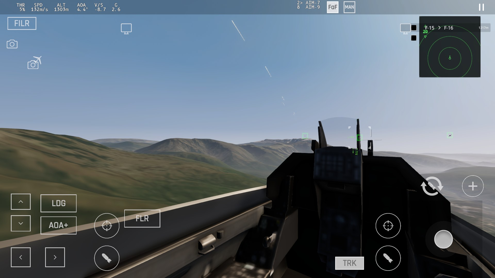

- Explicit enemy coordinates chosen so both sides start pointed at each other.
- Iterates `CS.Stage.Instance.airUnits` and switches every AI fighter to `CombatMode.Dogfight`.
- Skips the player by comparing transform roots.

Aircraft player on Blue, enemies on Red, `EliminateAllEnemies`.

### Source

Raw file: [`src/AceCombat.js`](examples/src/AceCombat.js). Copy the whole file into the game (Mission Editor, Load, Paste from clipboard).

<details>
<summary>Full source</summary>

<!-- source: examples/src/AceCombat.js -->
```js
// MissionFormatVersion: 1
// Description: 1 vs 4 dogfight over Mostar — shoot down all four F-15 Eagles.
// ============================================
// ACE COMBAT — 1 vs 4 dogfight over Mostar
// Player: your equipped jet (Blue team).
// Enemy: 4x F-15 Eagle (Red team), forced into Dogfight so they
//        pursue the player instead of the default ground-attack AI.
// Win: shoot down all four F-15s.
// ============================================

const TEAM_BLUE = 4; // player
const TEAM_RED = 3;  // enemies

async function Init() {
    mission.setPlayerType("Aircraft", TEAM_BLUE);
    mission.setWinCondition("EliminateAllEnemies");
    mission.setTime(14, 0);
    mission.setWeather("Clear Sky");
    await mission.loadMap("Mostar");
}

function SpawnUnits() {
    // Explicit enemy placement — head-on merge with the player.
    // The player spawns at ~(123, 1365, 6516) facing -Z. The default air spawn
    // point faces -Z too, so the enemy flight would start with its back to the
    // player and stall trying to whip around 180deg. Instead we hand-place the
    // four F-15s ahead of the player (lower Z) facing +Z (rotY 0), so both
    // sides begin pointed at each other. Altitude is held at 1350m — above the
    // ~1235m ridge line in this corridor, just under the player for a slight
    // height advantage.
    const enemies = [
        { x: -600, y: 1350, z: 4000, rotY: 0 },
        { x: -200, y: 1350, z: 4150, rotY: 0 },
        { x:  200, y: 1350, z: 4150, rotY: 0 },
        { x:  600, y: 1350, z: 4000, rotY: 0 },
    ];
    for (let i = 0; i < enemies.length; i++) {
        const e = enemies[i];
        mission.spawnUnit("f-15", e.x, e.y, e.z, e.rotY, TEAM_RED, false, 1.0, 1.0);
    }

    // The rest only makes sense during real gameplay.
    if (!mission.isGameplay) return;

    // Enemy air units default to SmartCAS (ground attack) and would ignore the
    // player's jet. Force every AI fighter into Dogfight so they engage the
    // player. Target acquisition is automatic by opposing team (Red vs Blue).
    const $t = puer.$typeof;
    let playerUnit = null;
    if (CS.Player.instance) playerUnit = CS.Player.instance.GetUnit();

    const airUnits = CS.Stage.Instance.airUnits;
    for (let i = 0; i < airUnits.Count; i++) {
        const u = airUnits.get_Item(i);
        if (!u) continue;
        if (playerUnit && u.transform.root.GetInstanceID() === playerUnit.transform.root.GetInstanceID()) continue;
        const ai = u.transform.GetComponent($t(CS.FlightAIFighter));
        if (ai) {
            ai.combatMode = CS.CombatMode.Dogfight;
            ai.state = CS.FighterState.DogfightEngage;
        }
    }
}
```
<!-- /source -->

</details>


---

## Gulf War 1991

Coalition C-RAM crew at dawn in Kuwait against a staggered Iraqi raid with a Mi-24 coming in low.

<!-- screenshot: example-gulf-war.jpg -->
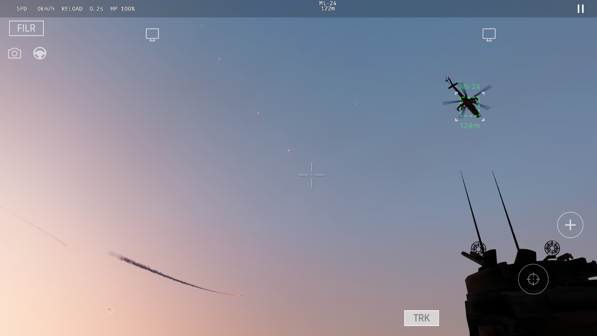

- The classic scenario shape: enemies staggered in depth along the air spawn heading, terrain-clamped altitude.
- A helicopter through the heli corridor.
- Allied camp spawned around the player's start.

Ground player, `EliminateAllEnemies`. A good template for historical scenarios.

### Source

Raw file: [`src/GulfWar_DesertStorm.js`](examples/src/GulfWar_DesertStorm.js). Copy the whole file into the game (Mission Editor, Load, Paste from clipboard).

<details>
<summary>Full source</summary>

<!-- source: examples/src/GulfWar_DesertStorm.js -->
```js
// ============================================
// Gulf War 1991 — Operation Desert Storm
// Player: Coalition C-RAM crew defending a desert camp in Kuwait.
// Enemy: Iraqi air force dawn raid — MiG-29 escorts, Mirage strike
//        jets, Su-25 attackers and a Mi-24 gunship.
// ============================================

const TEAM_GROUND = 1;
const TEAM_AIR = 2;

async function Init() {
    mission.setPlayerType("Ground", TEAM_GROUND);
    mission.setWinCondition("EliminateAllEnemies");
    mission.setTime(5, 40);
    mission.setWeather("Clear Sky");
    await mission.loadMap("Kuwait");
}

function SpawnUnits() {
    // Iraqi raid package, staggered in depth so they arrive in sequence
    const raid = ["mig-29", "mig-29", "mirage-2000", "mirage-2000", "su-25", "su-25"];
    const airSp = mission.getAirSpawnPoint();
    const airRotY = mission.getAirSpawnPointRotY();
    for (let i = 0; i < raid.length; i++) {
        const x = airSp.x + (i * 120) - (raid.length * 60);
        const z = airSp.z + (i * 800);
        const terrainY = mission.getTerrainHeight(x, z);
        const y = Math.max(airSp.y, terrainY + 250);
        mission.spawnUnit(raid[i], x, y, z, airRotY, TEAM_AIR, false, 1.0, 1.0);
    }

    // Mi-24 gunship comes in low through the heli corridor
    const heliSp = mission.getHeliSpawnPoint();
    const heliRotY = mission.getHeliSpawnPointRotY();
    const heliY = Math.max(heliSp.y, mission.getTerrainHeight(heliSp.x, heliSp.z) + 80);
    mission.spawnUnit("mi-24", heliSp.x, heliY, heliSp.z, heliRotY, TEAM_AIR, false, 1.0, 1.0);

    // Coalition camp around the player
    const playerSp = mission.getPlayerGroundStartPosition();
    const playerRotY = mission.getPlayerGroundStartRotY();

    // Shilka escort at the first ground spawn point
    if (mission.getGroundSpawnPointCount() > 0) {
        const sp = mission.getGroundSpawnPoint(0);
        mission.spawnUnit("shilka", sp.x, sp.y, sp.z, mission.getGroundSpawnPointRotY(0), TEAM_GROUND, false, 1.0, 1.0);
    }

    // Soft camp targets: supply truck + humvees spread around the player
    const camp = ["hemtt", "humvee", "humvee"];
    for (let i = 0; i < camp.length; i++) {
        const angle = (i / camp.length) * Math.PI * 2 + 0.6;
        const dist = 45 + i * 8;
        const x = playerSp.x + Math.cos(angle) * dist;
        const z = playerSp.z + Math.sin(angle) * dist;
        const y = mission.getTerrainHeight(x, z);
        mission.spawnUnit(camp[i], x, y, z, playerRotY, TEAM_GROUND, false, 1.0, 1.0);
    }
}
```
<!-- /source -->

</details>


---

## Combined Arms

Armour, SAMs, jets, gunships and warships on both sides of Island1, with explicit coordinates from a terrain scan.

<!-- screenshot: example-combined-arms.jpg -->
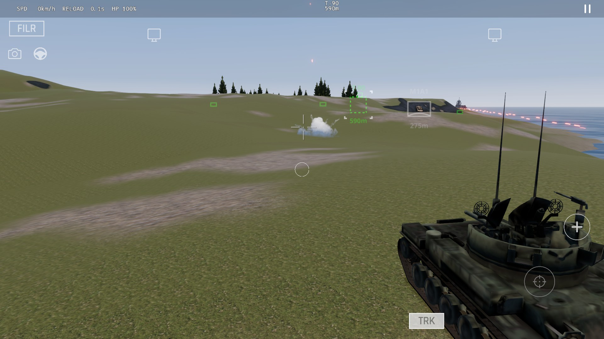

- `setPlayerStartPosition` in `Init` anchors the player's group.
- `setSpectateOnDeath(true)` so the battle continues after the player dies.
- An observer relay logs every unit's state and target every 10 s, a handy debugging pattern.
- Shows realistic engagement distances per unit class on a small island.

Blue (4) versus Red (3), `EliminateAllEnemies`.

### Source

Raw file: [`src/CombinedArms_Island1.js`](examples/src/CombinedArms_Island1.js). Copy the whole file into the game (Mission Editor, Load, Paste from clipboard).

<details>
<summary>Full source</summary>

<!-- source: examples/src/CombinedArms_Island1.js -->
```js
// MissionFormatVersion: 1
// Description: Unified battlefield prototype — armour, SAM, jets, gunships and warships clash on Island1.
// ============================================
// COMBINED ARMS — unified battlefield prototype v2
// BLUE (team 4, player): tank + Patriot + M1 Abrams + frigate + F-16 + AH-64
// RED  (team 3, enemy): 2x T-90A + Tunguska + destroyer + 2x MiG-29 + Mi-24
//
// v2 (2026-08-01): direct-coordinate spawn layout designed from a 50m terrain
// scan of Island1 (land spans x -1250..-350, z 1050..1850; water Y 310.33).
// Engagement distances per class (playtest round 2 findings):
//   ground vs ground  ~0.9 km  (island's physical maximum, SW tip vs E lobe)
//   fleet vs fleet    ~1.9 km  (just inside the 2 km surface gun gate)
//   each fleet to the enemy beach ~1.3-1.4 km (shore bombardment works)
//   jets ~5 km out, helis ~2.2-2.7 km behind their own fleets
// Player death no longer ends the round while allies fight on
// (mission.setSpectateOnDeath) — the camera follows the survivors.
// Embedded [UBF] observer logs the whole battle state every 10s.
// ============================================

const BLUE = 4; // player side
const RED = 3;  // enemy side

async function Init() {
    mission.setPlayerType("Ground", BLUE);
    mission.setWinCondition("EliminateAllEnemies");
    mission.setTime(11, 0);
    mission.setWeather("Clear Sky");
    await mission.loadMap("Island1"); // only map with both ground and sea
    // Player anchors the BLUE ground group on the southwest tip, facing the
    // RED ground group on the east lobe. Literal Y: Init runs in the parse pass,
    // before Island1 is loaded, so getTerrainHeight here would sample whatever
    // map is currently up (terrain at this spot is 323.4 m).
    mission.setPlayerStartPosition("Ground", -1150, 324, 1150, 47);
}

function SpawnUnits() {
    mission.setSpectateOnDeath(true);

    // --- BLUE ground group: southwest tip around the player ---
    mission.spawnUnit("m1-abrams", -1080, mission.getTerrainHeight(-1080, 1120), 1120, 47, BLUE, false, 1.0, 1.0);
    mission.spawnUnit("patriot", -1220, mission.getTerrainHeight(-1220, 1210), 1210, 47, BLUE, false, 1.0, 1.0);

    // --- RED ground group: east lobe, ~0.9 km from the BLUE tip ---
    mission.spawnUnit("t-90a", -550, mission.getTerrainHeight(-550, 1600), 1600, 227, RED, false, 1.0, 1.0);
    mission.spawnUnit("t-90a", -500, mission.getTerrainHeight(-500, 1500), 1500, 227, RED, false, 1.0, 1.0);
    mission.spawnUnit("2k22-tunguska", -650, mission.getTerrainHeight(-650, 1700), 1700, 227, RED, false, 1.0, 1.0);

    // --- NAVY: BLUE fleet southwest offshore, RED fleet east offshore.
    //     ~1.9 km apart so the ships can actually duel (2 km surface gun gate),
    //     and each fleet reaches the enemy beach for shore bombardment. ---
    const waterY = 310.33;
    mission.spawnUnit("frigate", -1700, waterY, 800, 90, BLUE, false, 1.0, 1.0);
    mission.spawnUnit("destroyer-class", 100, waterY, 1450, 270, RED, false, 1.0, 1.0);

    // --- RED air group: air spawn corridor ~5 km south, staggered in depth ---
    const air = mission.getAirSpawnPoint();
    const airRot = mission.getAirSpawnPointRotY();
    for (let i = 0; i < 2; i++) {
        mission.spawnUnit("mig-29", air.x + i * 200 - 100, Math.max(air.y, 600), air.z + i * 600, airRot, RED, false, 1.0, 1.0);
    }

    // --- Gunships: spawned behind their own fleets, outside immediate SAM reach ---
    mission.spawnUnit("mi-24", 1200, 350, 2400, 227, RED, false, 1.0, 1.0);
    mission.spawnUnit("ah-64", -2400, 350, 300, 47, BLUE, false, 1.0, 1.0);

    // --- BLUE air cover over the friendly fleet, facing the RED air corridor ---
    const toAirRot = Math.atan2(air.x - (-2200), air.z - 300) * 180 / Math.PI;
    mission.spawnUnit("f-16", -2200, 1250, 300, toAirRot, BLUE, false, 1.0, 1.0);

    // Everything below only makes sense during real gameplay.
    if (!mission.isGameplay) return;
    SetupObserver();
}

function OnUnitDead(unit) {
    if (!mission.isGameplay) return;
    try {
        CS.UnityEngine.Debug.Log("[UBF] DEAD t=" + Math.round(CS.UnityEngine.Time.time) + "s " + unit.name + " team=" + unit.team);
    } catch (e) { }
}

// ---------- [UBF] battle observer: full state snapshot every 10s ----------
function SetupObserver() {
    const $t = puer.$typeof;
    const root = new CS.UnityEngine.GameObject("UBF_Observer");
    const relay = root.AddComponent($t(CS.JsEventRelay));
    let nextSample = 5; // first snapshot 5s in
    let elapsed = 0;
    const aiCache = {}; // instanceId -> { air: UnitAI, ground: Ai }

    function GetAI(u) {
        const id = u.GetInstanceID();
        if (!(id in aiCache)) {
            const entry = { air: null, ground: null };
            entry.air = u.transform.GetComponentInChildren($t(CS.UnitAI));
            entry.ground = u.transform.GetComponentInChildren($t(CS.Ai));
            aiCache[id] = entry;
        }
        return aiCache[id];
    }

    relay.onUpdate = function (dt) {
        elapsed += dt;
        if (elapsed < nextSample) return;
        nextSample = elapsed + 10;
        try {
            const all = CS.Stage.Instance.allUnits;
            const fps = Math.round(1 / Math.max(dt, 0.0001));
            let lines = "[UBF] ===== t=" + Math.round(elapsed) + "s units=" + all.Count + " fps=" + fps + " =====";
            for (let i = 0; i < all.Count; i++) {
                const u = all.get_Item(i);
                if (!u) continue;
                const p = u.transform.position;
                let line = "[UBF] " + u.name + " team=" + u.team + " type=" + u.GetUnitType()
                    + " alive=" + u.isAlive + " hp=" + Math.round(u.CurrentHp * 10) / 10
                    + " pos=(" + Math.round(p.x) + "," + Math.round(p.y) + "," + Math.round(p.z) + ")";
                if (u.isAlive) {
                    const ai = GetAI(u);
                    let tgt = null;
                    let src = "";
                    if (ai.air && ai.air.closestAliveTarget) { tgt = ai.air.closestAliveTarget; src = "air"; }
                    else if (ai.ground && ai.ground.attackTarget) { tgt = ai.ground.attackTarget; src = "gnd"; }
                    if (tgt) {
                        const tp = tgt.transform.position;
                        const dx = tp.x - p.x, dy = tp.y - p.y, dz = tp.z - p.z;
                        const dist = Math.round(Math.sqrt(dx * dx + dy * dy + dz * dz));
                        line += " tgt[" + src + "]=" + tgt.name + " dist=" + dist;
                    } else {
                        line += " tgt=none";
                    }
                }
                lines += "\n" + line;
            }
            CS.UnityEngine.Debug.Log(lines);
        } catch (e) {
            CS.UnityEngine.Debug.Log("[UBF] observer error: " + e);
        }
    };
}
```
<!-- /source -->

</details>


---

## Ground battle

A tank column advances on your position. Weighted unit pools pick the enemy armour and your allies.

<!-- screenshot: example-ground-battle.jpg -->
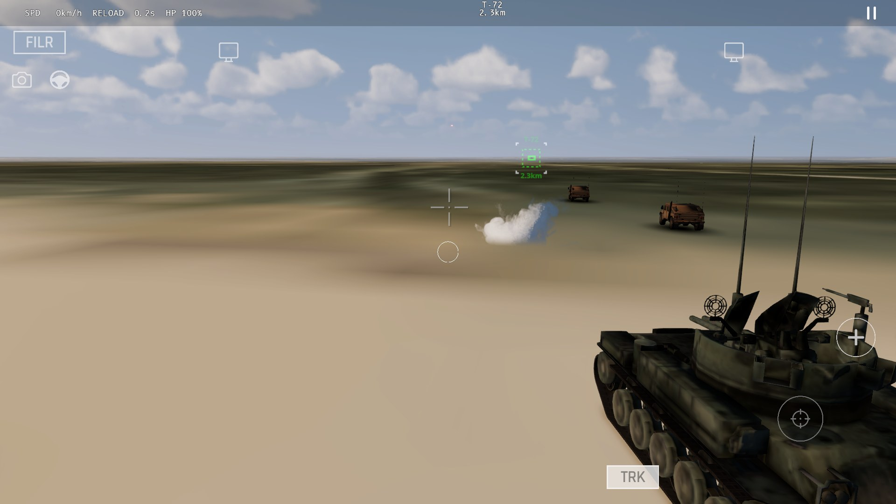

- `weightedPick` and `randomPick` from Common.js for variety between rounds.
- A `columnSlot` helper arranges units in a column behind a spawn point.
- The file starts with the reference comment the Mission Editor writes into saved missions.

Ground player, `EliminateAllEnemies`.

### Source

Raw file: [`src/Ground2GroundBattle.js`](examples/src/Ground2GroundBattle.js). Copy the whole file into the game (Mission Editor, Load, Paste from clipboard).

<details>
<summary>Full source</summary>

<!-- source: examples/src/Ground2GroundBattle.js -->
```js
// MissionFormatVersion: 1
// ============================================
// Mission Script v0.1
// ============================================
//
// --- Callbacks ---
// async function Init()      : Setup map, time, weather, playerType (required)
// function SpawnUnits()       : Spawn enemies and allies (required)
// function SpawnBoss()        : Boss variant spawn (optional)
// function OnUnitDead(unit)   : Called when any unit dies (optional)
// function OnGameEnd(won)     : Called on game end (optional)
//
// --- Init APIs ---
// await mission.loadMap("mapName")             : "random" for random map
// mission.setTime(hour, minute)                : hour 0-23, minute 0-59
// mission.setWeather("weatherName")
// mission.setPlayerType("type", team)          : Ground, Aircraft, Helicopter, Ship | team: 1=Ground 2=Air 3=Red 4=Blue
// mission.setWinCondition("type")              : EliminateAllEnemies, SurviveForTime, KillTargets, ReachDestination
// mission.setPlayerStartPosition("type", x, y, z, rotY)
//
// --- Spawn APIs ---
// mission.spawnUnit(unitId, x, y, z, rotY, team, isPlayer, hpMultiplier, speedMultiplier)
// mission.spawnObject(objectId, x, y, z, rotY, jsonParams?)
//
// --- Teams ---
// 0=None, 1=Ground(+Navy), 2=Air(+Heli), 3=Red, 4=Blue
// ============================================

// Ground2GroundBattle Mission Script
// Player: Ground unit, Enemies: Ground armor column, Allies: Ground units
// Enemy tanks advance on the player using the driver AI and hold at
// engagement range, so the fight comes to you.

// ============================================
// Unit Pools
// ============================================
const enemyArmorPool = [
    { name: "t-72",      weight: 5 },
    { name: "t-90a",     weight: 3 },
    { name: "type-99",   weight: 3 },
    { name: "m1-abrams", weight: 2 },
];
const enemyLightPool = ["apc", "apc-2", "humvee", "toyota-pickup"];

const allyArmorPool = [
    { name: "m1-abrams", weight: 4 },
    { name: "t-90a",     weight: 3 },
    { name: "type-99",   weight: 3 },
];
const allyLightPool = ["apc-2", "humvee"];

// ============================================
// Team Constants
// ============================================
const TEAM_GROUND = 1;
const TEAM_AIR = 2;

// ============================================
// Init
// ============================================
async function Init() {
    mission.setPlayerType("Ground", TEAM_GROUND);
    // Open desert: the driving AI has no pathfinding and the LOS check reads
    // buildings as terrain, so city maps stall the whole battle.
    await mission.loadMap("Kuwait");
    const t = weightedPick(timePool);
    mission.setTime(t.time[0], t.time[1]);
    const w = weightedPick(weatherPool);
    mission.setWeather(w.name);
}

// ============================================
// SpawnUnits - Ground2GroundBattle
// Enemies: MBTs 3-4 + light vehicles 2-3 at ground spawn points,
//          they close in on the player with the driving AI.
// Allies: tanks 1-2 at spawn points + light escorts 1-2 near player.
//
// Units spawn in a tight column behind each spawn point instead of a wide
// random scatter: a 30-60m scatter kept landing vehicles on buildings and
// riverbeds (city maps), where they flip on spawn and die instantly.
// Spawn points sit on drivable ground, so the column stays on it.
// ============================================

// Column slot i behind a spawn point facing rotY (degrees):
// 18m spacing straight back, +-3m lateral jitter.
// Y is the surface height; the spawner rests each vehicle's collider bottom
// on the surface, so no manual lift is needed here.
function columnSlot(sp, rotY, i) {
    const rad = rotY * Math.PI / 180;
    const fwdX = Math.sin(rad);
    const fwdZ = Math.cos(rad);
    const back = i * 18;
    const side = randomRange(-3, 4);
    const x = sp.x - fwdX * back + fwdZ * side;
    const z = sp.z - fwdZ * back - fwdX * side;
    return { x: x, y: mission.getTerrainHeight(x, z), z: z };
}

function SpawnUnits() {
    const playerSp = mission.getPlayerGroundStartPosition();
    const playerRotY = mission.getPlayerGroundStartRotY();

    // Sort spawn points by distance from the player: enemies take the far ones
    // (so the armor column has to advance on you), allies take the near ones.
    const groundCount = mission.getGroundSpawnPointCount();
    const byDistance = [];
    for (let i = 0; i < groundCount; i++) {
        const sp = mission.getGroundSpawnPoint(i);
        const dx = sp.x - playerSp.x;
        const dz = sp.z - playerSp.z;
        byDistance.push({ idx: i, d2: dx * dx + dz * dz });
    }
    byDistance.sort((a, b) => b.d2 - a.d2); // farthest first

    // Enemy armor column at the farthest spawn point, light vehicles trailing.
    // The column is pulled back extra distance behind the spawn point so the
    // battle opens with an approach march instead of an instant 2km gun duel
    // (the halt-fire doctrine stops them once they see a target inside 2km).
    const enemyIdx = byDistance[0].idx;
    const enemySp = mission.getGroundSpawnPoint(enemyIdx);
    const enemyRotY = mission.getGroundSpawnPointRotY(enemyIdx);
    const rad = enemyRotY * Math.PI / 180;
    let pullback = 900;
    while (pullback > 0) {
        const bx = enemySp.x - Math.sin(rad) * pullback;
        const bz = enemySp.z - Math.cos(rad) * pullback;
        if (mission.getTerrainHeight(bx, bz) != 0) {
            break;
        }
        pullback -= 100; // off the map: creep back toward the spawn point
    }
    const pulledSp = {
        x: enemySp.x - Math.sin(rad) * pullback,
        y: enemySp.y,
        z: enemySp.z - Math.cos(rad) * pullback,
    };
    const armorCount = randomRange(3, 5);
    const lightCount = randomRange(2, 4);
    for (let i = 0; i < armorCount; i++) {
        const unit = weightedPick(enemyArmorPool).name;
        const p = columnSlot(pulledSp, enemyRotY, i);
        mission.spawnUnit(unit, p.x, p.y, p.z, enemyRotY, TEAM_AIR, false, 1.0);
    }
    for (let i = 0; i < lightCount; i++) {
        const unit = randomPick(enemyLightPool);
        const p = columnSlot(pulledSp, enemyRotY, armorCount + i);
        mission.spawnUnit(unit, p.x, p.y, p.z, enemyRotY, TEAM_AIR, false, 1.0);
    }

    // Ally tank column at the spawn point closest to the player
    const allyIdx = byDistance[byDistance.length - 1].idx;
    const allySp = mission.getGroundSpawnPoint(allyIdx);
    const allyRotY = mission.getGroundSpawnPointRotY(allyIdx);
    const allyTankCount = randomRange(1, 3);
    for (let i = 0; i < allyTankCount; i++) {
        const unit = weightedPick(allyArmorPool).name;
        const p = columnSlot(allySp, allyRotY, i);
        mission.spawnUnit(unit, p.x, p.y, p.z, allyRotY, TEAM_GROUND, false, 1.0);
    }

    // Light escorts in column behind the player start
    const escortCount = randomRange(1, 3);
    for (let i = 0; i < escortCount; i++) {
        const unit = randomPick(allyLightPool);
        const p = columnSlot(playerSp, playerRotY, i + 1);
        mission.spawnUnit(unit, p.x, p.y, p.z, playerRotY, TEAM_GROUND, false, 1.0);
    }
}
```
<!-- /source -->

</details>


---

## Cinematic intro

An intro cutscene: the camera tracks the lead enemy jet, then sweeps back to your C-RAM before combat starts.

<!-- screenshot: example-cinematic-intro.jpg -->
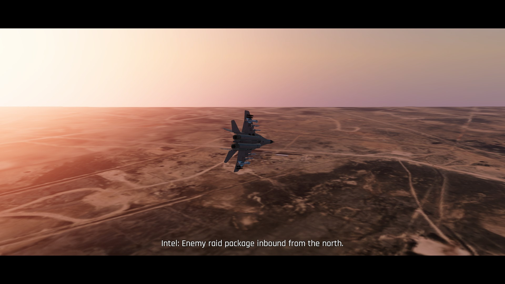

- `CinematicManager.Begin()` / `End()` around a small timeline driven by `onUpdate`.
- `FollowTransform` for the tracking shot, `MoveCamera` for the sweep, `ShowSubtitle` for dialogue.
- Everything after the spawns is behind the `isGameplay` guard.

See [Cutscenes](#cutscenes-cinematicmanager) for the API.

### Source

Raw file: [`src/CinematicIntro_Demo.js`](examples/src/CinematicIntro_Demo.js). Copy the whole file into the game (Mission Editor, Load, Paste from clipboard).

<details>
<summary>Full source</summary>

<!-- source: examples/src/CinematicIntro_Demo.js -->
```js
// ============================================
// CINEMATIC INTRO DEMO — cutscene API example
//
// Shows how mission JS drives an in-game cutscene via
// CS.CinematicManager.Instance:
//   Begin()  → blocks player input, hides gameplay UI/HUD,
//              slides in letterbox bars, takes over the camera
//   FollowTransform / SetCamera / MoveCamera → shot control
//   ShowSubtitle / PlayBGM / PlaySound      → dialogue + audio
//   End()    → restores everything, camera blends back
//
// Scenario: enemy raid inbound. Intro cutscene shows the lead
// jet, then sweeps back to the player's C-RAM before combat.
// ============================================

const TEAM_GROUND = 1;
const TEAM_AIR = 2;

async function Init() {
    mission.setPlayerType("Ground", TEAM_GROUND);
    mission.setWinCondition("EliminateAllEnemies");
    mission.setTime(6, 10);
    mission.setWeather("Clear Sky");
    await mission.loadMap("Kuwait");
}

function SpawnUnits() {
    const raid = ["mig-29", "mig-29", "su-25"];
    const airSp = mission.getAirSpawnPoint();
    const airRotY = mission.getAirSpawnPointRotY();
    for (let i = 0; i < raid.length; i++) {
        const x = airSp.x + (i * 150) - 150;
        const z = airSp.z + (i * 600);
        const terrainY = mission.getTerrainHeight(x, z);
        const y = Math.max(airSp.y, terrainY + 250);
        mission.spawnUnit(raid[i], x, y, z, airRotY, TEAM_AIR, false, 1.0, 1.0);
    }

    // Cutscenes only exist in real gameplay (the editor parse pass also calls SpawnUnits)
    if (!mission.isGameplay) return;
    runIntroCinematic();
}

function runIntroCinematic() {
    const UE = CS.UnityEngine;
    const $t = puer.$typeof;

    // Root parented to Stage => auto-cleanup on round end
    const root = new UE.GameObject("CinematicIntro");
    if (CS.Stage.Instance) {
        root.transform.SetParent(CS.Stage.Instance.transform, false);
    }
    const relay = root.AddComponent($t(CS.JsEventRelay));
    const cine = CS.CinematicManager.Instance;

    let t = 0;
    let step = 0;
    relay.onUpdate = (dt) => {
        t += dt;

        // Shot 1 (t=1s): chase-cam on the lead enemy jet
        if (step === 0 && t >= 1.0) {
            step = 1;
            let enemy = null;
            const units = CS.Stage.Instance.allUnits;
            for (let i = 0; i < units.Count; i++) {
                const u = units.get_Item(i);
                if (u && u.isAlive && u.team === CS.Team.Air) { enemy = u; break; }
            }
            cine.Begin();
            if (enemy) {
                cine.FollowTransform(enemy.transform, -35, 12, 45);
            }
            cine.ShowSubtitle("Intel: Enemy raid package inbound from the north.", 4.5);
        }

        // Shot 2 (t=5.5s): glide down to the player's vehicle
        if (step === 1 && t >= 5.5) {
            step = 2;
            const player = CS.Player.instance.currentUnit;
            const p = player.transform.position;
            cine.MoveCamera(p.x + 30, p.y + 18, p.z - 40, p.x, p.y + 2, p.z, 3.0);
            cine.ShowSubtitle("HQ: Man the C-RAM. Weapons free!", 4.0);
        }

        // t=10s: hand control back to the player
        if (step === 2 && t >= 10.0) {
            step = 3;
            cine.End();
            relay.onUpdate = null;
        }
    };
}
```
<!-- /source -->

</details>


---

## Drone Defense

You are a rifleman guarding a parked vehicle and three squadmates. Kamikaze FPV quadcopters come in waves; shoot them all down.

<!-- screenshot: example-drone-defense.jpg -->
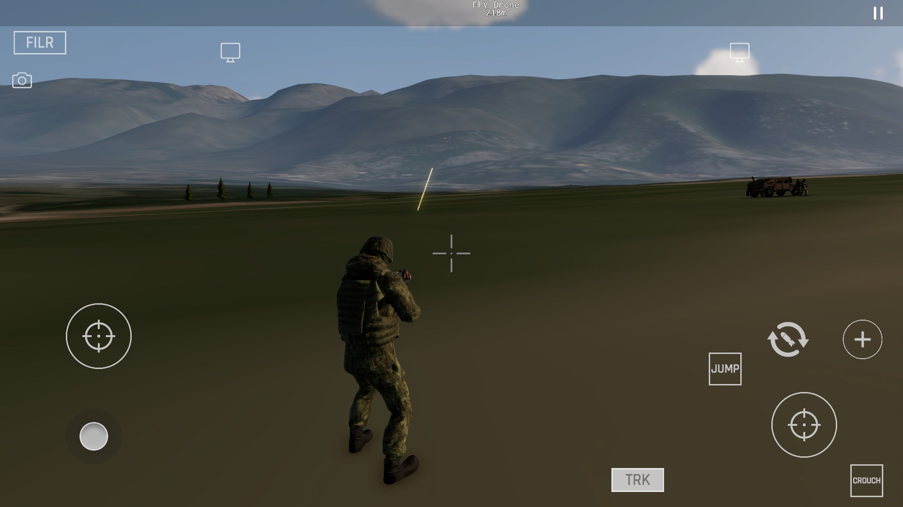

- Infantry player via `spawnUnit("soldier", ..., isPlayer = true, ..., "ak")`.
- `mission.setUnitHoldPosition` keeps the squad in place.
- A wave state machine: spawn on a bearing, poll `isAlive`, cooldown, next wave, `mission.win()` at the end.
- Test mode kills waves from script with `CurrentHp = 0; Dead(player)`.

Ground player, `Manual` win condition. The round keeps running after the squad dies as long as you live.

### Source

Raw file: [`src/DroneDefense.js`](examples/src/DroneDefense.js). Copy the whole file into the game (Mission Editor, Load, Paste from clipboard).

<details>
<summary>Full source</summary>

<!-- source: examples/src/DroneDefense.js -->
```js
// MissionFormatVersion: 1
// Description: Kamikaze quadcopter defense as infantry — stop FPV drone waves from wiping out your squad.
// ============================================
// DRONE DEFENSE — 카미카제 드론 방어전 (보병)
//
// You are a soldier guarding your squad: one parked vehicle with three
// riflemen taking cover at its flanks (same cluster shape as the Drone
// Strike mode) — everyone holds position, nobody chases anything.
// Kamikaze FPV quadcopters come in low waves and dive on them (the AI
// targets your squadmates before you — you are the last resort target).
// Shoot every drone down before the squad is wiped out.
//
// Player:  soldier, "ak" (press EQUIP / Z first — weapon starts holstered).
//          No MANPADS: an IR seeker cannot lock a tiny electric quad — rifles only, like real counter-FPV.
// Enemies: fpv-drone kamikaze quadcopters closing from 500-700 m, low.
// Win:     clear all 2 waves.
// Lose:    you die. Losing the squad no longer ends the round — you are the
//          drones' last-resort target, so with the squad gone they come for
//          you and you fight on alone.
//
// Self-test (MET autoRun "jsgames"): __gameTest.start() enables test mode.
// TEST_LOSE = false → win path: each wave's drones are JS-killed shortly
//   after spawning; verifies wave progression and the win.
// TEST_LOSE = true → squad-wipe path: nobody defends; the drones wipe the
//   squad and the round must KEEP running (the player is still alive).
// ============================================

const TEST_LOSE = false;

const TEAM_ALLY = 1;
const TEAM_ENEMY = 2;

const WAVE_DELAY = 6;        // seconds between wave clear and next spawn
const POLL_INTERVAL = 0.5;   // wave/squad alive polling

// Fixed bearings (compass degrees from the base) so rounds are comparable.
// Each entry is one wave: groups of quadcopters per bearing.
const WAVES = [
    { groups: [{ bearing: 20, count: 3, dist: 500 }] },
    { groups: [{ bearing: 300, count: 2, dist: 550 }, { bearing: 80, count: 2, dist: 650 }] }
];

const DRONE_ALT = 50;

async function Init() {
    mission.setPlayerType("Ground", TEAM_ALLY);
    mission.setWinCondition("Manual");
    mission.setTime(8, 0);
    mission.setWeather("Cloudy 1");
    // FPV games play only on the close-quarters urban maps.
    const maps = ["Mostar", "Bakhmut"];
    await mission.loadMap(maps[Math.floor(Math.random() * maps.length)]);
}

function SpawnUnits() {
    const sp = mission.getPlayerGroundStartPosition();
    const bx = sp.x;
    const bz = sp.z;
    const rotY = mission.getPlayerGroundStartRotY();

    // You — AK for the close quads, Stinger as the long-range option.
    const py = mission.getTerrainHeight(bx, bz);
    mission.spawnUnit("soldier", bx, py, bz, rotY, TEAM_ALLY, true, 1.0, 1.0, "ak");

    // The squad you are defending: one parked vehicle with three riflemen
    // hugging its flanks like cover (same cluster shape as the Drone Strike
    // mode), 60m from the player so a drone hit on them doesn't also kill
    // you. Everyone holds position — the squad defends the spot.
    const vehiclePool = ["humvee", "apc-2", "apc", "toyota-pickup"];
    const ax = bx + 55;
    const az = bz + 35;
    const ay = mission.getTerrainHeight(ax, az);
    const vehRotY = 100;
    const allies = [];
    const vehicle = vehiclePool[Math.floor(Math.random() * vehiclePool.length)];
    const v = mission.spawnUnit(vehicle, ax, ay, az, vehRotY, TEAM_ALLY, false, 1.0, 1.0);
    mission.setUnitHoldPosition(v, true);
    allies.push(v);
    const vrad = vehRotY * Math.PI / 180;
    const fwdX = Math.sin(vrad), fwdZ = Math.cos(vrad);
    const rightX = Math.cos(vrad), rightZ = -Math.sin(vrad);
    for (let i = 0; i < 3; i++) {
        let side = 1;
        if (i % 2 === 1) { side = -1; }
        const lat = (2.6 + Math.random() * 1.0) * side;
        const lon = (Math.random() * 2 - 1) * 2.5;
        const x = ax + rightX * lat + fwdX * lon;
        const z = az + rightZ * lat + fwdZ * lon;
        const y = mission.getTerrainHeight(x, z);
        const u = mission.spawnUnit("soldier", x, y, z, randomRange(0, 360), TEAM_ALLY, false, 1.0, 1.0, "ak");
        mission.setUnitHoldPosition(u, true);
        allies.push(u);
    }

    // Everything below is the live wave game — skip in editor preview.
    if (!mission.isGameplay) return;
    SetupWaveGame(bx, bz, allies);
}

function SetupWaveGame(bx, bz, allies) {
    const UE = CS.UnityEngine;
    const $t = puer.$typeof;

    const state = {
        waveIndex: -1,          // index of the wave currently in the air
        waveUnits: [],          // spawnUnit handles of the current wave
        wavesCleared: 0,
        alliesAlive: allies.length,
        nextWaveAt: 4,          // first wave 4s in
        elapsed: 0,
        nextPoll: 0,
        finished: false,
        testMode: false,
        testKillAt: -1,
        testCheckAt: -1
    };

    const test = {
        ready: true,
        done: false,
        passed: false,
        log: "",
        start: function () {
            state.testMode = true;
            if (TEST_LOSE) {
                // Lose path: defend nothing, the drones must wipe the squad.
                test.log = "lose-test mode on";
                return;
            }
            // A wave may already be in the air before the harness calls start()
            // (wave 1 spawns 4s in) — arm the kill timer for it too.
            state.testKillAt = state.elapsed + 2;
            test.log = "test mode on";
        }
    };
    globalThis.__gameTest = test;

    function spawnPoint(bearing, dist, alt, jitterIndex) {
        // Spread multiple drones of one group along the bearing arc and in depth.
        const spreadDeg = (jitterIndex - 1) * 12;
        const rad = (bearing + spreadDeg) * Math.PI / 180;
        const d = dist + jitterIndex * 120;
        const x = bx + Math.sin(rad) * d;
        const z = bz + Math.cos(rad) * d;
        const groundY = mission.getTerrainHeight(x, z);
        const baseY = mission.getTerrainHeight(bx, bz);
        const y = Math.max(groundY, baseY) + alt;
        const rotToBase = Math.atan2(bx - x, bz - z) * 180 / Math.PI;
        return { x: x, y: y, z: z, rotY: rotToBase };
    }

    function spawnWave(index) {
        const wave = WAVES[index];
        state.waveIndex = index;
        state.waveUnits = [];

        for (let g = 0; g < wave.groups.length; g++) {
            const grp = wave.groups[g];
            for (let i = 0; i < grp.count; i++) {
                const p = spawnPoint(grp.bearing, grp.dist, DRONE_ALT, i);
                state.waveUnits.push(mission.spawnUnit("fpv-drone", p.x, p.y, p.z, p.rotY, TEAM_ENEMY, false, 1.0, 1.0));
            }
        }

        if (state.testMode) {
            if (!TEST_LOSE) {
                state.testKillAt = state.elapsed + 2;
            }
            test.log += " | wave" + (index + 1) + " spawned " + state.waveUnits.length;
        }
    }

    function aliveCount(list) {
        let n = 0;
        for (let i = 0; i < list.length; i++) {
            if (list[i] && list[i].isAlive) n++;
        }
        return n;
    }

    function finish(won) {
        state.finished = true;
        if (won) {
            mission.win();
        } else {
            mission.fail();
        }
        if (state.testMode) {
            test.done = true;
            test.passed = won && state.wavesCleared === WAVES.length;
            test.log += " | finished won=" + won + " waves=" + state.wavesCleared + " allies=" + state.alliesAlive;
        }
    }

    const root = new UE.GameObject("DroneDefenseLogic");
    root.transform.SetParent(CS.Stage.Instance.transform, false);
    const relay = root.AddComponent($t(CS.JsEventRelay));

    relay.onUpdate = function (dt) {
        if (state.finished) return;
        state.elapsed += dt;

        // Test mode: simulate the player clearing the wave.
        if (state.testMode && state.testKillAt > 0 && state.elapsed >= state.testKillAt) {
            state.testKillAt = -1;
            const playerUnit = CS.Player.instance.GetUnit();
            for (let i = 0; i < state.waveUnits.length; i++) {
                const u = state.waveUnits[i];
                if (u && u.isAlive) {
                    u.CurrentHp = 0;
                    u.Dead(playerUnit);
                }
            }
        }

        // Pending wave spawn
        if (state.nextWaveAt > 0 && state.elapsed >= state.nextWaveAt) {
            state.nextWaveAt = -1;
            spawnWave(state.wavesCleared);
        }

        if (state.elapsed < state.nextPoll) return;
        state.nextPoll = state.elapsed + POLL_INTERVAL;

        // Squad status. Losing the whole squad does NOT end the round — the
        // player is the drones' last-resort target, so they keep coming and
        // the fight goes on alone (the engine handles the player's own death).
        const alliesNow = aliveCount(allies);
        if (alliesNow < state.alliesAlive) {
            state.alliesAlive = alliesNow;
            if (alliesNow === 0 && state.testMode && TEST_LOSE) {
                state.testCheckAt = state.elapsed + 3;
            }
        }

        // Lose-test: the squad is gone — verify the round kept running (the
        // old rule ended it here), then report.
        if (state.testCheckAt > 0 && state.elapsed >= state.testCheckAt) {
            state.testCheckAt = -1;
            test.passed = !state.finished;
            test.done = true;
            test.log += " | squad wiped, round still running=" + !state.finished;
        }

        // Wave cleared?
        if (state.waveIndex >= 0 && state.nextWaveAt < 0 && aliveCount(state.waveUnits) === 0) {
            state.wavesCleared++;
            state.waveIndex = -1;
            if (state.wavesCleared >= WAVES.length) {
                finish(true);
            } else {
                state.nextWaveAt = state.elapsed + WAVE_DELAY;
            }
        }
    };
}
```
<!-- /source -->

</details>


---

## Infantry 20 vs 20

Pure infantry firefight, two staggered lines per side. You are one of the twenty.

<!-- screenshot: example-infantry.jpg -->
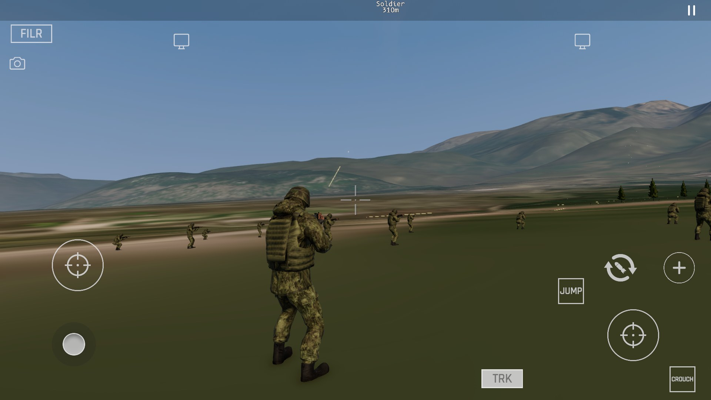

- A `spawnLine` helper spreads soldiers along a line relative to the player's start heading.
- AI soldiers get a 4x HP multiplier so the fight lasts.
- The player soldier keeps 1 HP; use your squad as cover.

Ground player seated in a soldier with `isPlayer = true`.

### Source

Raw file: [`src/Infantry20v20.js`](examples/src/Infantry20v20.js). Copy the whole file into the game (Mission Editor, Load, Paste from clipboard).

<details>
<summary>Full source</summary>

<!-- source: examples/src/Infantry20v20.js -->
```js
// ============================================
// Infantry Battle 20 vs 20
//
// Pure infantry firefight: you + 19 allied riflemen against 20 enemy riflemen,
// two staggered lines per side, ~280m apart. No vehicles, no aircraft.
//
// All AI soldiers spawn with a 4x HP multiplier — at stock single-digit HP a
// 20-rifle exchange at this range wipes a side in ~10 seconds, which is not a
// game. You stay at 1 HP (Unit.Start resets the player's HP to PlayerMaxHp).
//
// YOU are one of the 20 — spawnUnit isPlayer seats you in a soldier (same as the
// Play As Infantry demo). Press EQUIP (Z) first to draw the rifle. One rifle
// round kills you (PlayerMaxHp = 1), so use your squad as cover and engage from
// the back line.
//
// Layout, relative to your ground start position:
//   YOU               1 soldier "ak", 15m behind your front line
//   YOUR FRONT LINE   10 allied soldiers at +40m
//   YOUR BACK LINE    9 allied soldiers at +25m
//   ENEMY FRONT LINE  10 soldiers at +320m, facing you
//   ENEMY BACK LINE   10 soldiers at +335m
// Kill all 20 to win.
// ============================================

const TEAM_ALLY = 1;   // Ground
const TEAM_ENEMY = 2;  // Air (the enemy side used by the other infantry demos)

const SQUAD_SPACING = 9;
const ALLY_FRONT = 40;
const ALLY_BACK = 25;
const ENEMY_FRONT = 320;
const ENEMY_BACK = 335;

async function Init() {
    mission.setPlayerType("Ground", TEAM_ALLY);
    mission.setWinCondition("EliminateAllEnemies");
    mission.setTime(9, 30);
    mission.setWeather("Clear Sky");
    await mission.loadMap("Mostar");
}

// A line of riflemen centred on (centerX, centerZ), spread along X.
function spawnLine(count, centerX, centerZ, rotY, team) {
    const startX = centerX - ((count - 1) * SQUAD_SPACING) / 2;
    for (let i = 0; i < count; i++) {
        const x = startX + i * SQUAD_SPACING;
        const z = centerZ;
        const y = mission.getTerrainHeight(x, z);
        mission.spawnUnit("soldier", x, y, z, rotY, team, false, 4.0, 1.0, "ak");
    }
}

function SpawnUnits() {
    const sp = mission.getPlayerGroundStartPosition();
    const rotY = mission.getPlayerGroundStartRotY();

    // You, behind your own lines. isPlayer = true hands this soldier to the
    // player and removes the ground vehicle setPlayerType spawned.
    const py = mission.getTerrainHeight(sp.x, sp.z + 10);
    mission.spawnUnit("soldier", sp.x, py, sp.z + 10, rotY, TEAM_ALLY, true, 1.0, 1.0, "ak");

    // Back lines sit half a step sideways so the rear rank shoots through the gaps
    // instead of into its own front rank's backs.
    const stagger = SQUAD_SPACING / 2;

    // Your side: 10 + 9 = 19 riflemen.
    spawnLine(10, sp.x, sp.z + ALLY_FRONT, rotY, TEAM_ALLY);
    spawnLine(9, sp.x + stagger, sp.z + ALLY_BACK, rotY, TEAM_ALLY);

    // Enemy side: 10 + 10 = 20 riflemen, facing you.
    spawnLine(10, sp.x, sp.z + ENEMY_FRONT, rotY + 180, TEAM_ENEMY);
    spawnLine(10, sp.x + stagger, sp.z + ENEMY_BACK, rotY + 180, TEAM_ENEMY);
}
```
<!-- /source -->

</details>


---

## Play as infantry

The smallest infantry mission: you on foot with a rifle against six enemy soldiers carrying Stingers.

<!-- screenshot: example-soldier-play.jpg -->
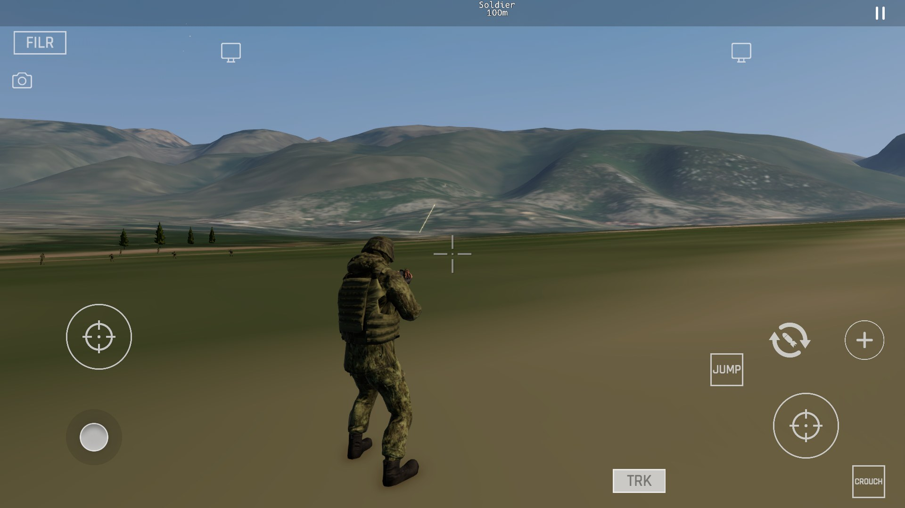

- Explains why the enemies carry Stingers: they never fire at a man on foot, so the round is winnable while you learn the controls.
- Two squads spawned ahead of the player at 100 m and 170 m.

Change `ENEMY_WEAPON` to `"ak"` for a real firefight.

### Source

Raw file: [`src/SoldierPlay_Demo.js`](examples/src/SoldierPlay_Demo.js). Copy the whole file into the game (Mission Editor, Load, Paste from clipboard).

<details>
<summary>Full source</summary>

<!-- source: examples/src/SoldierPlay_Demo.js -->
```js
// ============================================
// Play As Infantry (Soldier) — Demo
//
// Puts YOU on foot instead of in a vehicle, to exercise the infantry mobile HUD:
// move stick, EQUIP / SPRINT / CROUCH / JUMP, ADS, fire.
//
// How the player becomes a soldier:
//   mission.spawnUnit("soldier", x, y, z, rotY, team, true, 1.0, 1.0, "ak")
//                                                     ^^^^ isPlayer
// spawnUnit's isPlayer flag seats you in whatever it spawns, so no new player
// type is needed — setPlayerType stays "Ground" and the vehicle it spawns is
// replaced the moment this soldier takes over.
//
// FIRST THING TO DO IN GAME: press EQUIP (or Z on keyboard) to draw the rifle.
// A soldier starts with the weapon holstered; ADS and fire do nothing until it
// is out.
//
// WHY THE ENEMIES CARRY STINGERS
// The soldier prefab has PlayerMaxHp = 1, so one rifle round kills you, and a
// mission cannot raise it (Unit.Start resets the player's HP to PlayerMaxHp,
// which overrides the spawn hpMultiplier). Enemy riflemen would end the round
// before you finished reading the HUD. Stinger soldiers are anti-air: they hold
// their ground and track you but never launch at a man on foot, so you get a
// winnable round to actually drive the controls with.
// Want a real firefight? Raise PlayerMaxHp on Soldier2_Code_LOD, then swap
// ENEMY_WEAPON below to "ak".
//
// Layout, all relative to your start position:
//   YOU              1 soldier, "ak"
//   AHEAD  (+100m)   4 enemy soldiers
//   AHEAD  (+170m)   2 enemy soldiers
// Kill all 6 to win.
// ============================================

const TEAM_ALLY = 1;   // Ground
const TEAM_ENEMY = 2;  // Air — the enemy side used by the other infantry demo

const ENEMY_WEAPON = "stinger";
const FIRST_LINE = 100;
const SECOND_LINE = 170;
const SQUAD_SPACING = 9;

async function Init() {
    mission.setPlayerType("Ground", TEAM_ALLY);
    mission.setWinCondition("EliminateAllEnemies");
    mission.setTime(10, 0);
    mission.setWeather("Clear Sky");
    await mission.loadMap("Mostar");
}

// A line of soldiers centred on (centerX, centerZ), spread along X.
function spawnSquad(count, centerX, centerZ, rotY, team, weaponId) {
    const startX = centerX - ((count - 1) * SQUAD_SPACING) / 2;
    for (let i = 0; i < count; i++) {
        const x = startX + i * SQUAD_SPACING;
        const z = centerZ;
        const y = mission.getTerrainHeight(x, z);
        mission.spawnUnit("soldier", x, y, z, rotY, team, false, 1.0, 1.0, weaponId);
    }
}

function SpawnUnits() {
    const sp = mission.getPlayerGroundStartPosition();
    const rotY = mission.getPlayerGroundStartRotY();

    // You. isPlayer = true hands this soldier to the player and deletes the
    // ground vehicle that setPlayerType spawned a moment earlier.
    const py = mission.getTerrainHeight(sp.x, sp.z);
    mission.spawnUnit("soldier", sp.x, py, sp.z, rotY, TEAM_ALLY, true, 1.0, 1.0, "ak");

    // Enemy squads downrange, in two lines.
    spawnSquad(4, sp.x, sp.z + FIRST_LINE, rotY + 180, TEAM_ENEMY, ENEMY_WEAPON);
    spawnSquad(2, sp.x, sp.z + SECOND_LINE, rotY + 180, TEAM_ENEMY, ENEMY_WEAPON);
}
```
<!-- /source -->

</details>


---

## FPV Operator

Play the soldier who flies kamikaze drones. Stop an unarmed convoy that is driving straight at you.

<!-- screenshot: example-fpv-operator.jpg -->
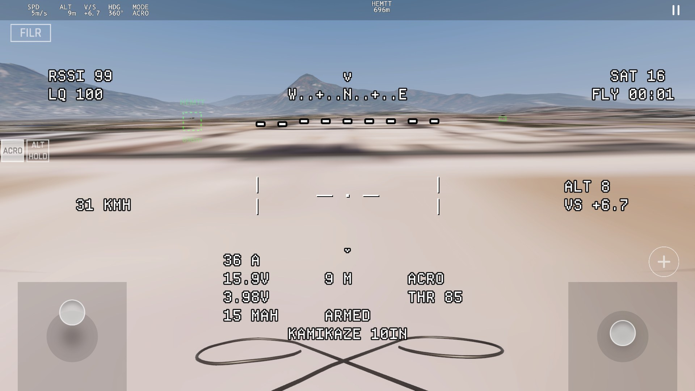

- Soldier kit `"ak,fpv-drone"`: hold fire to launch a drone, control jumps to it, dive it into a vehicle.
- A ring of convoy vehicles at three distances, all driven by the normal ground AI toward the player.

Ground player, `EliminateAllEnemies`.

### Source

Raw file: [`src/FPVOperator.js`](examples/src/FPVOperator.js). Copy the whole file into the game (Mission Editor, Load, Paste from clipboard).

<details>
<summary>Full source</summary>

<!-- source: examples/src/FPVOperator.js -->
```js
// ============================================
// FPV Operator — play the soldier who flies the kamikaze drone
// Player: infantry with the FPV drone controller (soldierWeapon "fpv-drone").
// Hold the fire button to launch a drone: control and camera jump to it,
// dive it into a vehicle — the warhead pops, the airframe dies with it, and
// you are back in the soldier's boots. 5s later the next drone is ready.
// Targets: an unarmed convoy 450-700m out — they drive straight at you and
// WILL run you over, so stop them with drone strikes before they arrive.
// ============================================

const TEAM_PLAYER = 1;
const TEAM_ENEMY = 2;

async function Init() {
    mission.setPlayerType("Ground", TEAM_PLAYER);
    mission.setWinCondition("EliminateAllEnemies");
    mission.setTime(12, 0);
    mission.setWeather("Clear Sky");
    await mission.loadMap("Seoul");
}

function SpawnUnits() {
    const playerSp = mission.getPlayerGroundStartPosition();
    const px = playerSp.x;
    const pz = playerSp.z;
    const py = mission.getTerrainHeight(px, pz);

    // You: a soldier carrying a rifle AND the FPV drone controller — the
    // change-weapon button swaps between them.
    mission.spawnUnit("soldier", px, py, pz, 0, TEAM_PLAYER, true, 1.0, 1.0, "ak,fpv-drone");

    // Unarmed convoy in a ring, 450-700m out. Ground AI drives them straight
    // at the soldier — the mission is a race to break the convoy with drone
    // strikes before it rolls over you.
    const targets = ["humvee", "apc-2", "hemtt", "humvee", "apc-2", "hemtt"];
    for (let i = 0; i < targets.length; i++) {
        const angle = (i / targets.length) * Math.PI * 2;
        const dist = 450 + (i % 3) * 125; // 450 / 575 / 700m
        const x = px + Math.cos(angle) * dist;
        const z = pz + Math.sin(angle) * dist;
        const y = mission.getTerrainHeight(x, z);
        const rotY = Math.random() * 360;
        mission.spawnUnit(targets[i], x, y, z, rotY, TEAM_ENEMY, false, 1.0, 1.0);
    }
}
```
<!-- /source -->

</details>


---

## Air Race

A six-ring checkpoint time trial over Kuwait. Fly your equipped jet through every ring; the HUD shows progress and time.

<!-- screenshot: example-air-race.jpg -->
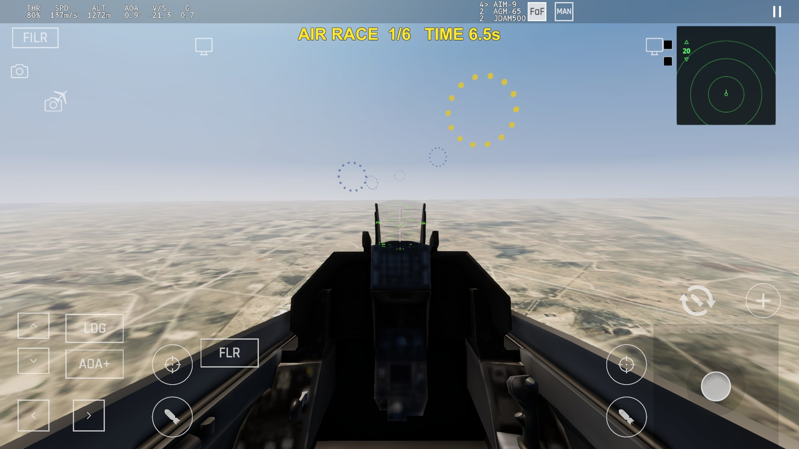

- One `JsEventRelay` per ring with a sphere trigger, plus one manager relay for the loop and HUD.
- Rings are built from primitive spheres with their colliders removed and two shared materials.
- Trigger detection is backed by a distance check every frame, so a fast pass cannot be missed.
- The course is laid out from the aircraft start transform's forward and right vectors, with terrain clearance from `mission.getTerrainHeight`.

Aircraft player, `Manual` win condition, `mission.win()` after the last ring.

### Source

Raw file: [`src/AirRace_Kuwait.js`](examples/src/AirRace_Kuwait.js). Copy the whole file into the game (Mission Editor, Load, Paste from clipboard).

<details>
<summary>Full source</summary>

<!-- source: examples/src/AirRace_Kuwait.js -->
```js
// MissionFormatVersion: 1
// ============================================
// AIR RACE — Checkpoint Time Trial (pure-JS custom game prototype)
//
// Roblox-style demo: every game rule lives in this script.
// C# side provides only:
//   - the mission.* API (map/player/win plumbing)
//   - JsEventRelay (Unity messages -> JS callbacks)
//   - the full engine via the CS.* global (PuerTS)
//
// Player: your equipped aircraft. Fly through all rings, fastest time wins.
// ============================================

const RING_COUNT = 6;
const RING_RADIUS = 60;        // trigger + visual radius (m)
const RING_SEGMENTS = 14;      // spheres forming each ring visual
const SEGMENT_SCALE = 10;      // diameter of each ring sphere (m)
const FIRST_CP_DIST = 600;     // distance from start to first ring (m)
const CP_SPACING = 700;        // distance between rings (m)
const MIN_CLEARANCE = 120;     // min height above terrain (m)
const FINISH_WIN_DELAY = 2.5;  // seconds after finish before mission.win()

async function Init() {
    mission.setPlayerType("Aircraft", 4);
    mission.setWinCondition("Manual");
    mission.setTime(10, 30);
    mission.setWeather("Clear Sky");
    await mission.loadMap("Kuwait");
}

function SpawnUnits() {
    // The editor parse pass also calls SpawnUnits (data collection mode).
    // The race only exists in real gameplay.
    if (!mission.isGameplay) return;
    setupRace();
}

// ---------- small vector helpers (plain arrays, no interop cost) ----------
function vSub(a, b) { return [a[0] - b[0], a[1] - b[1], a[2] - b[2]]; }
function vAdd(a, b) { return [a[0] + b[0], a[1] + b[1], a[2] + b[2]]; }
function vScale(a, s) { return [a[0] * s, a[1] * s, a[2] * s]; }
function vLen(a) { return Math.sqrt(a[0] * a[0] + a[1] * a[1] + a[2] * a[2]); }
function vNorm(a) {
    const l = vLen(a);
    if (l < 0.0001) return [0, 0, 1];
    return vScale(a, 1 / l);
}
function vCross(a, b) {
    return [
        a[1] * b[2] - a[2] * b[1],
        a[2] * b[0] - a[0] * b[2],
        a[0] * b[1] - a[1] * b[0]
    ];
}

function setupRace() {
    const UE = CS.UnityEngine;
    const $t = puer.$typeof;

    // ---------- shared state ----------
    const state = {
        current: 0,
        total: RING_COUNT,
        finished: false,
        time: 0,
        winSent: false,
        finishTimer: 0,
        positions: [],
        lastPassVia: "",
        hudReady: false
    };
    globalThis.__race = state;

    // ---------- root object (parented to Stage => auto-cleanup on round end) ----------
    const raceRoot = new UE.GameObject("RaceRoot");
    if (CS.Stage.Instance) {
        raceRoot.transform.SetParent(CS.Stage.Instance.transform, false);
    }

    // ---------- course layout from the aircraft start pose ----------
    const startTr = CS.StageEnvironment.Instance.PlayerAircraftStartPosition;
    const spv = startTr.position;
    const sp = [spv.x, spv.y, spv.z];
    const fwv = startTr.forward;
    let fwd = vNorm([fwv.x, 0, fwv.z]);
    const right = vNorm(vCross([0, 1, 0], fwd));

    const lateral = [0, 150, -200, 250, -250, 0];
    const climb = [0, 60, -40, 100, -60, 20];

    const centers = [];
    for (let i = 0; i < RING_COUNT; i++) {
        const dist = FIRST_CP_DIST + i * CP_SPACING;
        let p = vAdd(sp, vScale(fwd, dist));
        p = vAdd(p, vScale(right, lateral[i % lateral.length]));
        p[1] = sp[1] + climb[i % climb.length];
        const groundY = mission.getTerrainHeight(p[0], p[2]);
        if (p[1] < groundY + MIN_CLEARANCE) {
            p[1] = groundY + MIN_CLEARANCE;
        }
        centers.push(p);
        state.positions.push({ x: p[0], y: p[1], z: p[2] });
    }

    // ---------- materials (3 shared instances, not per-sphere) ----------
    const shader = UE.Shader.Find("Sprites/Default");
    const matActive = new UE.Material(shader);
    matActive.color = new UE.Color(1, 0.85, 0.1, 1);
    const matPending = new UE.Material(shader);
    matPending.color = new UE.Color(0.45, 0.55, 0.75, 1);

    // ---------- build rings ----------
    const rings = [];
    for (let i = 0; i < RING_COUNT; i++) {
        let prev = sp;
        if (i > 0) prev = centers[i - 1];
        const dir = vNorm(vSub(centers[i], prev));
        const u = vNorm(vCross(dir, [0, 1, 0]));
        const v = vCross(u, dir);

        const ringGo = new UE.GameObject("RaceRing_" + i);
        ringGo.transform.SetParent(raceRoot.transform, false);
        ringGo.transform.position = new UE.Vector3(centers[i][0], centers[i][1], centers[i][2]);

        // visual: spheres arranged in a circle
        for (let s = 0; s < RING_SEGMENTS; s++) {
            const ang = (s / RING_SEGMENTS) * Math.PI * 2;
            const off = vAdd(vScale(u, Math.cos(ang) * RING_RADIUS), vScale(v, Math.sin(ang) * RING_RADIUS));
            const sphere = UE.GameObject.CreatePrimitive(UE.PrimitiveType.Sphere);
            sphere.name = "seg";
            sphere.transform.SetParent(ringGo.transform, false);
            sphere.transform.localPosition = new UE.Vector3(off[0], off[1], off[2]);
            sphere.transform.localScale = new UE.Vector3(SEGMENT_SCALE, SEGMENT_SCALE, SEGMENT_SCALE);
            // visual only — the primitive's collider would physically block the aircraft
            UE.Object.Destroy(sphere.GetComponent($t(UE.SphereCollider)));
            const rend = sphere.GetComponent($t(UE.MeshRenderer));
            if (i === 0) {
                rend.sharedMaterial = matActive;
            } else {
                rend.sharedMaterial = matPending;
            }
            rend.shadowCastingMode = UE.Rendering.ShadowCastingMode.Off;
        }

        // trigger volume + relay
        const col = ringGo.AddComponent($t(UE.SphereCollider));
        col.isTrigger = true;
        col.radius = RING_RADIUS;
        const relay = ringGo.AddComponent($t(CS.JsEventRelay));
        const ringIndex = i;
        relay.onTriggerEnter = function (other) {
            if (isPlayerCollider(other)) {
                passCheckpoint(ringIndex, "trigger");
            }
        };

        rings.push(ringGo);
    }

    // ---------- HUD (UGUI built from JS) ----------
    let hudText = null;
    (function buildHud() {
        const canvasGo = new UE.GameObject("RaceHUD");
        canvasGo.transform.SetParent(raceRoot.transform, false);
        const canvas = canvasGo.AddComponent($t(UE.Canvas));
        canvas.renderMode = UE.RenderMode.ScreenSpaceOverlay;
        canvas.sortingOrder = 500;
        canvasGo.AddComponent($t(UE.UI.CanvasScaler));

        const textGo = new UE.GameObject("RaceText");
        textGo.transform.SetParent(canvasGo.transform, false);
        const text = textGo.AddComponent($t(UE.UI.Text));
        text.font = UE.Resources.GetBuiltinResource($t(UE.Font), "LegacyRuntime.ttf");
        text.fontSize = 40;
        text.fontStyle = UE.FontStyle.Bold;
        text.alignment = UE.TextAnchor.UpperCenter;
        text.color = new UE.Color(1, 0.9, 0.2, 1);
        const outline = textGo.AddComponent($t(UE.UI.Outline));
        outline.effectColor = new UE.Color(0, 0, 0, 0.9);

        const rt = textGo.GetComponent($t(UE.RectTransform));
        rt.anchorMin = new UE.Vector2(0.5, 1);
        rt.anchorMax = new UE.Vector2(0.5, 1);
        rt.pivot = new UE.Vector2(0.5, 1);
        rt.anchoredPosition = new UE.Vector2(0, -60);
        rt.sizeDelta = new UE.Vector2(1100, 130);

        hudText = text;
        state.hudReady = true;
    })();

    function updateHud() {
        if (!hudText) return;
        if (state.finished) {
            hudText.text = "FINISH!  " + state.time.toFixed(1) + "s";
            return;
        }
        hudText.text = "AIR RACE  " + state.current + "/" + RING_COUNT
            + "   TIME " + state.time.toFixed(1) + "s";
    }

    // ---------- player helpers ----------
    let cachedUnit = null;
    function playerUnit() {
        if (cachedUnit && cachedUnit.isAlive) return cachedUnit;
        const p = CS.Player.instance;
        if (!p) return null;
        cachedUnit = p.GetUnit();
        return cachedUnit;
    }

    function isPlayerCollider(other) {
        const u = playerUnit();
        if (!u) return false;
        let t = other.transform;
        const rb = other.attachedRigidbody;
        if (rb) t = rb.transform;
        return t.root.GetInstanceID() === u.transform.root.GetInstanceID();
    }

    // ---------- race rules ----------
    function passCheckpoint(index, via) {
        if (state.finished) return;
        if (index !== state.current) return;

        state.lastPassVia = via;
        rings[index].SetActive(false);
        state.current++;
        console.log("[AirRace] checkpoint " + state.current + "/" + RING_COUNT + " via " + via);

        if (state.current >= RING_COUNT) {
            state.finished = true;
            updateHud();
            return;
        }

        // highlight new active ring
        const active = rings[state.current];
        const rends = active.GetComponentsInChildren($t(UE.MeshRenderer));
        for (let r = 0; r < rends.Length; r++) {
            rends.get_Item(r).sharedMaterial = matActive;
        }
        updateHud();
    }

    // ---------- per-frame logic: one relay for the whole race ----------
    const managerRelay = raceRoot.AddComponent($t(CS.JsEventRelay));
    managerRelay.onUpdate = function (dt) {
        if (state.finished) {
            state.finishTimer += dt;
            if (!state.winSent && state.finishTimer >= FINISH_WIN_DELAY) {
                state.winSent = true;
                console.log("[AirRace] finished in " + state.time.toFixed(1) + "s — mission.win()");
                mission.win();
            }
            return;
        }

        state.time += dt;

        // distance fallback so the race also works if physics layers
        // filter out the trigger contact
        const u = playerUnit();
        if (u) {
            const pos = u.transform.position;
            const c = state.positions[state.current];
            const dx = pos.x - c.x;
            const dy = pos.y - c.y;
            const dz = pos.z - c.z;
            if (dx * dx + dy * dy + dz * dz < RING_RADIUS * RING_RADIUS) {
                passCheckpoint(state.current, "distance");
            }
        }

        updateHud();
    };

    updateHud();
    console.log("[AirRace] course ready: " + RING_COUNT + " rings from ("
        + sp[0].toFixed(0) + "," + sp[1].toFixed(0) + "," + sp[2].toFixed(0) + ")");
}
```
<!-- /source -->

</details>


---

## Tetris

A complete Tetris on a UGUI board. Clear ten lines to win the round; stack out to lose.

<!-- screenshot: example-tetris.jpg -->
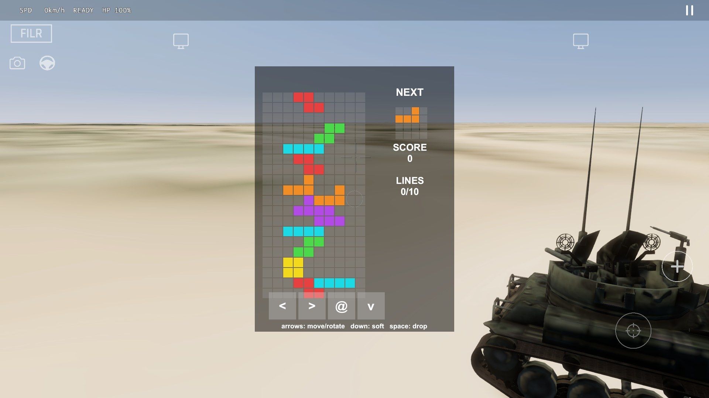

- The whole game state lives in JS arrays; only changed cells cross into C#.
- Keyboard input with hold-to-repeat, plus four on-screen buttons for touch.
- A big centre Text for `YOU WIN!` / `GAME OVER`, then a delayed `mission.win()` / `mission.fail()`.
- Debug hooks on `globalThis` let an automated test drive the game.

The map and the player's vehicle are loaded but irrelevant: the panel covers the screen.

### Source

Raw file: [`src/Tetris.js`](examples/src/Tetris.js). Copy the whole file into the game (Mission Editor, Load, Paste from clipboard).

<details>
<summary>Full source</summary>

<!-- source: examples/src/Tetris.js -->
```js
// MissionFormatVersion: 1
// ============================================
// TETRIS — inside a combat flight game.
//
// Absurdity-proof for the pure-JS custom game stack: this mission ignores
// the entire war game and renders a playable Tetris on a UGUI canvas.
// Everything below is plain mission JS using:
//   - CS.* (PuerTS full engine access) for UI construction
//   - JsEventRelay.onUpdate as the game loop
//   - CS.UnityEngine.InputSystem.Keyboard for controls (+ on-screen buttons)
//   - mission.win()/fail() to end the round
//
// Goal: clear 10 lines to WIN. Stack out = lose.
// Controls: arrows move/rotate, down = soft drop, space = hard drop.
// ============================================

const COLS = 10;
const ROWS = 20;
const CELL = 28;
const TARGET_LINES = 10;
const GRAVITY_SEC = 0.8;
const SOFT_SEC = 0.05;
const END_DELAY = 2.2;

async function Init() {
    mission.setPlayerType("Ground", 1);
    mission.setWinCondition("Manual");
    mission.setTime(12, 0);
    mission.setWeather("Clear Sky");
    await mission.loadMap("Kuwait");
}

function SpawnUnits() {
    // Editor parse pass also calls this — only build in real gameplay.
    if (!mission.isGameplay) return;
    setupTetris();
}

function setupTetris() {
    const UE = CS.UnityEngine;
    const $t = puer.$typeof;

    // ---------- piece data ----------
    const PIECES = [
        { size: 4, blocks: [[0, 1], [1, 1], [2, 1], [3, 1]], color: [0.10, 0.85, 0.90] }, // I
        { size: 2, blocks: [[0, 0], [1, 0], [0, 1], [1, 1]], color: [0.95, 0.85, 0.10] }, // O
        { size: 3, blocks: [[1, 0], [0, 1], [1, 1], [2, 1]], color: [0.70, 0.30, 0.90] }, // T
        { size: 3, blocks: [[1, 0], [2, 0], [0, 1], [1, 1]], color: [0.30, 0.85, 0.30] }, // S
        { size: 3, blocks: [[0, 0], [1, 0], [1, 1], [2, 1]], color: [0.90, 0.25, 0.25] }, // Z
        { size: 3, blocks: [[0, 0], [0, 1], [1, 1], [2, 1]], color: [0.25, 0.45, 0.95] }, // J
        { size: 3, blocks: [[2, 0], [0, 1], [1, 1], [2, 1]], color: [0.95, 0.55, 0.15] }  // L
    ];
    // ROT[p][r] = array of [x,y] cells for rotation r
    const ROT = [];
    for (let p = 0; p < PIECES.length; p++) {
        const size = PIECES[p].size;
        const rots = [PIECES[p].blocks];
        for (let r = 1; r < 4; r++) {
            const prev = rots[r - 1];
            const cur = [];
            for (let b = 0; b < prev.length; b++) {
                cur.push([size - 1 - prev[b][1], prev[b][0]]);
            }
            rots.push(cur);
        }
        ROT.push(rots);
    }

    // ---------- game state ----------
    let board = [];
    for (let y = 0; y < ROWS; y++) board.push(new Array(COLS).fill(0));

    const state = {
        hudReady: false,
        score: 0,
        lines: 0,
        locked: 0,
        px: 0,
        py: 0,
        dead: false,
        won: false
    };
    globalThis.__tetris = state;

    let cur = null;             // { p, r, x, y }
    let nextP = Math.floor(Math.random() * PIECES.length);
    let dropTimer = 0;
    let endTimer = 0;
    let endSent = false;
    let holdLeft = 0;
    let holdRight = 0;

    // ---------- core rules ----------
    function collides(p, r, x, y) {
        const blocks = ROT[p][r];
        for (let b = 0; b < blocks.length; b++) {
            const bx = x + blocks[b][0];
            const by = y + blocks[b][1];
            if (bx < 0 || bx >= COLS || by >= ROWS) return true;
            if (by >= 0 && board[by][bx]) return true;
        }
        return false;
    }

    function spawnPiece() {
        cur = { p: nextP, r: 0, x: 3, y: -2 };
        nextP = Math.floor(Math.random() * PIECES.length);
        if (collides(cur.p, cur.r, cur.x, cur.y)) {
            gameOver();
            return;
        }
        syncState();
        paintPreview();
        repaint();
    }

    function move(dx) {
        if (!cur || state.dead || state.won) return;
        if (!collides(cur.p, cur.r, cur.x + dx, cur.y)) {
            cur.x += dx;
            syncState();
            repaint();
        }
    }

    function rotate() {
        if (!cur || state.dead || state.won) return;
        const nr = (cur.r + 1) % 4;
        const kicks = [0, -1, 1, -2, 2];
        for (let k = 0; k < kicks.length; k++) {
            if (!collides(cur.p, nr, cur.x + kicks[k], cur.y)) {
                cur.r = nr;
                cur.x += kicks[k];
                syncState();
                repaint();
                return;
            }
        }
    }

    function stepDown() {
        if (!cur || state.dead || state.won) return;
        if (!collides(cur.p, cur.r, cur.x, cur.y + 1)) {
            cur.y += 1;
            syncState();
            repaint();
        } else {
            lockPiece();
        }
    }

    function hardDrop() {
        if (!cur || state.dead || state.won) return;
        while (!collides(cur.p, cur.r, cur.x, cur.y + 1)) cur.y += 1;
        lockPiece();
    }

    function lockPiece() {
        const blocks = ROT[cur.p][cur.r];
        let above = false;
        for (let b = 0; b < blocks.length; b++) {
            const bx = cur.x + blocks[b][0];
            const by = cur.y + blocks[b][1];
            if (by < 0) { above = true; continue; }
            board[by][bx] = cur.p + 1;
        }
        state.locked++;
        if (above) {
            gameOver();
            return;
        }
        clearLines();
        spawnPiece();
    }

    function clearLines() {
        const kept = [];
        for (let y = 0; y < ROWS; y++) {
            let full = true;
            for (let x = 0; x < COLS; x++) {
                if (!board[y][x]) { full = false; break; }
            }
            if (!full) kept.push(board[y]);
        }
        const n = ROWS - kept.length;
        if (n > 0) {
            while (kept.length < ROWS) kept.unshift(new Array(COLS).fill(0));
            board = kept;
            state.lines += n;
            const scoreTable = [0, 100, 300, 500, 800];
            state.score += scoreTable[Math.min(n, 4)];
            paintScore();
            checkWin();
        }
    }

    function checkWin() {
        if (state.lines >= TARGET_LINES && !state.won && !state.dead) {
            state.won = true;
            bigText.text = "YOU WIN!";
            console.log("[Tetris] WIN — " + state.lines + " lines, score " + state.score);
        }
    }

    function gameOver() {
        if (state.dead || state.won) return;
        state.dead = true;
        bigText.text = "GAME OVER";
        console.log("[Tetris] game over — score " + state.score);
    }

    function syncState() {
        if (!cur) return;
        state.px = cur.x;
        state.py = cur.y;
    }

    // ---------- UI ----------
    const root = new UE.GameObject("TetrisRoot");
    if (CS.Stage.Instance) {
        root.transform.SetParent(CS.Stage.Instance.transform, false);
    }
    const relay = root.AddComponent($t(CS.JsEventRelay));

    const canvasGo = new UE.GameObject("TetrisHUD");
    canvasGo.transform.SetParent(root.transform, false);
    const canvas = canvasGo.AddComponent($t(UE.Canvas));
    canvas.renderMode = UE.RenderMode.ScreenSpaceOverlay;
    canvas.sortingOrder = 500;
    canvasGo.AddComponent($t(UE.UI.CanvasScaler));

    const font = UE.Resources.GetBuiltinResource($t(UE.Font), "LegacyRuntime.ttf");

    function makeRect(name, parent, x, y, w, h) {
        const go = new UE.GameObject(name);
        go.transform.SetParent(parent.transform, false);
        const rt = go.AddComponent($t(UE.RectTransform));
        rt.anchorMin = new UE.Vector2(0.5, 0.5);
        rt.anchorMax = new UE.Vector2(0.5, 0.5);
        rt.anchoredPosition = new UE.Vector2(x, y);
        rt.sizeDelta = new UE.Vector2(w, h);
        return go;
    }

    function makeImage(name, parent, x, y, w, h, color) {
        const go = makeRect(name, parent, x, y, w, h);
        const img = go.AddComponent($t(UE.UI.Image));
        img.color = color;
        return img;
    }

    function makeText(name, parent, x, y, w, h, size, str) {
        const go = makeRect(name, parent, x, y, w, h);
        const text = go.AddComponent($t(UE.UI.Text));
        text.font = font;
        text.fontSize = size;
        text.fontStyle = UE.FontStyle.Bold;
        text.alignment = UE.TextAnchor.MiddleCenter;
        text.color = new UE.Color(1, 1, 1, 1);
        text.text = str;
        return text;
    }

    const panel = makeImage("panel", canvasGo, 0, 0, 540, 720, new UE.Color(0, 0, 0, 0.78));

    // board cells (top-left of board at (-250, 290) inside panel)
    const BOARD_LEFT = -250;
    const BOARD_TOP = 290;
    const EMPTY_COLOR = new UE.Color(1, 1, 1, 0.06);
    const pieceColors = [];
    for (let p = 0; p < PIECES.length; p++) {
        const c = PIECES[p].color;
        pieceColors.push(new UE.Color(c[0], c[1], c[2], 1));
    }

    const cellImages = [];
    for (let y = 0; y < ROWS; y++) {
        const row = [];
        for (let x = 0; x < COLS; x++) {
            const cx = BOARD_LEFT + x * CELL + CELL / 2;
            const cy = BOARD_TOP - y * CELL - CELL / 2;
            row.push(makeImage("c" + x + "_" + y, panel.gameObject, cx, cy, CELL - 2, CELL - 2, EMPTY_COLOR));
        }
        cellImages.push(row);
    }

    // next-piece preview (4x4)
    makeText("nextLabel", panel.gameObject, 150, 290, 160, 40, 28, "NEXT");
    const PRE = 22;
    const previewImages = [];
    for (let y = 0; y < 4; y++) {
        const row = [];
        for (let x = 0; x < 4; x++) {
            const cx = 110 + x * PRE + PRE / 2;
            const cy = 250 - y * PRE - PRE / 2;
            row.push(makeImage("p" + x + "_" + y, panel.gameObject, cx, cy, PRE - 2, PRE - 2, EMPTY_COLOR));
        }
        previewImages.push(row);
    }

    const scoreText = makeText("score", panel.gameObject, 150, 80, 220, 200, 26,
        "SCORE\n0\n\nLINES\n0/" + TARGET_LINES);
    const bigText = makeText("big", panel.gameObject, 0, 0, 460, 120, 56, "");
    makeText("help", panel.gameObject, 0, -345, 520, 30, 18,
        "arrows: move/rotate   down: soft   space: drop");

    function makeButton(label, x, cb) {
        const img = makeImage("btn_" + label, panel.gameObject, x, -290, 74, 74, new UE.Color(1, 1, 1, 0.14));
        const btn = img.gameObject.AddComponent($t(UE.UI.Button));
        btn.onClick.AddListener(cb);
        makeText("lbl", img.gameObject, 0, 0, 74, 74, 34, label);
    }
    makeButton("<", -195, function () { move(-1); });
    makeButton(">", -115, function () { move(1); });
    makeButton("@", -35, function () { rotate(); });
    makeButton("v", 45, function () { hardDrop(); });

    // ---------- rendering (diffed — only changed cells cross the JS/C# boundary) ----------
    const lastPaint = new Array(ROWS * COLS).fill(-1);

    function repaint() {
        // desired = board + current piece overlay
        for (let y = 0; y < ROWS; y++) {
            for (let x = 0; x < COLS; x++) {
                let v = board[y][x];
                if (cur) {
                    const blocks = ROT[cur.p][cur.r];
                    for (let b = 0; b < blocks.length; b++) {
                        if (cur.x + blocks[b][0] === x && cur.y + blocks[b][1] === y) {
                            v = cur.p + 1;
                        }
                    }
                }
                const idx = y * COLS + x;
                if (lastPaint[idx] !== v) {
                    lastPaint[idx] = v;
                    if (v === 0) {
                        cellImages[y][x].color = EMPTY_COLOR;
                    } else {
                        cellImages[y][x].color = pieceColors[v - 1];
                    }
                }
            }
        }
    }

    const lastPreview = new Array(16).fill(-1);

    function paintPreview() {
        const blocks = ROT[nextP][0];
        for (let y = 0; y < 4; y++) {
            for (let x = 0; x < 4; x++) {
                let v = 0;
                for (let b = 0; b < blocks.length; b++) {
                    if (blocks[b][0] === x && blocks[b][1] === y) v = nextP + 1;
                }
                const idx = y * 4 + x;
                if (lastPreview[idx] !== v) {
                    lastPreview[idx] = v;
                    if (v === 0) {
                        previewImages[y][x].color = EMPTY_COLOR;
                    } else {
                        previewImages[y][x].color = pieceColors[v - 1];
                    }
                }
            }
        }
    }

    function paintScore() {
        scoreText.text = "SCORE\n" + state.score + "\n\nLINES\n" + state.lines + "/" + TARGET_LINES;
    }

    // ---------- input ----------
    function readKeys(dt) {
        const kb = CS.UnityEngine.InputSystem.Keyboard.current;
        if (!kb) return false;

        if (kb.leftArrowKey.wasPressedThisFrame) { move(-1); holdLeft = -0.25; }
        if (kb.rightArrowKey.wasPressedThisFrame) { move(1); holdRight = -0.25; }

        // hold-to-repeat
        if (kb.leftArrowKey.isPressed) {
            holdLeft += dt;
            if (holdLeft > 0.12) { holdLeft = 0; move(-1); }
        }
        if (kb.rightArrowKey.isPressed) {
            holdRight += dt;
            if (holdRight > 0.12) { holdRight = 0; move(1); }
        }

        if (kb.upArrowKey.wasPressedThisFrame || kb.zKey.wasPressedThisFrame) rotate();
        if (kb.spaceKey.wasPressedThisFrame) hardDrop();
        return kb.downArrowKey.isPressed;
    }

    // ---------- debug hooks (used by the MET automated test) ----------
    globalThis.__tetrisDebug = {
        moveLeft: function () { move(-1); },
        moveRight: function () { move(1); },
        rotate: function () { rotate(); },
        hardDrop: function () { hardDrop(); },
        forceLines: function (n) { state.lines += n; paintScore(); checkWin(); }
    };

    // ---------- game loop ----------
    relay.onUpdate = function (dt) {
        if (state.won || state.dead) {
            endTimer += dt;
            if (!endSent && endTimer >= END_DELAY) {
                endSent = true;
                if (state.won) {
                    mission.win();
                } else {
                    mission.fail();
                }
            }
            return;
        }

        const soft = readKeys(dt);

        dropTimer += dt;
        let interval = GRAVITY_SEC;
        if (soft) interval = SOFT_SEC;
        if (dropTimer >= interval) {
            dropTimer = 0;
            stepDown();
        }
    };

    spawnPiece();
    paintScore();
    state.hudReady = true;
    console.log("[Tetris] board ready — clear " + TARGET_LINES + " lines to win");
}
```
<!-- /source -->

</details>


---

## Flappy Jet

Flappy Bird with your fighter. Tap or press space to pitch up and fly through ten gates.

<!-- screenshot: example-flappy-jet.jpg -->
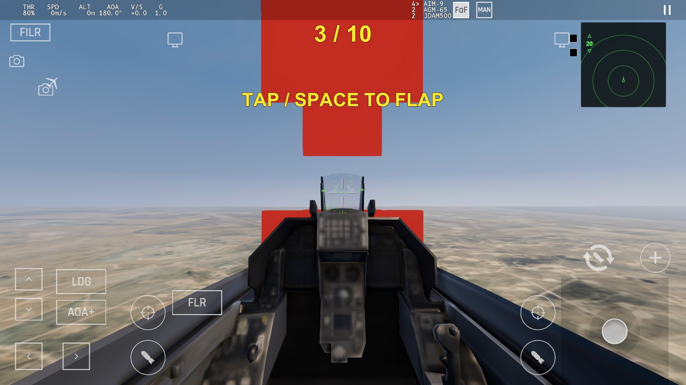

- Takes over the player's aircraft: the flight model is disabled and the Rigidbody set kinematic, then the script integrates its own motion.
- Gates are thin trigger cubes; touching a bar is a crash, passing the gap scores.
- One `tapped()` function reads keyboard, mouse and touchscreen.
- Contains an autopilot for automated testing (`__gameTest.start()`).

Aircraft player on Kuwait with a `Manual` win condition.

### Source

Raw file: [`src/FlappyJet.js`](examples/src/FlappyJet.js). Copy the whole file into the game (Mission Editor, Load, Paste from clipboard).

<details>
<summary>Full source</summary>

<!-- source: examples/src/FlappyJet.js -->
```js
// MissionFormatVersion: 1
// ============================================
// FLAPPY JET — flappy bird with a fighter jet.
//
// Pure-JS custom game: takes over the player aircraft (kinematic),
// tap/space to pitch up, fly through 10 gates to win, touch a bar = crash.
// Uses CS.* engine access + JsEventRelay only.
//
// Self-test: globalThis.__gameTest.start() enables an autopilot that
// steers through every gap — used by MET autoRun="jsgames".
// ============================================

const GATE_COUNT = 10;
const GATE_SPACING = 260;
const FIRST_GATE_DIST = 500;
const GAP_HEIGHT = 110;
const BAR_WIDTH = 160;
const BAR_THICK = 8;
const BAR_TALL = 400;
const SPEED = 55;
const GRAVITY = 60;
const JUMP_VY = 28;
const END_DELAY = 2.2;

async function Init() {
    mission.setPlayerType("Aircraft", 4);
    mission.setWinCondition("Manual");
    mission.setTime(9, 0);
    mission.setWeather("Clear Sky");
    await mission.loadMap("Kuwait");
}

function SpawnUnits() {
    if (!mission.isGameplay) return;
    setupFlappy();
}

function setupFlappy() {
    const UE = CS.UnityEngine;
    const $t = puer.$typeof;

    const state = {
        score: 0,
        crashed: false,
        won: false,
        testMode: false,
        // runtime instrumentation (JS-side, no interop cost)
        dist: 0,
        py: 0,
        updates: 0,
        barEvents: 0,
        gapEvents: 0,
        otherHits: 0
    };
    globalThis.__flappy = state;

    const test = {
        ready: false,
        done: false,
        passed: false,
        log: "",
        start: function () { state.testMode = true; test.log = "autopilot on"; }
    };
    globalThis.__gameTest = test;

    // ---------- root ----------
    const root = new UE.GameObject("FlappyRoot");
    if (CS.Stage.Instance) {
        root.transform.SetParent(CS.Stage.Instance.transform, false);
    }
    const relay = root.AddComponent($t(CS.JsEventRelay));

    // ---------- take over the player aircraft ----------
    const unit = CS.Player.instance.GetUnit();
    const mio = unit;
    // stop the real flight physics from fighting the flappy controller
    if (mio.aircraft) mio.aircraft.enabled = false;
    if (unit.rigidbody) {
        unit.rigidbody.isKinematic = true;
    }

    const startTr = CS.StageEnvironment.Instance.PlayerAircraftStartPosition;
    const spv = startTr.position;
    const sp = [spv.x, spv.y, spv.z];
    const fwv = startTr.forward;
    let fl = Math.sqrt(fwv.x * fwv.x + fwv.z * fwv.z);
    let fwd = [0, 0, 1];
    if (fl > 0.001) fwd = [fwv.x / fl, 0, fwv.z / fl];

    // plane state (JS-owned)
    let dist = 0;       // distance along fwd
    let py = sp[1];     // altitude
    let vy = 0;

    // ---------- gates ----------
    const shader = UE.Shader.Find("Sprites/Default");
    const matBar = new UE.Material(shader);
    matBar.color = new UE.Color(0.9, 0.25, 0.2, 1);

    const gaps = [];    // gap center Y per gate
    let gapY = sp[1];
    const gates = [];

    function makeBar(parent, cx, cy, cz, sy) {
        const bar = UE.GameObject.CreatePrimitive(UE.PrimitiveType.Cube);
        bar.name = "bar";
        bar.transform.SetParent(parent.transform, false);
        bar.transform.position = new UE.Vector3(cx, cy, cz);
        // face the corridor: wide across, tall, thin along path
        bar.transform.rotation = UE.Quaternion.LookRotation(new UE.Vector3(fwd[0], 0, fwd[2]));
        bar.transform.localScale = new UE.Vector3(BAR_WIDTH, sy, BAR_THICK);
        const col = bar.GetComponent($t(UE.BoxCollider));
        col.isTrigger = true;
        const rend = bar.GetComponent($t(UE.MeshRenderer));
        rend.sharedMaterial = matBar;
        rend.shadowCastingMode = UE.Rendering.ShadowCastingMode.Off;
        return bar;
    }

    for (let i = 0; i < GATE_COUNT; i++) {
        const d = FIRST_GATE_DIST + i * GATE_SPACING;
        gapY += (Math.random() - 0.5) * 90;
        const minY = sp[1] - 160;
        const maxY = sp[1] + 160;
        if (gapY < minY) gapY = minY;
        if (gapY > maxY) gapY = maxY;
        gaps.push(gapY);

        const cx = sp[0] + fwd[0] * d;
        const cz = sp[2] + fwd[2] * d;

        const gate = new UE.GameObject("Gate_" + i);
        gate.transform.SetParent(root.transform, false);

        const topBar = makeBar(gate, cx, gapY + GAP_HEIGHT / 2 + BAR_TALL / 2, cz, BAR_TALL);
        const botBar = makeBar(gate, cx, gapY - GAP_HEIGHT / 2 - BAR_TALL / 2, cz, BAR_TALL);

        const barRelayTop = topBar.AddComponent($t(CS.JsEventRelay));
        barRelayTop.onTriggerEnter = function (other) {
            state.barEvents++;
            if (isPlayer(other)) crash();
            else state.otherHits++;
        };
        const barRelayBot = botBar.AddComponent($t(CS.JsEventRelay));
        barRelayBot.onTriggerEnter = function (other) {
            state.barEvents++;
            if (isPlayer(other)) crash();
            else state.otherHits++;
        };

        // invisible gap sensor
        const sensor = new UE.GameObject("gap");
        sensor.transform.SetParent(gate.transform, false);
        sensor.transform.position = new UE.Vector3(cx, gapY, cz);
        sensor.transform.rotation = UE.Quaternion.LookRotation(new UE.Vector3(fwd[0], 0, fwd[2]));
        const scol = sensor.AddComponent($t(UE.BoxCollider));
        scol.isTrigger = true;
        scol.size = new UE.Vector3(BAR_WIDTH, GAP_HEIGHT, 6);
        const gateIndex = i;
        let counted = false;
        const srelay = sensor.AddComponent($t(CS.JsEventRelay));
        srelay.onTriggerEnter = function (other) {
            state.gapEvents++;
            if (counted) return;
            if (!isPlayer(other)) { state.otherHits++; return; }
            counted = true;
            pass(gateIndex);
        };

        gates.push(gate);
    }

    // ---------- HUD ----------
    const canvasGo = new UE.GameObject("FlappyHUD");
    canvasGo.transform.SetParent(root.transform, false);
    const canvas = canvasGo.AddComponent($t(UE.Canvas));
    canvas.renderMode = UE.RenderMode.ScreenSpaceOverlay;
    canvas.sortingOrder = 500;
    canvasGo.AddComponent($t(UE.UI.CanvasScaler));

    const font = UE.Resources.GetBuiltinResource($t(UE.Font), "LegacyRuntime.ttf");
    function makeText(name, x, y, w, h, size) {
        const go = new UE.GameObject(name);
        go.transform.SetParent(canvasGo.transform, false);
        const rt = go.AddComponent($t(UE.RectTransform));
        rt.anchorMin = new UE.Vector2(0.5, 1);
        rt.anchorMax = new UE.Vector2(0.5, 1);
        rt.pivot = new UE.Vector2(0.5, 1);
        rt.anchoredPosition = new UE.Vector2(x, y);
        rt.sizeDelta = new UE.Vector2(w, h);
        const text = go.AddComponent($t(UE.UI.Text));
        text.font = font;
        text.fontSize = size;
        text.fontStyle = UE.FontStyle.Bold;
        text.alignment = UE.TextAnchor.MiddleCenter;
        text.color = new UE.Color(1, 0.9, 0.2, 1);
        const outline = go.AddComponent($t(UE.UI.Outline));
        outline.effectColor = new UE.Color(0, 0, 0, 0.9);
        return text;
    }
    const scoreText = makeText("score", 0, -50, 700, 90, 64);
    const bigText = makeText("big", 0, -220, 900, 120, 52);
    scoreText.text = "0 / " + GATE_COUNT;
    bigText.text = "TAP / SPACE TO FLAP";

    // ---------- helpers ----------
    function isPlayer(other) {
        let t = other.transform;
        const rb = other.attachedRigidbody;
        if (rb) t = rb.transform;
        return t.root.GetInstanceID() === unit.transform.root.GetInstanceID();
    }

    function pass(i) {
        if (state.crashed || state.won) return;
        state.score++;
        scoreText.text = state.score + " / " + GATE_COUNT;
        if (state.score >= GATE_COUNT) {
            state.won = true;
            bigText.text = "CLEAR!";
            console.log("[Flappy] clear!");
            test.done = true;
            test.passed = true;
            test.log = "cleared " + state.score + " gates";
        }
    }

    function crash() {
        if (state.crashed || state.won) return;
        state.crashed = true;
        bigText.text = "CRASH!  " + state.score + " / " + GATE_COUNT;
        console.log("[Flappy] crash at score " + state.score);
        test.done = true;
        test.passed = false;
        test.log = "crashed at " + state.score;
    }

    // ---------- input ----------
    function tapped() {
        const kb = CS.UnityEngine.InputSystem.Keyboard.current;
        if (kb && kb.spaceKey.wasPressedThisFrame) return true;
        const mouse = CS.UnityEngine.InputSystem.Mouse.current;
        if (mouse && mouse.leftButton.wasPressedThisFrame) return true;
        const touch = CS.UnityEngine.InputSystem.Touchscreen.current;
        if (touch && touch.primaryTouch.press.wasPressedThisFrame) return true;
        return false;
    }

    // ---------- game loop ----------
    let started = false;
    let endTimer = 0;
    let endSent = false;

    relay.onUpdate = function (dt) {
        if (state.crashed || state.won) {
            endTimer += dt;
            if (!endSent && endTimer >= END_DELAY) {
                endSent = true;
                if (state.won) mission.win();
                else mission.fail();
            }
            return;
        }

        let speed = SPEED;
        if (state.testMode) {
            started = true;
            speed = SPEED * 2;
            // autopilot: track the current gap center
            let target = gaps[state.score];
            if (target === undefined) target = sp[1];
            py += (target - py) * Math.min(1, dt * 4);
            vy = 0;
        } else {
            if (tapped()) {
                started = true;
                vy = JUMP_VY;
                if (bigText.text.length > 6) bigText.text = "";
            }
            if (started) {
                vy -= GRAVITY * dt;
                py += vy * dt;
            }
        }

        if (started) dist += speed * dt;

        // Autopilot only: distance-based pass fallback. At low editor FPS the kinematic
        // teleport steps can tunnel straight through the 6m-deep gap trigger, the score
        // never advances, and the autopilot keeps flying at a stale gap height into a bar.
        if (state.testMode) {
            const gateDist = FIRST_GATE_DIST + state.score * GATE_SPACING;
            if (dist > gateDist + 5) pass(state.score);
        }

        // altitude floor/ceiling = crash
        if (py < sp[1] - 260 || py > sp[1] + 260) {
            crash();
        }

        const nx = sp[0] + fwd[0] * dist;
        const nz = sp[2] + fwd[2] * dist;
        const pos = new UE.Vector3(nx, py, nz);
        unit.transform.position = pos;
        if (unit.rigidbody) unit.rigidbody.position = pos;

        state.dist = dist;
        state.py = py;
        state.updates++;

        // pitch follows vertical velocity
        let pitch = -vy * 1.2;
        if (pitch > 45) pitch = 45;
        if (pitch < -60) pitch = -60;
        const look = UE.Quaternion.LookRotation(new UE.Vector3(fwd[0], 0, fwd[2]));
        unit.transform.rotation = look * UE.Quaternion.Euler(pitch, 0, 0);
    };

    test.ready = true;
    console.log("[Flappy] ready — " + GATE_COUNT + " gates");
}
```
<!-- /source -->

</details>


---

## C-RAM Golf

Three holes on Mostar. Aim with the normal turret camera, hold a power meter, and launch a bouncy physics ball at the flag.

<!-- screenshot: example-cram-golf.jpg -->
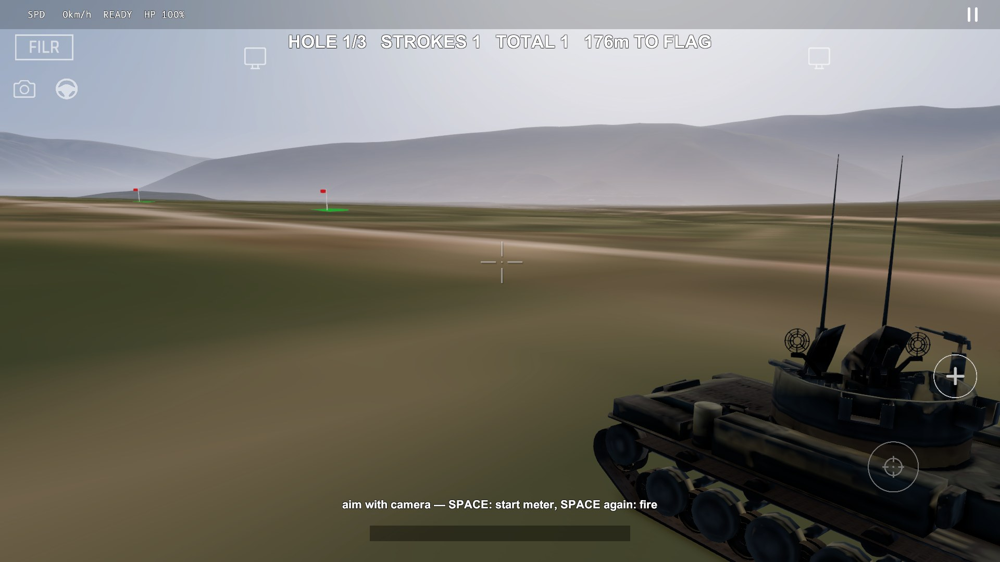

- A real physics ball: primitive sphere with Rigidbody, physics material and continuous collision.
- Aiming reads `Camera.main.transform.forward`.
- A UGUI power bar whose fill width is driven from `onUpdate`.
- Hole detection is 'ball stopped within 10 m of the flag' rather than a trigger.

Ground player, `Manual` win condition; finishing all holes wins.

### Source

Raw file: [`src/CRAMGolf.js`](examples/src/CRAMGolf.js). Copy the whole file into the game (Mission Editor, Load, Paste from clipboard).

<details>
<summary>Full source</summary>

<!-- source: examples/src/CRAMGolf.js -->
```js
// MissionFormatVersion: 1
// ============================================
// C-RAM GOLF — golf, but the ball is launched from your gun position.
//
// Pure-JS custom game. 3 holes on Mostar terrain. Aim with the normal
// CIWS camera, press SPACE to start the power meter, SPACE again to fire.
// Ball is a JS-spawned physics sphere (bouncy). Ball stops within 10m of
// the flag = holed. Fewest total strokes; finishing always wins the round.
//
// Self-test hook: __gameTest.start() — one real launch, then teleports
// the ball onto each green to verify hole detection / progression / win.
// ============================================

const HOLE_COUNT = 3;
const HOLE_RADIUS = 10;
const MAX_POWER_MS = 110;    // launch speed at 100% power (m/s)
const LOFT = 0.5;            // upward bias added to aim direction
const STOP_SPEED = 0.8;
const STOP_TIME = 1.2;
const END_DELAY = 3.0;

async function Init() {
    mission.setPlayerType("Ground", 1);
    mission.setWinCondition("Manual");
    mission.setTime(15, 0);
    mission.setWeather("Clear Sky");
    await mission.loadMap("Mostar");
}

function SpawnUnits() {
    if (!mission.isGameplay) return;
    setupGolf();
}

function setupGolf() {
    const UE = CS.UnityEngine;
    const $t = puer.$typeof;

    const state = {
        hole: 0,
        strokes: 0,
        totalStrokes: 0,
        finished: false,
        charging: false,
        power: 0,
        testMode: false
    };
    globalThis.__golf = state;

    const test = {
        ready: false,
        done: false,
        passed: false,
        log: "",
        start: function () { state.testMode = true; testPhase = 0; test.log = "test started"; }
    };
    globalThis.__gameTest = test;
    let testPhase = -1;
    let testTimer = 0;

    // ---------- root ----------
    const root = new UE.GameObject("GolfRoot");
    if (CS.Stage.Instance) {
        root.transform.SetParent(CS.Stage.Instance.transform, false);
    }
    const relay = root.AddComponent($t(CS.JsEventRelay));

    const shader = UE.Shader.Find("Sprites/Default");
    function makeMat(r, g, b) {
        const m = new UE.Material(shader);
        m.color = new UE.Color(r, g, b, 1);
        return m;
    }
    const matGreen = makeMat(0.2, 0.75, 0.25);
    const matPole = makeMat(0.9, 0.9, 0.9);
    const matFlag = makeMat(0.95, 0.15, 0.15);
    const matBall = makeMat(1, 1, 1);

    // ---------- course ----------
    const startTr = CS.StageEnvironment.Instance.PlayerGroundStartPosition;
    const spv = startTr.position;
    const tee = [spv.x, spv.y + 2, spv.z];
    const fwv = startTr.forward;
    let fl = Math.sqrt(fwv.x * fwv.x + fwv.z * fwv.z);
    let fwd = [0, 0, 1];
    if (fl > 0.001) fwd = [fwv.x / fl, 0, fwv.z / fl];

    // hole layout: rotate direction a bit per hole, growing distance
    const holes = [];
    const angles = [-20, 15, -5];
    const dists = [280, 380, 500];
    for (let i = 0; i < HOLE_COUNT; i++) {
        const a = angles[i] * Math.PI / 180;
        const dx = fwd[0] * Math.cos(a) - fwd[2] * Math.sin(a);
        const dz = fwd[0] * Math.sin(a) + fwd[2] * Math.cos(a);
        const hx = tee[0] + dx * dists[i];
        const hz = tee[2] + dz * dists[i];
        const hy = mission.getTerrainHeight(hx, hz);
        holes.push([hx, hy, hz]);
    }

    function buildFlag(i) {
        const h = holes[i];
        const flagRoot = new UE.GameObject("Hole_" + i);
        flagRoot.transform.SetParent(root.transform, false);
        flagRoot.transform.position = new UE.Vector3(h[0], h[1], h[2]);

        const green = UE.GameObject.CreatePrimitive(UE.PrimitiveType.Cylinder);
        green.transform.SetParent(flagRoot.transform, false);
        green.transform.localPosition = new UE.Vector3(0, 0.1, 0);
        green.transform.localScale = new UE.Vector3(HOLE_RADIUS * 2, 0.1, HOLE_RADIUS * 2);
        UE.Object.Destroy(green.GetComponent($t(UE.CapsuleCollider)));
        green.GetComponent($t(UE.MeshRenderer)).sharedMaterial = matGreen;

        const pole = UE.GameObject.CreatePrimitive(UE.PrimitiveType.Cylinder);
        pole.transform.SetParent(flagRoot.transform, false);
        pole.transform.localPosition = new UE.Vector3(0, 5, 0);
        pole.transform.localScale = new UE.Vector3(0.4, 5, 0.4);
        UE.Object.Destroy(pole.GetComponent($t(UE.CapsuleCollider)));
        pole.GetComponent($t(UE.MeshRenderer)).sharedMaterial = matPole;

        const flag = UE.GameObject.CreatePrimitive(UE.PrimitiveType.Cube);
        flag.transform.SetParent(flagRoot.transform, false);
        flag.transform.localPosition = new UE.Vector3(1.6, 9, 0);
        flag.transform.localScale = new UE.Vector3(3, 1.8, 0.1);
        UE.Object.Destroy(flag.GetComponent($t(UE.BoxCollider)));
        flag.GetComponent($t(UE.MeshRenderer)).sharedMaterial = matFlag;

        return flagRoot;
    }
    const flagObjects = [];
    for (let i = 0; i < HOLE_COUNT; i++) flagObjects.push(buildFlag(i));

    // ---------- ball ----------
    const ball = UE.GameObject.CreatePrimitive(UE.PrimitiveType.Sphere);
    ball.name = "GolfBall";
    ball.transform.SetParent(root.transform, false);
    ball.transform.position = new UE.Vector3(tee[0], tee[1], tee[2]);
    ball.transform.localScale = new UE.Vector3(1.6, 1.6, 1.6);
    ball.GetComponent($t(UE.MeshRenderer)).sharedMaterial = matBall;
    const ballCol = ball.GetComponent($t(UE.SphereCollider));
    try {
        const pm = new UE.PhysicsMaterial();
        pm.bounciness = 0.45;
        pm.dynamicFriction = 0.6;
        pm.staticFriction = 0.6;
        ballCol.material = pm;
    } catch (e) {
        console.log("[Golf] physics material unavailable: " + e);
    }
    const ballRb = ball.AddComponent($t(UE.Rigidbody));
    ballRb.mass = 1;
    ballRb.collisionDetectionMode = UE.CollisionDetectionMode.ContinuousDynamic;
    ballRb.isKinematic = true;   // parked until first stroke

    // ---------- HUD ----------
    const canvasGo = new UE.GameObject("GolfHUD");
    canvasGo.transform.SetParent(root.transform, false);
    const canvas = canvasGo.AddComponent($t(UE.Canvas));
    canvas.renderMode = UE.RenderMode.ScreenSpaceOverlay;
    canvas.sortingOrder = 500;
    canvasGo.AddComponent($t(UE.UI.CanvasScaler));

    const font = UE.Resources.GetBuiltinResource($t(UE.Font), "LegacyRuntime.ttf");
    function makeText(name, x, y, w, h, size, anchorTop) {
        const go = new UE.GameObject(name);
        go.transform.SetParent(canvasGo.transform, false);
        const rt = go.AddComponent($t(UE.RectTransform));
        let ay = 0;
        if (anchorTop) ay = 1;
        rt.anchorMin = new UE.Vector2(0.5, ay);
        rt.anchorMax = new UE.Vector2(0.5, ay);
        rt.pivot = new UE.Vector2(0.5, ay);
        rt.anchoredPosition = new UE.Vector2(x, y);
        rt.sizeDelta = new UE.Vector2(w, h);
        const text = go.AddComponent($t(UE.UI.Text));
        text.font = font;
        text.fontSize = size;
        text.fontStyle = UE.FontStyle.Bold;
        text.alignment = UE.TextAnchor.MiddleCenter;
        text.color = new UE.Color(1, 1, 1, 1);
        const outline = go.AddComponent($t(UE.UI.Outline));
        outline.effectColor = new UE.Color(0, 0, 0, 0.9);
        return text;
    }
    const infoText = makeText("info", 0, -50, 900, 60, 34, true);
    const bigText = makeText("big", 0, -160, 900, 100, 48, true);
    const helpText = makeText("help", 0, 90, 900, 40, 22, false);
    helpText.text = "aim with camera — SPACE: start meter, SPACE again: fire";

    // power bar
    const barBg = new UE.GameObject("powerBg");
    barBg.transform.SetParent(canvasGo.transform, false);
    const bgRt = barBg.AddComponent($t(UE.RectTransform));
    bgRt.anchorMin = new UE.Vector2(0.5, 0);
    bgRt.anchorMax = new UE.Vector2(0.5, 0);
    bgRt.pivot = new UE.Vector2(0.5, 0);
    bgRt.anchoredPosition = new UE.Vector2(0, 40);
    bgRt.sizeDelta = new UE.Vector2(500, 30);
    barBg.AddComponent($t(UE.UI.Image)).color = new UE.Color(0, 0, 0, 0.6);

    const barFill = new UE.GameObject("powerFill");
    barFill.transform.SetParent(barBg.transform, false);
    const fillRt = barFill.AddComponent($t(UE.RectTransform));
    fillRt.anchorMin = new UE.Vector2(0, 0.5);
    fillRt.anchorMax = new UE.Vector2(0, 0.5);
    fillRt.pivot = new UE.Vector2(0, 0.5);
    fillRt.anchoredPosition = new UE.Vector2(2, 0);
    fillRt.sizeDelta = new UE.Vector2(0, 24);
    const fillImg = barFill.AddComponent($t(UE.UI.Image));
    fillImg.color = new UE.Color(1, 0.8, 0.1, 1);

    function updateHud() {
        const h = holes[state.hole];
        const bp = ball.transform.position;
        const dx = bp.x - h[0];
        const dz = bp.z - h[2];
        const d = Math.sqrt(dx * dx + dz * dz);
        infoText.text = "HOLE " + (state.hole + 1) + "/" + HOLE_COUNT
            + "   STROKES " + state.strokes
            + "   TOTAL " + state.totalStrokes
            + "   " + d.toFixed(0) + "m TO FLAG";
    }

    // ---------- stroke logic ----------
    let stopTimer = 0;
    let inFlight = false;
    let endTimer = 0;
    let endSent = false;

    function fire(dir, power) {
        state.strokes++;
        state.totalStrokes++;
        ballRb.isKinematic = false;
        const speed = power / 100 * MAX_POWER_MS;
        const up = LOFT;
        let vx = dir[0];
        let vz = dir[2];
        const l = Math.sqrt(vx * vx + vz * vz);
        if (l > 0.001) { vx /= l; vz /= l; }
        const norm = Math.sqrt(1 + up * up);
        ballRb.linearVelocity = new UE.Vector3(
            vx / norm * speed, up / norm * speed, vz / norm * speed);
        inFlight = true;
        stopTimer = 0;
        bigText.text = "";
        updateHud();
        console.log("[Golf] stroke " + state.strokes + " power " + power.toFixed(0));
    }

    function ballStopped() {
        inFlight = false;
        const h = holes[state.hole];
        const bp = ball.transform.position;
        const dx = bp.x - h[0];
        const dz = bp.z - h[2];
        const d = Math.sqrt(dx * dx + dz * dz);
        if (d <= HOLE_RADIUS) {
            holed();
        } else {
            bigText.text = d.toFixed(0) + "m to flag — shoot again";
        }
        updateHud();
    }

    function holed() {
        console.log("[Golf] hole " + (state.hole + 1) + " done in " + state.strokes);
        flagObjects[state.hole].SetActive(false);
        state.hole++;
        if (state.hole >= HOLE_COUNT) {
            state.finished = true;
            bigText.text = "FINISH!  " + state.totalStrokes + " STROKES";
            test.done = true;
            test.passed = true;
            test.log = "finished in " + state.totalStrokes + " strokes";
            return;
        }
        state.strokes = 0;
        bigText.text = "HOLE " + (state.hole + 1) + "!";
        // next tee = where the previous flag stood
        const prev = holes[state.hole - 1];
        ballRb.isKinematic = true;
        const pos = new UE.Vector3(prev[0], prev[1] + 2, prev[2]);
        ball.transform.position = pos;
        updateHud();
    }

    // ---------- input ----------
    function spacePressed() {
        const kb = CS.UnityEngine.InputSystem.Keyboard.current;
        if (kb && kb.spaceKey.wasPressedThisFrame) return true;
        return false;
    }

    // ---------- game loop ----------
    relay.onUpdate = function (dt) {
        if (state.finished) {
            endTimer += dt;
            if (!endSent && endTimer >= END_DELAY) {
                endSent = true;
                mission.win();
            }
            return;
        }

        // test autopilot
        if (state.testMode) {
            testTimer += dt;
            if (testPhase === 0 && testTimer > 1) {
                // one real launch toward hole 1 (verifies physics + stroke count)
                const h = holes[0];
                const bp = ball.transform.position;
                fire([h[0] - bp.x, 0, h[2] - bp.z], 60);
                testPhase = 1;
                testTimer = 0;
            } else if (testPhase === 1 && testTimer > 4) {
                // physics sanity: the launched ball must have left the tee
                const bp = ball.transform.position;
                const dx = bp.x - tee[0];
                const dz = bp.z - tee[2];
                const moved = Math.sqrt(dx * dx + dz * dz);
                if (moved < 20) {
                    test.done = true;
                    test.passed = false;
                    test.log = "ball did not fly (moved " + moved.toFixed(1) + "m)";
                } else {
                    test.log = "launch flew " + moved.toFixed(0) + "m";
                    testPhase = 2;
                }
                testTimer = 0;
            } else if (testPhase === 2 && testTimer > 1.5) {
                // deterministic hole progression: physics randomness (slopes,
                // water) must not decide the test — call the hole logic directly
                testTimer = 0;
                ballRb.isKinematic = true;
                inFlight = false;
                holed();
            }
        } else {
            if (!inFlight) {
                if (state.charging) {
                    state.power += dt * 90;
                    if (state.power > 100) state.power = 100;
                    fillRt.sizeDelta = new UE.Vector2(state.power / 100 * 496, 24);
                    if (spacePressed()) {
                        state.charging = false;
                        const cam = UE.Camera.main;
                        let dir = [fwd[0], 0, fwd[2]];
                        if (cam) {
                            const cf = cam.transform.forward;
                            dir = [cf.x, 0, cf.z];
                        }
                        fire(dir, state.power);
                        fillRt.sizeDelta = new UE.Vector2(0, 24);
                    }
                } else if (spacePressed()) {
                    state.charging = true;
                    state.power = 0;
                }
            }
        }

        // stop detection
        if (inFlight) {
            const v = ballRb.linearVelocity;
            const speed = Math.sqrt(v.x * v.x + v.y * v.y + v.z * v.z);
            if (speed < STOP_SPEED) {
                stopTimer += dt;
                if (stopTimer > STOP_TIME) ballStopped();
            } else {
                stopTimer = 0;
            }
            // fell off the world
            if (ball.transform.position.y < -50) {
                const h = holes[state.hole];
                ballRb.linearVelocity = new UE.Vector3(0, 0, 0);
                ballRb.position = new UE.Vector3(h[0], h[1] + 3, h[2]);
            }
            updateHud();
        }
    };

    updateHud();
    test.ready = true;
    console.log("[Golf] course ready — " + HOLE_COUNT + " holes from ("
        + tee[0].toFixed(0) + "," + tee[1].toFixed(0) + "," + tee[2].toFixed(0) + ")");
}
```
<!-- /source -->

</details>


---

## 1942 Shooter

A top-down arcade shooter rendered by an overlay camera 3 km above the map. Twenty kills win; three lives.

<!-- screenshot: example-shooter-1942.jpg -->
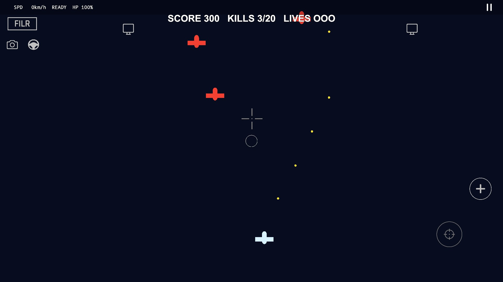

- Builds its own orthographic camera with a higher depth than the game camera.
- Player ship, enemies and bullets are primitive shapes from a pool, moved by transform writes only.
- All collision is JS math on arrays; no colliders or physics.
- Shows how to keep interop cost low in a busy game.

The world underneath keeps running but is never seen.

### Source

Raw file: [`src/Shooter1942.js`](examples/src/Shooter1942.js). Copy the whole file into the game (Mission Editor, Load, Paste from clipboard).

<details>
<summary>Full source</summary>

<!-- source: examples/src/Shooter1942.js -->
```js
// MissionFormatVersion: 1
// ============================================
// 1942 — top-down arcade shooter inside the flight game.
//
// Pure-JS custom game. Builds its own orthographic overlay camera
// (renders on top of the normal game camera), a primitive-built player
// ship, enemy waves and bullets at y=3000, with ALL game logic and
// collision math in JS (no physics, no colliders — positions live in
// JS arrays, only transform writes cross the interop boundary).
//
// Controls: arrow keys to move, auto-fire. 20 kills to win, 3 lives.
// Self-test: __gameTest.start() → fast spawns + aim-assist autopilot.
// ============================================

const FIELD_Y = 3000;
const HALF_W = 52;          // playfield half width (x)
const TOP_Z = 65;
const BOT_Z = -65;
const SHIP_SPEED = 45;
const BULLET_SPEED = 90;
const FIRE_INTERVAL = 0.18;
const SPAWN_INTERVAL = 1.1;
const KILL_TARGET = 20;
const START_LIVES = 3;
const END_DELAY = 2.5;

async function Init() {
    mission.setPlayerType("Ground", 1);
    mission.setWinCondition("Manual");
    mission.setTime(12, 0);
    mission.setWeather("Clear Sky");
    await mission.loadMap("Kuwait");
}

function SpawnUnits() {
    if (!mission.isGameplay) return;
    setup1942();
}

function setup1942() {
    const UE = CS.UnityEngine;
    const $t = puer.$typeof;

    const state = {
        score: 0,
        kills: 0,
        lives: START_LIVES,
        won: false,
        dead: false,
        testMode: false
    };
    globalThis.__s1942 = state;

    const test = {
        ready: false,
        done: false,
        passed: false,
        log: "",
        start: function () { state.testMode = true; test.log = "autopilot on"; }
    };
    globalThis.__gameTest = test;

    // ---------- root ----------
    const root = new UE.GameObject("Arcade1942Root");
    if (CS.Stage.Instance) {
        root.transform.SetParent(CS.Stage.Instance.transform, false);
    }
    const relay = root.AddComponent($t(CS.JsEventRelay));

    // ---------- overlay camera ----------
    const camGo = new UE.GameObject("ArcadeCam");
    camGo.transform.SetParent(root.transform, false);
    camGo.transform.position = new UE.Vector3(0, FIELD_Y + 100, 0);
    camGo.transform.rotation = UE.Quaternion.Euler(90, 0, 0);
    const cam = camGo.AddComponent($t(UE.Camera));
    cam.orthographic = true;
    cam.orthographicSize = 70;
    cam.nearClipPlane = 1;
    cam.farClipPlane = 300;
    cam.depth = 99;
    cam.clearFlags = UE.CameraClearFlags.SolidColor;
    cam.backgroundColor = new UE.Color(0.03, 0.05, 0.12, 1);

    // ---------- materials ----------
    const shader = UE.Shader.Find("Sprites/Default");
    function makeMat(r, g, b) {
        const m = new UE.Material(shader);
        m.color = new UE.Color(r, g, b, 1);
        return m;
    }
    const matShip = makeMat(0.85, 0.95, 1);
    const matEnemy = makeMat(0.95, 0.25, 0.2);
    const matBullet = makeMat(1, 0.9, 0.2);

    function stripCollider(go) {
        const cap = go.GetComponent($t(UE.CapsuleCollider));
        if (cap) UE.Object.Destroy(cap);
        const box = go.GetComponent($t(UE.BoxCollider));
        if (box) UE.Object.Destroy(box);
        const sph = go.GetComponent($t(UE.SphereCollider));
        if (sph) UE.Object.Destroy(sph);
    }

    function makePlane(mat, big) {
        const p = new UE.GameObject("plane");
        p.transform.SetParent(root.transform, false);

        const body = UE.GameObject.CreatePrimitive(UE.PrimitiveType.Capsule);
        body.transform.SetParent(p.transform, false);
        body.transform.localRotation = UE.Quaternion.Euler(90, 0, 0);
        body.transform.localScale = new UE.Vector3(2.4, 3.2, 2.4);
        stripCollider(body);
        body.GetComponent($t(UE.MeshRenderer)).sharedMaterial = mat;

        const wings = UE.GameObject.CreatePrimitive(UE.PrimitiveType.Cube);
        wings.transform.SetParent(p.transform, false);
        let wingZ = -0.8;
        if (big) wingZ = 0.8;
        wings.transform.localPosition = new UE.Vector3(0, 0, wingZ);
        wings.transform.localScale = new UE.Vector3(9, 0.7, 2.2);
        stripCollider(wings);
        wings.GetComponent($t(UE.MeshRenderer)).sharedMaterial = mat;

        return p;
    }

    // ---------- player ship ----------
    const ship = makePlane(matShip, false);
    let shipX = 0;
    let shipZ = -48;
    let invuln = 0;
    ship.transform.position = new UE.Vector3(shipX, FIELD_Y, shipZ);

    // ---------- pools ----------
    const bullets = [];
    for (let i = 0; i < 24; i++) {
        const b = UE.GameObject.CreatePrimitive(UE.PrimitiveType.Sphere);
        b.transform.SetParent(root.transform, false);
        b.transform.localScale = new UE.Vector3(1.1, 1.1, 1.1);
        stripCollider(b);
        b.GetComponent($t(UE.MeshRenderer)).sharedMaterial = matBullet;
        b.SetActive(false);
        bullets.push({ go: b, x: 0, z: 0, active: false });
    }

    const enemies = [];
    for (let i = 0; i < 16; i++) {
        const e = makePlane(matEnemy, true);
        e.transform.rotation = UE.Quaternion.Euler(0, 180, 0);
        e.SetActive(false);
        enemies.push({ go: e, x: 0, z: 0, speed: 0, drift: 0, phase: 0, active: false });
    }

    // ---------- HUD ----------
    const canvasGo = new UE.GameObject("ArcadeHUD");
    canvasGo.transform.SetParent(root.transform, false);
    const canvas = canvasGo.AddComponent($t(UE.Canvas));
    canvas.renderMode = UE.RenderMode.ScreenSpaceOverlay;
    canvas.sortingOrder = 500;
    canvasGo.AddComponent($t(UE.UI.CanvasScaler));

    const font = UE.Resources.GetBuiltinResource($t(UE.Font), "LegacyRuntime.ttf");
    function makeText(name, x, y, w, h, size) {
        const go = new UE.GameObject(name);
        go.transform.SetParent(canvasGo.transform, false);
        const rt = go.AddComponent($t(UE.RectTransform));
        rt.anchorMin = new UE.Vector2(0.5, 1);
        rt.anchorMax = new UE.Vector2(0.5, 1);
        rt.pivot = new UE.Vector2(0.5, 1);
        rt.anchoredPosition = new UE.Vector2(x, y);
        rt.sizeDelta = new UE.Vector2(w, h);
        const text = go.AddComponent($t(UE.UI.Text));
        text.font = font;
        text.fontSize = size;
        text.fontStyle = UE.FontStyle.Bold;
        text.alignment = UE.TextAnchor.MiddleCenter;
        text.color = new UE.Color(1, 1, 1, 1);
        const outline = go.AddComponent($t(UE.UI.Outline));
        outline.effectColor = new UE.Color(0, 0, 0, 0.9);
        return text;
    }
    const scoreText = makeText("score", 0, -40, 800, 60, 36);
    const bigText = makeText("big", 0, -240, 900, 120, 56);

    function updateHud() {
        let hearts = "";
        for (let i = 0; i < state.lives; i++) hearts += "O";
        scoreText.text = "SCORE " + state.score + "   KILLS " + state.kills + "/" + KILL_TARGET
            + "   LIVES " + hearts;
    }

    // ---------- spawn / fire ----------
    function spawnEnemy() {
        for (let i = 0; i < enemies.length; i++) {
            const e = enemies[i];
            if (e.active) continue;
            e.active = true;
            e.x = (Math.random() * 2 - 1) * (HALF_W - 6);
            e.z = TOP_Z;
            e.speed = 16 + Math.random() * 12;
            e.drift = (Math.random() * 2 - 1) * 8;
            e.phase = Math.random() * 6.28;
            e.go.SetActive(true);
            e.go.transform.position = new UE.Vector3(e.x, FIELD_Y, e.z);
            return;
        }
    }

    function fireBullet() {
        for (let i = 0; i < bullets.length; i++) {
            const b = bullets[i];
            if (b.active) continue;
            b.active = true;
            b.x = shipX;
            b.z = shipZ + 4;
            b.go.SetActive(true);
            b.go.transform.position = new UE.Vector3(b.x, FIELD_Y, b.z);
            return;
        }
    }

    function killEnemy(e) {
        e.active = false;
        e.go.SetActive(false);
        state.kills++;
        state.score += 100;
        updateHud();
        if (state.kills >= KILL_TARGET && !state.won && !state.dead) {
            state.won = true;
            bigText.text = "STAGE CLEAR!";
            test.done = true;
            test.passed = true;
            test.log = "cleared with score " + state.score;
            console.log("[1942] clear — score " + state.score);
        }
    }

    function hitPlayer(e) {
        e.active = false;
        e.go.SetActive(false);
        if (state.testMode) return;
        state.lives--;
        invuln = 2;
        updateHud();
        if (state.lives <= 0 && !state.dead && !state.won) {
            state.dead = true;
            bigText.text = "GAME OVER";
            test.done = true;
            test.passed = false;
            test.log = "died at " + state.kills + " kills";
            console.log("[1942] game over");
        }
    }

    // ---------- game loop ----------
    let fireTimer = 0;
    let spawnTimer = 0;
    let time = 0;
    let endTimer = 0;
    let endSent = false;

    relay.onUpdate = function (dt) {
        if (state.won || state.dead) {
            endTimer += dt;
            if (!endSent && endTimer >= END_DELAY) {
                endSent = true;
                if (state.won) mission.win();
                else mission.fail();
            }
            return;
        }

        time += dt;
        if (invuln > 0) invuln -= dt;

        // --- input / autopilot ---
        if (state.testMode) {
            // aim assist: track nearest active enemy x
            let best = null;
            let bestZ = 999;
            for (let i = 0; i < enemies.length; i++) {
                const e = enemies[i];
                if (e.active && e.z < bestZ) { bestZ = e.z; best = e; }
            }
            if (best) {
                const diff = best.x - shipX;
                let step = SHIP_SPEED * dt;
                if (Math.abs(diff) < step) step = Math.abs(diff);
                if (diff > 0) shipX += step;
                else shipX -= step;
            }
        } else {
            const kb = CS.UnityEngine.InputSystem.Keyboard.current;
            if (kb) {
                if (kb.leftArrowKey.isPressed) shipX -= SHIP_SPEED * dt;
                if (kb.rightArrowKey.isPressed) shipX += SHIP_SPEED * dt;
                if (kb.upArrowKey.isPressed) shipZ += SHIP_SPEED * dt;
                if (kb.downArrowKey.isPressed) shipZ -= SHIP_SPEED * dt;
            }
        }
        if (shipX < -HALF_W) shipX = -HALF_W;
        if (shipX > HALF_W) shipX = HALF_W;
        if (shipZ < BOT_Z + 6) shipZ = BOT_Z + 6;
        if (shipZ > 20) shipZ = 20;
        ship.transform.position = new UE.Vector3(shipX, FIELD_Y, shipZ);

        // --- auto fire ---
        fireTimer += dt;
        if (fireTimer >= FIRE_INTERVAL) {
            fireTimer = 0;
            fireBullet();
        }

        // --- spawns ---
        spawnTimer += dt;
        let interval = SPAWN_INTERVAL;
        if (state.testMode) interval = 0.35;
        if (spawnTimer >= interval) {
            spawnTimer = 0;
            spawnEnemy();
        }

        // --- bullets ---
        for (let i = 0; i < bullets.length; i++) {
            const b = bullets[i];
            if (!b.active) continue;
            b.z += BULLET_SPEED * dt;
            if (b.z > TOP_Z) {
                b.active = false;
                b.go.SetActive(false);
                continue;
            }
            b.go.transform.position = new UE.Vector3(b.x, FIELD_Y, b.z);
        }

        // --- enemies + collisions (all JS math) ---
        for (let i = 0; i < enemies.length; i++) {
            const e = enemies[i];
            if (!e.active) continue;
            e.z -= e.speed * dt;
            e.x += Math.sin(time * 1.5 + e.phase) * e.drift * dt;
            if (e.x < -HALF_W) e.x = -HALF_W;
            if (e.x > HALF_W) e.x = HALF_W;
            if (e.z < BOT_Z) {
                e.active = false;
                e.go.SetActive(false);
                continue;
            }

            // bullet hits
            let killed = false;
            for (let j = 0; j < bullets.length; j++) {
                const b = bullets[j];
                if (!b.active) continue;
                const dx = b.x - e.x;
                const dz = b.z - e.z;
                if (dx * dx + dz * dz < 12) {
                    b.active = false;
                    b.go.SetActive(false);
                    killEnemy(e);
                    killed = true;
                    break;
                }
            }
            if (killed) continue;

            // player hit
            if (invuln <= 0) {
                const dx = e.x - shipX;
                const dz = e.z - shipZ;
                if (dx * dx + dz * dz < 20) {
                    hitPlayer(e);
                    continue;
                }
            }

            e.go.transform.position = new UE.Vector3(e.x, FIELD_Y, e.z);
        }
    };

    updateHud();
    bigText.text = "";
    test.ready = true;
    console.log("[1942] arcade ready — " + KILL_TARGET + " kills to win");
}
```
<!-- /source -->

</details>


---

## Recipes

Short, copy-ready pieces that the examples use. Each assumes the usual
prelude inside a gameplay-only setup function:

```js
const UE = CS.UnityEngine;
const $t = puer.$typeof;
const root = new UE.GameObject("Root");
root.transform.SetParent(CS.Stage.Instance.transform, false);
const relay = root.AddComponent($t(CS.JsEventRelay));
```

### Delays and timers

```js
let elapsed = 0;
let nextAt = 5;
relay.onUpdate = function (dt) {
    elapsed += dt;
    if (elapsed >= nextAt) {
        nextAt = elapsed + 10;      // every 10 s
        doSomething();
    }
};
```

For a one-shot, set `nextAt = Infinity` after firing.

### Waves

Spawn a wave, wait until it is dead, spawn the next one. Drone Defense is the
full version.

```js
const WAVES = [["fpv-drone", "fpv-drone", "fpv-drone"], ["shahed-136", "shahed-136"]];
let wave = -1;
let alive = [];
let cooldown = 4;

function spawnWave() {
    wave++;
    alive = [];
    const p = mission.getPlayerPosition();
    for (let i = 0; i < WAVES[wave].length; i++) {
        const a = (i / WAVES[wave].length) * Math.PI * 2;
        const x = p.x + Math.cos(a) * 600;
        const z = p.z + Math.sin(a) * 600;
        const y = mission.getTerrainHeight(x, z) + 120;
        const rotY = Math.atan2(p.x - x, p.z - z) * 180 / Math.PI;
        const u = mission.spawnUnit(WAVES[wave][i], x, y, z, rotY, 2);
        if (u) alive.push(u);
    }
}

relay.onUpdate = function (dt) {
    if (cooldown > 0) {
        cooldown -= dt;
        if (cooldown <= 0) spawnWave();
        return;
    }
    let n = 0;
    for (let i = 0; i < alive.length; i++) if (alive[i] && alive[i].isAlive) n++;
    if (n === 0) {
        if (wave + 1 >= WAVES.length) { mission.win(); cooldown = Infinity; }
        else cooldown = 6;
    }
};
```

Use `mission.manual()` in `Init` for wave games; otherwise the round ends the
moment the first wave dies.

### Counting enemies and allies

```js
function countTeam(team, alive) {
    const units = CS.Stage.Instance.allUnits;
    let n = 0;
    for (let i = 0; i < units.Count; i++) {
        const u = units.get_Item(i);
        if (!u) continue;
        if (u.team !== team) continue;
        if (alive && !u.isAlive) continue;
        n++;
    }
    return n;
}
```

Poll this a few times per second, not every frame, when unit counts are
large.

### Detecting a death

There is no death callback for scripts. Keep the handles and poll `isAlive`:

```js
const watched = [];                       // fill with spawnUnit results
let lastAlive = watched.length;
relay.onUpdate = function (dt) {
    let n = 0;
    for (let i = 0; i < watched.length; i++) if (watched[i] && watched[i].isAlive) n++;
    if (n < lastAlive) { onSomeoneDied(lastAlive - n); lastAlive = n; }
};
```

### Killing a unit from script

```js
const killer = CS.Player.instance.GetUnit();
u.CurrentHp = 0;
u.Dead(killer);          // credited to the player, with the normal effects
```

### Teleporting

Write through the Rigidbody. Writing `transform.position` on a unit with
continuous collision sweeps it through everything in between and it dies to
terrain.

```js
const rb = unit.rigidbody;
rb.position = new UE.Vector3(x, y, z);
rb.rotation = UE.Quaternion.Euler(0, rotY, 0);
```

For the player there is `mission.movePlayer(x, y, z, rotY)`, which also keeps
the speed.

### Is this collider the player?

```js
function isPlayerCollider(other) {
    const u = CS.Player.instance.GetUnit();
    if (!u) return false;
    let t = other.transform;
    if (other.attachedRigidbody) t = other.attachedRigidbody.transform;
    return t.root.GetInstanceID() === u.transform.root.GetInstanceID();
}
```

### Trigger with a distance fallback

```js
const CENTER = [x, y, z];
const R = 60;
relay.onTriggerEnter = function (other) { if (isPlayerCollider(other)) pass("trigger"); };
managerRelay.onUpdate = function (dt) {
    const p = CS.Player.instance.GetUnit().transform.position;
    const dx = p.x - CENTER[0], dy = p.y - CENTER[1], dz = p.z - CENTER[2];
    if (dx * dx + dy * dy + dz * dz < R * R) pass("distance");
};
```

### Making enemy jets dogfight

```js
const airUnits = CS.Stage.Instance.airUnits;
const me = CS.Player.instance.GetUnit();
for (let i = 0; i < airUnits.Count; i++) {
    const u = airUnits.get_Item(i);
    if (!u || u === me) continue;
    const ai = u.transform.GetComponent($t(CS.FlightAIFighter));
    if (ai) { ai.combatMode = CS.CombatMode.Dogfight; ai.state = CS.FighterState.DogfightEngage; }
}
```

### Parking ground units and soldiers

```js
const v = mission.spawnUnit("humvee", x, y, z, 100, 1);
mission.setUnitHoldPosition(v, true);
```

### Taking over the player's aircraft

Flappy Jet turns the jet into a puppet:

```js
const unit = CS.Player.instance.GetUnit();
if (unit.aircraft) unit.aircraft.enabled = false;   // stop the flight model
unit.rigidbody.isKinematic = true;
relay.onUpdate = function (dt) {
    // integrate your own motion, then:
    unit.rigidbody.position = new UE.Vector3(px, py, pz);
    unit.rigidbody.rotation = UE.Quaternion.LookRotation(new UE.Vector3(fx, fy, fz));
};
```

### Keyboard, mouse and touch

```js
function tapped() {
    const kb = CS.UnityEngine.InputSystem.Keyboard.current;
    if (kb && kb.spaceKey.wasPressedThisFrame) return true;
    const mouse = CS.UnityEngine.InputSystem.Mouse.current;
    if (mouse && mouse.leftButton.wasPressedThisFrame) return true;
    const touch = CS.UnityEngine.InputSystem.Touchscreen.current;
    if (touch && touch.primaryTouch.press.wasPressedThisFrame) return true;
    return false;
}
```

Held keys: `kb.leftArrowKey.isPressed`. For repeat-while-held, keep your own
timer as Tetris does.

### Aiming with the player camera

```js
const cam = UE.Camera.main;
const f = cam.transform.forward;
let dir = [f.x, 0, f.z];          // flatten, then normalise in JS
```

### Ending the round

```js
let endTimer = 0, endSent = false;
relay.onUpdate = function (dt) {
    if (state.won || state.dead) {
        endTimer += dt;
        if (!endSent && endTimer >= 2.2) {     // let the player read the result
            endSent = true;
            if (state.won) mission.win(); else mission.fail();
        }
    }
};
```

### Self-test hook

The bundled mini-games expose `globalThis.__gameTest = { ready, done,
passed, log, start() }` so an automated harness can drive them. It is
optional and harmless; `start()` usually enables an autopilot. Copy the
pattern if you want your mission to be testable without a human.


---

## mission.* API

`mission` is the object the game hands to your script. Most calls behave
differently in the two passes (see [How a mission runs](#how-a-mission-runs)):
in the **parse pass** they record values, in the **gameplay pass** they act.

Coordinates are Unity world units (metres), Y up. `rotY` is a heading in
degrees around the vertical axis: `0` faces +Z, `90` faces +X. Vector results
are objects with `.x`, `.y`, `.z`.

### Setup (call in `Init`)

| Call | Description |
|------|-------------|
| `await loadMap(name)` | Loads the map scene. `name` is a map ID from [Maps](#maps-and-spawn-points). `"random"` picks one at random but cannot be opened in the Mission Editor. |
| `setTime(hours, minutes)` | Time of day, 24-hour clock. Recorded in the parse pass and applied when the round starts. Applies immediately when called in gameplay. |
| `setWeather(name)` | Weather preset by name; see [Time and weather](#time-and-weather). Same timing as `setTime`. |
| `setPlayerType(type, team = 4)` | The player's vehicle class: `"Ground"`, `"Aircraft"`, `"Helicopter"` or `"Ship"`. `team` is a [Team](#team) number. Write the arguments as literals. |
| `setPlayerStartPosition(type, x, y, z, rotY, slot = 0)` | Overrides the map's start position for that player type. `slot` is for multiplayer (below). |
| `setRevealAllEnemies(enabled)` | Whether every enemy is visible on the HUD and slewable by the targeting pod. Default **on**; call with `false` for hide-and-seek scenarios. |

The player type decides which of your vehicles you fly. The actual vehicle
is whatever the player has equipped for that class in the garage, unless you
spawn one with `isPlayer = true`.

### Win condition

| Call | Description |
|------|-------------|
| `setWinCondition(name)` | `"EliminateAllEnemies"`, `"SurviveForTime"` or `"Manual"`. Write the argument as a literal. |
| `eliminateAll()` | Same as `setWinCondition("EliminateAllEnemies")`. Win when no enemy unit is alive. |
| `survive(seconds)` | Win after surviving `seconds`. This is the only way to set the timer. |
| `manual()` | Same as `setWinCondition("Manual")`: the round only ends when you call `win()` or `fail()`. |
| `win()` | End the round as a victory. Gameplay pass only. |
| `fail()` | End the round as a defeat. Gameplay pass only. |
| `setSpectateOnDeath(enabled)` | Keep the round running after the player dies while teammates are alive; the camera spectates them and the match is decided by team elimination. Call in `SpawnUnits`; gameplay pass only. |

Losing is always possible regardless of the win condition: the player's unit
being destroyed ends the round unless `setSpectateOnDeath(true)` is active
and allies remain.

### Spawning

#### `spawnUnit(unitId, x, y, z, rotY = 0, team = 3, isPlayer = false, hpMultiplier = 1, speedMultiplier = 1, soldierWeapon = "", loadout = 0)`

Spawns a unit. Returns the unit (an `IUnit`, see
[Engine access](#units-iunit)) in the gameplay pass and `null` in
the parse pass.

| Parameter | Description |
|-----------|-------------|
| `unitId` | An ID from [Quick reference](#quick-reference). Unknown IDs log a warning and return `null`. IDs starting with `"Player "` are editor placeholders and are skipped. |
| `x, y, z` | World position. For ground units use `getTerrainHeight(x, z)` for `y`. Air units treat `y` as their patrol altitude (450 m minimum). |
| `rotY` | Heading in degrees. |
| `team` | [Team](#team) number. Default `3` (Red). |
| `isPlayer` | `true` seats the player in this unit, replacing the vehicle spawned for the player type. |
| `hpMultiplier` | Scales max and current HP. Has no effect on the player's own unit. |
| `speedMultiplier` | Aircraft only: scales top speed. |
| `soldierWeapon` | Infantry only: weapon IDs, comma separated (`"ak"`, `"stinger"`, `"fpv-drone"`, `"ak,fpv-drone"`). |
| `loadout` | Aircraft with hardpoints: `LOADOUT.AIR_TO_AIR`, `LOADOUT.AIR_TO_GROUND` or `LOADOUT.MULTIROLE` from Common.js. `0` (omitted) keeps the factory armament; for the player it also lets the game auto-pick a loadout from the enemy composition. |

```js
const jet = mission.spawnUnit("f-15", 200, 1350, 4150, 0, 3, false, 1.0, 1.0, "", LOADOUT.AIR_TO_AIR);
const me = mission.spawnUnit("soldier", px, py, pz, 0, 1, true, 1.0, 1.0, "ak,fpv-drone");
```

#### `spawnObject(objectId, x, y, z, rotY = 0, jsonParams = "")`

Places a building or a missile spawner. See
[Objects and spawners](#objects-and-spawners) for IDs and the JSON
parameter formats.

### Unit control (gameplay pass)

| Call | Description |
|------|-------------|
| `setUnitPath(unit, "x,y,z;x,y,z;...")` | Scripted route for an FPV drone. `unit` is a `spawnUnit` return value. Returns `true` on success. |
| `setUnitHoldPosition(unit, hold)` | Pins a unit to its spawn spot. Soldiers stop advancing and only acquire targets within weapon range; ground vehicles keep their AI driver parked while the gunner still fights. Returns `true` on success. |

For anything else (AI mode, HP, lock-on, killing a unit) use the unit handle
directly; see [Engine access](#engine-access-the-cs-global).

### Player queries

Valid in the gameplay pass, once `SpawnUnits` runs the player already exists.

| Call | Returns |
|------|---------|
| `getPlayerUnitType()` | `"ground"`, `"air"`, `"heli"`, `"navy"`, `"drone"` or `"none"` |
| `isPlayerGroundTeam()` | `true` for ground and naval players |
| `getPlayerPosition()` | Vector3 of the player's unit |
| `getPlayerRotY()` | Heading of the player's unit in degrees |
| `movePlayer(x, y, z, rotY)` | Teleports the player's unit, keeping its speed along the new heading |

### Spawn points and terrain

These read the loaded map's authored spawn transforms.

| Call | Returns |
|------|---------|
| `getPlayerGroundStartPosition()` / `getPlayerGroundStartRotY()` | Where a ground player starts |
| `getGroundSpawnPointCount()` | Number of authored ground spawn points |
| `getGroundSpawnPoint(i)` / `getGroundSpawnPointRotY(i)` | Ground spawn point `i` (zero-based; out of range returns the zero vector) |
| `getAirSpawnPoint()` / `getAirSpawnPointRotY()` | The map's air entry point, typically a few kilometres out facing the base |
| `getMidAirSpawnPoint()` | A point at 6,000 m altitude on the same bearing as the air spawn point, pushed further out, for aircraft that should start high. Only valid once the map is loaded (gameplay pass). |
| `getHeliSpawnPoint()` / `getHeliSpawnPointRotY()` | Helicopter entry point; derived from the air point at low altitude when the map has none |
| `getNavalSpawnPointCount()` | Number of naval spawn points (0 on maps without water starts) |
| `getNavalSpawnPoint(i)` / `getNavalSpawnPointRotY(i)` | Naval spawn point `i` |
| `getTerrainHeight(x, z)` | Ground height at `(x, z)` from a downward raycast against terrain layers. `0` when nothing is hit. |
| `getSurfaceHeight(x, z)` | Height of the topmost static surface including buildings and props. Compare with `getTerrainHeight` to detect a spot that is under a building. |
| `getWaterHeight()` | Water surface height of the loaded map. Ground units spawned below it are in the sea or a river. |

### Round information

| Call | Description |
|------|-------------|
| `isGameplay` | Field. `false` in the parse pass, `true` in gameplay. |
| `playCount()` | How many rounds this player has played (all modes). The built-in modes use it to ramp difficulty. |
| `wasLastDrone()` / `setLastDrone(v)` | A boolean that survives between rounds in the same session. The built-in Ground vs Air mode uses it to avoid two drone rounds in a row. Free for your own use. |

### Multiplayer

These only matter in multiplayer rooms and are no-ops otherwise.

| Call | Description |
|------|-------------|
| `setPlayerTeams(team, team, ...)` | Which teams players may join in the lobby. Default: every team number used in the script. |
| `setTeamStartPosition(team, type, x, y, z, rotY)` | One start per team and vehicle type; players of that team and type are spread around it automatically. |
| `setPlayerStartPosition(type, x, y, z, rotY, slot)` | With `slot > 0`, a start for the n-th player of that type. |

On non-host clients the script runs in a presentation mode: `spawnUnit`
returns `null` and `win()`, `fail()` and `setSpectateOnDeath()` are ignored.

### Not available

The reference comment the Mission Editor writes at the top of a saved file
mentions a few names that are **not** part of `mission.*` in the current
build: `enemyCount()`, `allyCount()`, `listUnits()`, `listSoldierWeapons()`,
`listMaps()`, `listWeather()`, and the optional callbacks `SpawnBoss()`,
`OnUnitDead(unit)` and `OnGameEnd(won)`. Count units by iterating
`CS.Stage.Instance.allUnits` (see the [cookbook](#recipes)),
and use the lists on this site for IDs.


---

## JsEventRelay: events and the game loop

`CS.JsEventRelay` is a small component that forwards Unity messages to plain
JavaScript functions. It is the only bridge a mission needs to react to
physics and frame events; all rules stay in your script.

```js
const UE = CS.UnityEngine;
const $t = puer.$typeof;

const go = new UE.GameObject("MyLogic");
go.transform.SetParent(CS.Stage.Instance.transform, false);   // auto-cleanup at round end
const relay = go.AddComponent($t(CS.JsEventRelay));

relay.onUpdate = function (dt) { /* every frame, dt = Time.deltaTime in seconds */ };
relay.onTriggerEnter = function (other) { /* other: UnityEngine.Collider */ };
relay.onTriggerExit = function (other) { };
relay.onCollisionEnter = function (collision) { /* collision: UnityEngine.Collision */ };
```

| Field | Unity message | Argument |
|-------|---------------|----------|
| `onUpdate` | `Update()` | `dt` (float): seconds since last frame |
| `onTriggerEnter` | `OnTriggerEnter(Collider)` | the other collider |
| `onTriggerExit` | `OnTriggerExit(Collider)` | the other collider |
| `onCollisionEnter` | `OnCollisionEnter(Collision)` | the collision |

Assign a function to a field to subscribe; assign `null` to unsubscribe. A
relay only receives trigger and collision messages for colliders on the same
GameObject (or a child without its own Rigidbody), exactly like a
MonoBehaviour would.

### Game loop

One relay with `onUpdate` is the standard game loop. Keep a JS-side state
object, advance timers with `dt`, and touch the engine only when something
changes.

```js
const state = { elapsed: 0, nextWaveAt: 4, wave: 0, finished: false };

relay.onUpdate = function (dt) {
    if (state.finished) return;
    state.elapsed += dt;
    if (state.elapsed >= state.nextWaveAt) {
        state.wave++;
        state.nextWaveAt = state.elapsed + 12;
        spawnWave(state.wave);
    }
};
```

There is no reliable `setTimeout` in the mission environment. Model delays as
timers inside `onUpdate`.

### Trigger volumes

Add a collider with `isTrigger = true` to the same GameObject as the relay:

```js
const ring = new UE.GameObject("Checkpoint");
ring.transform.SetParent(CS.Stage.Instance.transform, false);
ring.transform.position = new UE.Vector3(x, y, z);
const col = ring.AddComponent($t(UE.SphereCollider));
col.isTrigger = true;
col.radius = 60;

const relay = ring.AddComponent($t(CS.JsEventRelay));
relay.onTriggerEnter = function (other) {
    if (isPlayerCollider(other)) passCheckpoint();
};
```

Units are made of many colliders. To find out whether a collider belongs to
the player, walk up to the Rigidbody's root and compare it with the player's
root:

```js
function isPlayerCollider(other) {
    const u = CS.Player.instance.GetUnit();
    if (!u) return false;
    let t = other.transform;
    if (other.attachedRigidbody) t = other.attachedRigidbody.transform;
    return t.root.GetInstanceID() === u.transform.root.GetInstanceID();
}
```

> [!TIP]
> **Add a distance fallback**
>
> Physics layers can filter a trigger contact, and a fast aircraft can step
> through a thin trigger between two physics frames. The Air Race example
> checks the distance to the active ring every frame as well and accepts
> whichever fires first.

### Collisions

`onCollisionEnter` fires for non-trigger colliders on a GameObject with a
Rigidbody. The C-RAM Golf example uses it to hear the ball land; for game
logic that only needs "did A touch B", triggers are simpler.

### Several relays

Nothing limits you to one relay. The Air Race uses one relay per ring for the
trigger and one manager relay for the loop and HUD. A relay's callbacks are
called on the main thread in normal Unity order, so it is safe to touch any
engine object from them.


---

## Engine access: the CS.* global

Mission scripts run in PuerTS, which exposes the game's C# assemblies under
the `CS` global. Anything public in Unity or in the game is reachable. This
page collects the idioms and the handles a mission actually uses.

### Idioms

```js
const UE = CS.UnityEngine;          // namespace shortcut
const $t = puer.$typeof;            // C# Type for AddComponent / GetComponent

const go = new UE.GameObject("Thing");                   // constructors: new
go.transform.SetParent(CS.Stage.Instance.transform, false);
go.transform.position = new UE.Vector3(10, 400, 20);
const col = go.AddComponent($t(UE.SphereCollider));       // generic methods take a Type
const rend = go.GetComponent($t(UE.MeshRenderer));
const all = go.GetComponentsInChildren($t(UE.MeshRenderer));

UE.Object.Destroy(col);                                  // static methods on the type
const cube = UE.GameObject.CreatePrimitive(UE.PrimitiveType.Cube);   // enums as properties
rend.shadowCastingMode = UE.Rendering.ShadowCastingMode.Off;
```

#### Collections

C# lists and arrays are not JS arrays. Use the C# members:

```js
const units = CS.Stage.Instance.allUnits;    // List<IUnit>
for (let i = 0; i < units.Count; i++) {
    const u = units.get_Item(i);
}
const rends = go.GetComponentsInChildren($t(UE.MeshRenderer));   // array
for (let i = 0; i < rends.Length; i++) {
    rends.get_Item(i).sharedMaterial = mat;
}
```

#### Structs

`Vector3`, `Color`, `Quaternion` and friends are copied across the boundary.
Read `.x .y .z` from a returned value; to change a position build a new
`Vector3` and assign it. For per-frame math keep numbers in plain JS arrays
and only cross into C# when you write a transform.

#### Null

A destroyed or missing Unity object arrives as a JS value that is falsy in
`if (!obj)` checks. Test with `if (!unit)` rather than `=== null`.

#### Logging

`console.log("...")` writes to the game log (file locations in
[Pitfalls and FAQ](#where-do-my-consolelog-lines-go)).
`CS.UnityEngine.Debug.Log("...")` does the same through Unity.

### Game handles

#### Stage

`CS.Stage.Instance` is the current round.

| Member | Type | Notes |
|--------|------|-------|
| `transform` | Transform | Parent your objects here for automatic cleanup at round end |
| `allUnits` | List\<IUnit\> | Every unit alive or dead this round, including the player |
| `allUnitsExceptPlayer` | List\<IUnit\> |
| `airUnits`, `groundUnits` | List\<IUnit\> | Split by class (naval units are in `groundUnits`) |
| `isGameOver` | bool |
| `winCondition` | enum | The active `WinConditionType` |
| `revealAllEnemyPositions` | bool | Same switch as `mission.setRevealAllEnemies` |
| `spectateOnDeath` | bool | Same switch as `mission.setSpectateOnDeath` |

#### Player

`CS.Player.instance` is the human player.

| Member | Notes |
|--------|-------|
| `GetUnit()` | The unit the player is in (`IUnit`), or falsy between vehicles |
| `currentUnit` | Same as above, as a field |
| `lockedTarget` | The unit currently locked by the player's sensors |
| `availableTargets` | List\<IUnit\> the lock-on system can cycle through |
| `LockOnToTarget(unit)`, `ClearLockOn()` | Drive the lock-on |
| `SetUnit(unit, deletePrevious)` | Move the player into another unit (what `spawnUnit(..., isPlayer=true)` does) |

#### Units (IUnit)

Everything `mission.spawnUnit` returns, and everything in the Stage lists, is
an `IUnit`.

| Member | Notes |
|--------|-------|
| `name` | The unit ID you spawned it with (for example `"mig-29"`) |
| `team` | `CS.Team` enum value; compare with numbers or `CS.Team.Red` |
| `isAlive` | bool |
| `MaxHp`, `CurrentHp` | Hit points. To kill from script the examples set `CurrentHp = 0` and then call `Dead(killer)` |
| `Dead(killer)` | Kill the unit as if `killer` (another IUnit) destroyed it |
| `IsBoss` | Boss flag (HP bar styling) |
| `transform`, `rigidbody` | Standard Unity handles. Teleport through `rigidbody.position`, not `transform.position` |
| `GetUnitType()` | `CS.UnitType` enum: `Ground`, `Navy`, `Air`, `Heli`, `FPVDrone`, `Character`, ... |
| `killCount`, `shootCount` | Statistics |
| `lockedTarget`, `LockOnToTarget(unit)`, `ClearLockOn()` | Sensor lock of this unit |
| `AliveTime` | Seconds since spawn |

Aircraft are `CS.AircraftMio` with an `aircraft` component (`CS.Aircraft`)
that holds the flight model. Flappy Jet disables it
(`unit.aircraft.enabled = false`) and sets the Rigidbody kinematic to take
over the aircraft completely.

#### Aircraft AI

Enemy jets default to ground-attack behaviour. For air-to-air missions switch
them to dogfight:

```js
const ai = unit.transform.GetComponent($t(CS.FlightAIFighter));
if (ai) {
    ai.combatMode = CS.CombatMode.Dogfight;      // SmartCAS, AggressiveCAS, Kamikaze, Dogfight, OrbitGunship
    ai.state = CS.FighterState.DogfightEngage;
}
```

`CombatMode.Kamikaze` with `FighterState.Kamikaze` turns a jet or drone into a
suicide attacker.

#### Map data

`CS.StageEnvironment.Instance` holds the map's authored transforms:
`PlayerGroundStartPosition`, `PlayerAircraftStartPosition`,
`PlayerHelicopterStartPosition`, `PlayerNavalStartPosition`,
`PlayerCharacterStartPosition`, `AirUnitspawnPoint`, `HeliUnitspawnPoint`,
`GroundSpawnPointParent` and `NavalSpawnPointParent` (children are the
points). The `mission.get*SpawnPoint` calls read these for you; use the
transforms directly when you need `.forward` or `.right`.

#### Time

`CS.UnityEngine.Time.time`, `Time.deltaTime`, `Time.timeScale`. Setting
`timeScale = 0` freezes the world; the cutscene system is built on unscaled
time so it keeps running.

### Input

The game uses Unity's Input System. Read devices directly:

```js
const kb = CS.UnityEngine.InputSystem.Keyboard.current;
if (kb && kb.spaceKey.wasPressedThisFrame) jump();
if (kb && kb.leftArrowKey.isPressed) moveLeft(dt);

const mouse = CS.UnityEngine.InputSystem.Mouse.current;
if (mouse && mouse.leftButton.wasPressedThisFrame) tap();

const touch = CS.UnityEngine.InputSystem.Touchscreen.current;
if (touch && touch.primaryTouch.press.wasPressedThisFrame) tap();
```

Each device is `null` on platforms that do not have it, so always check.
For mobile, on-screen buttons built with UGUI (see [Drawing UI](#drawing-ui)) are
the reliable choice. The player's normal vehicle controls keep working unless
you disable the vehicle, so a mini-game that takes over the aircraft should
also freeze the flight model as Flappy Jet does.

### Cameras

The player camera is `CS.UnityEngine.Camera.main`. C-RAM Golf reads
`Camera.main.transform.forward` to aim the ball where the player is looking.

For a fully custom view create your own camera with a higher `depth` than the
game camera; it renders on top. The 1942 shooter does this with an
orthographic camera looking straight down at a playfield 3 km above the map:

```js
const camGo = new UE.GameObject("ArcadeCam");
camGo.transform.SetParent(root.transform, false);
camGo.transform.position = new UE.Vector3(0, 3100, 0);
camGo.transform.rotation = UE.Quaternion.Euler(90, 0, 0);
const cam = camGo.AddComponent($t(UE.Camera));
cam.orthographic = true;
cam.orthographicSize = 70;
cam.depth = 99;
cam.clearFlags = UE.CameraClearFlags.SolidColor;
cam.backgroundColor = new UE.Color(0.03, 0.05, 0.12, 1);
```

### Materials and primitives

```js
const shader = UE.Shader.Find("Sprites/Default");     // unlit, colored, works everywhere
const mat = new UE.Material(shader);
mat.color = new UE.Color(1, 0.85, 0.1, 1);

const sphere = UE.GameObject.CreatePrimitive(UE.PrimitiveType.Sphere);
sphere.transform.SetParent(root.transform, false);
sphere.transform.localScale = new UE.Vector3(10, 10, 10);
UE.Object.Destroy(sphere.GetComponent($t(UE.SphereCollider)));   // visual only
sphere.GetComponent($t(UE.MeshRenderer)).sharedMaterial = mat;
```

Two rules from the examples:

- Create a material once and share it (`sharedMaterial`), never one per
  object.
- Primitives come with a collider. Remove it for decorations, set
  `isTrigger = true` for volumes, keep it only for objects that should
  physically block things.

### Physics objects

C-RAM Golf's ball is an ordinary physics sphere:

```js
const ball = UE.GameObject.CreatePrimitive(UE.PrimitiveType.Sphere);
const rb = ball.AddComponent($t(UE.Rigidbody));
rb.mass = 1;
rb.collisionDetectionMode = UE.CollisionDetectionMode.ContinuousDynamic;
rb.isKinematic = true;                       // parked until launched
// launch:
rb.isKinematic = false;
rb.linearVelocity = new UE.Vector3(dx * speed, dy * speed, dz * speed);
```

### What you should not rely on

- `require`, `import`, `fetch`, `setTimeout`, `setInterval`: not provided to
  mission scripts. Use `JsEventRelay.onUpdate` for timing.
- Editor-only APIs (`UnityEditor.*`): absent in the shipped game.
- Internal class names and fields beyond the ones listed here can change
  between game versions. The `mission.*` API and `JsEventRelay` are the
  stable surface.


---

## Drawing UI

Missions draw their own HUDs with Unity UI (UGUI) built from JavaScript:
a Canvas, then Text, Image and Button components on RectTransforms. Every
example HUD on this site is made this way. This page is the toolbox.

<!-- screenshot: ui-overview.jpg -->
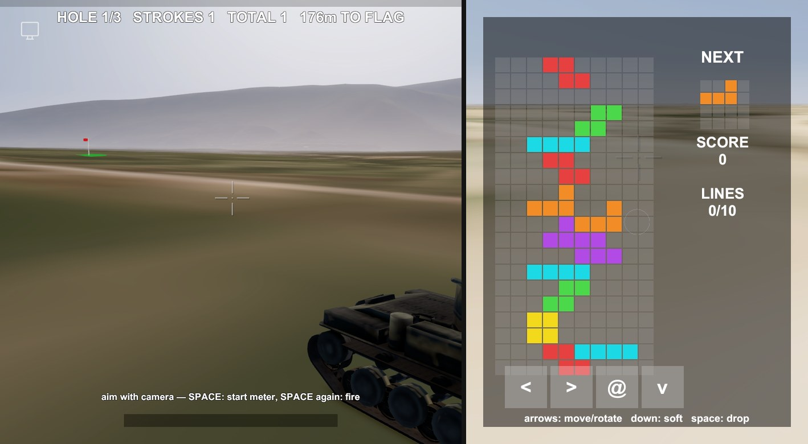

*Title text with outline, a progress bar, a grid of cells and on-screen buttons, all created from JavaScript.*

### Canvas

```js
const UE = CS.UnityEngine;
const $t = puer.$typeof;

const canvasGo = new UE.GameObject("MyHUD");
canvasGo.transform.SetParent(CS.Stage.Instance.transform, false);   // auto-cleanup
const canvas = canvasGo.AddComponent($t(UE.Canvas));
canvas.renderMode = UE.RenderMode.ScreenSpaceOverlay;
canvas.sortingOrder = 500;                                          // above the game HUD
canvasGo.AddComponent($t(UE.UI.CanvasScaler));
```

`sortingOrder = 500` puts your canvas above the game's own HUD. The default
CanvasScaler works in constant pixel size; positions and sizes below are in
pixels of the reference canvas.

### RectTransform basics

Every UI element needs a RectTransform. Anchors decide which screen edge or
corner the element sticks to; `anchoredPosition` is the offset from that
anchor; `pivot` is the point inside the element that sits on the anchor.

```js
function makeRect(name, parent, anchorX, anchorY, x, y, w, h) {
    const go = new UE.GameObject(name);
    go.transform.SetParent(parent.transform, false);
    const rt = go.AddComponent($t(UE.RectTransform));
    rt.anchorMin = new UE.Vector2(anchorX, anchorY);
    rt.anchorMax = new UE.Vector2(anchorX, anchorY);
    rt.pivot = new UE.Vector2(anchorX, anchorY);
    rt.anchoredPosition = new UE.Vector2(x, y);
    rt.sizeDelta = new UE.Vector2(w, h);
    return go;
}
```

| Anchor (x, y) | Sticks to | Typical offset |
|---------------|-----------|----------------|
| `0.5, 1` | top centre | `y = -60` (down from the top) |
| `0.5, 0.5` | screen centre | `0, 0` |
| `0.5, 0` | bottom centre | `y = 40` (up from the bottom) |
| `0, 1` | top left | `x = 20, y = -20` |
| `1, 1` | top right | `x = -20, y = -20` |

Anchoring to edges keeps the layout sane on phones and ultrawide monitors.

### Text

<!-- screenshot: ui-text.jpg -->


```js
const font = UE.Resources.GetBuiltinResource($t(UE.Font), "LegacyRuntime.ttf");

function makeText(name, parent, anchorX, anchorY, x, y, w, h, size, str) {
    const go = makeRect(name, parent, anchorX, anchorY, x, y, w, h);
    const text = go.AddComponent($t(UE.UI.Text));
    text.font = font;
    text.fontSize = size;
    text.fontStyle = UE.FontStyle.Bold;
    text.alignment = UE.TextAnchor.MiddleCenter;
    text.color = new UE.Color(1, 1, 1, 1);
    text.text = str;
    const outline = go.AddComponent($t(UE.UI.Outline));   // readable over any background
    outline.effectColor = new UE.Color(0, 0, 0, 0.9);
    return text;
}

const title = makeText("title", canvasGo, 0.5, 1, 0, -60, 1100, 130, 40, "AIR RACE  0/6");
title.text = "AIR RACE  1/6   TIME 12.3s";      // update any time
```

`LegacyRuntime.ttf` is the built-in font and is always available. Multi-line
text works with `\n`.

### Panels and images

<!-- screenshot: ui-panel-bar.jpg -->
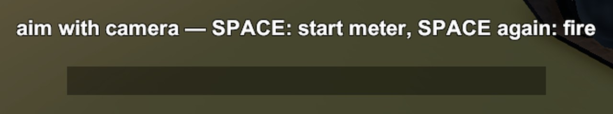

An `Image` without a sprite is a flat colored rectangle, which covers panels,
bars and cells:

```js
function makeImage(name, parent, anchorX, anchorY, x, y, w, h, color) {
    const go = makeRect(name, parent, anchorX, anchorY, x, y, w, h);
    const img = go.AddComponent($t(UE.UI.Image));
    img.color = color;
    return img;
}

// translucent panel in the centre
const panel = makeImage("panel", canvasGo, 0.5, 0.5, 0, 0, 540, 720, new UE.Color(0, 0, 0, 0.78));

// progress bar: background plus a fill whose width you change
const barBg = makeImage("powerBg", canvasGo, 0.5, 0, 0, 40, 500, 30, new UE.Color(0, 0, 0, 0.6));
const fill = makeImage("powerFill", barBg.gameObject, 0, 0.5, 2, 0, 0, 24, new UE.Color(1, 0.6, 0.1, 1));
const fillRt = fill.GetComponent($t(UE.RectTransform));
// each frame:
fillRt.sizeDelta = new UE.Vector2(power / 100 * 496, 24);
```

### Grids of cells

<!-- screenshot: ui-grid.jpg -->
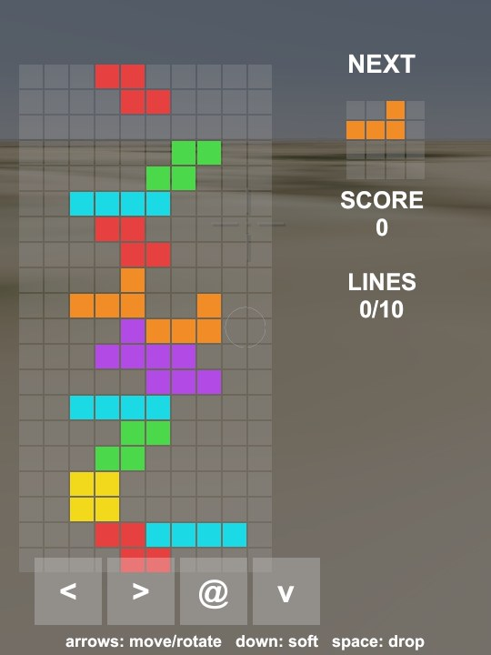

Tetris draws its board as a grid of small Images and only recolors cells that
changed since the last frame. Crossing the JS to C# boundary has a cost, so
diffing pays off for anything with many elements:

```js
const cells = [];
for (let y = 0; y < ROWS; y++) {
    const row = [];
    for (let x = 0; x < COLS; x++) {
        row.push(makeImage("c" + x + "_" + y, panel.gameObject, 0.5, 0.5,
            LEFT + x * CELL + CELL / 2, TOP - y * CELL - CELL / 2, CELL - 2, CELL - 2, EMPTY));
    }
    cells.push(row);
}
const last = new Array(ROWS * COLS).fill(-1);
function repaint(board) {
    for (let y = 0; y < ROWS; y++) for (let x = 0; x < COLS; x++) {
        const v = board[y][x];
        const i = y * COLS + x;
        if (last[i] !== v) { last[i] = v; cells[y][x].color = colors[v]; }
    }
}
```

### Buttons

<!-- screenshot: ui-buttons.jpg -->
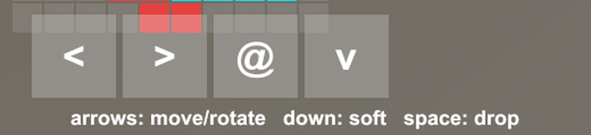

A Button on an Image, with a Text child for the label. This is how mini-games
get touch controls on mobile:

```js
function makeButton(label, parent, x, y, cb) {
    const img = makeImage("btn_" + label, parent, 0.5, 0.5, x, y, 74, 74, new UE.Color(1, 1, 1, 0.14));
    const btn = img.gameObject.AddComponent($t(UE.UI.Button));
    btn.onClick.AddListener(cb);
    makeText("lbl", img.gameObject, 0.5, 0.5, 0, 0, 74, 74, 34, label);
    return btn;
}
makeButton("<", panel.gameObject, -195, -290, function () { move(-1); });
makeButton(">", panel.gameObject, -115, -290, function () { move(1); });
```

The game's own EventSystem handles clicks and touches; you do not need to
create one. A plain JS function is accepted by `AddListener`.

### Showing and hiding

`go.SetActive(false)` hides an element and its children. Toggling
`text.text = ""` is fine for labels. For a "big centre message" keep one Text
and set it to `""` when idle, as Tetris and Flappy Jet do.

### What is not covered

TextMeshPro, sprites from image files and layout groups all work through the
same `CS.*` access, but there is no way to ship image assets with a mission
script, so the examples stick to colored rectangles and the built-in font.


---

## Cutscenes: CinematicManager

`CS.CinematicManager.Instance` runs in-game cutscenes: it blocks player input,
hides the gameplay UI and HUD, slides in letterbox bars, takes over the
camera, and provides subtitles and audio. The first access creates it.

<!-- screenshot: cinematic-letterbox.jpg -->
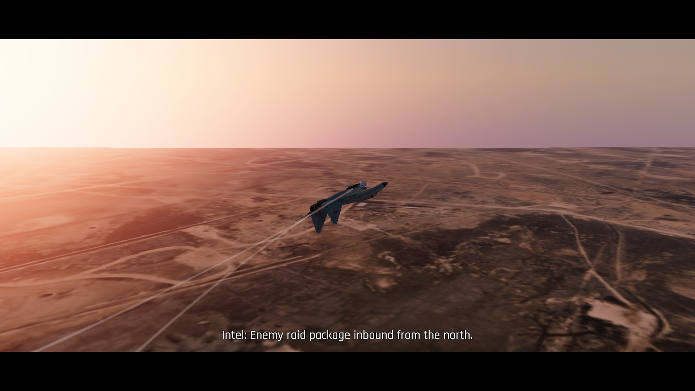

*A cutscene shot: letterbox bars, subtitle, custom camera.*

| Call | Description |
|------|-------------|
| `Begin()` | Start the cutscene, blending from the current camera pose. |
| `End()` | Stop it. The camera blends back to gameplay; input and UI return. |
| `SetCamera(px, py, pz, lx, ly, lz)` | Cut to a camera at `p` looking at `l`. |
| `MoveCamera(px, py, pz, lx, ly, lz, seconds)` | Glide from the current pose to the new one over `seconds` (smooth-stepped). |
| `FollowTransform(transform, ox, oy, oz)` | Track a transform: the camera sits at the transform's position plus the world offset and looks at it. |
| `SetFov(fov)` | Lens field of view in degrees. |
| `ShowSubtitle(text, seconds)` | Show a subtitle. `seconds <= 0` keeps it until `HideSubtitle()`. |
| `HideSubtitle()` | |
| `PlayBGM(clip, volume, fadeSeconds)` / `StopBGM(fadeSeconds)` | Cutscene music on the music mixer. |
| `PlaySound(clip, volume)` | One-shot sound effect. |
| `CS.CinematicManager.IsPlaying` | Static: `true` while a cutscene runs. |

Everything inside runs on unscaled time, so a cutscene can freeze the world
with `CS.UnityEngine.Time.timeScale = 0` and still animate.

### Driving a timeline

The manager gives you shots; sequencing is your script's job. The usual
pattern is a step list advanced from `JsEventRelay.onUpdate`:

```js
function runIntroCinematic() {
    const UE = CS.UnityEngine;
    const $t = puer.$typeof;
    const cine = CS.CinematicManager.Instance;
    const player = CS.Player.instance.GetUnit();
    const lead = CS.Stage.Instance.airUnits.get_Item(0);

    const go = new UE.GameObject("IntroTimeline");
    go.transform.SetParent(CS.Stage.Instance.transform, false);
    const relay = go.AddComponent($t(CS.JsEventRelay));

    let t = 0;
    let step = 0;
    cine.Begin();
    cine.FollowTransform(lead.transform, -40, 12, -80);
    cine.ShowSubtitle("Raid inbound. Four contacts, low and fast.", 4);

    relay.onUpdate = function (dt) {
        t += UE.Time.unscaledDeltaTime;
        if (step === 0 && t > 4) {
            step = 1;
            const p = player.transform.position;
            cine.MoveCamera(p.x + 60, p.y + 25, p.z - 60, p.x, p.y + 3, p.z, 3);
            cine.ShowSubtitle("Guns hot. Good luck.", 3);
        }
        if (step === 1 && t > 7.5) {
            step = 2;
            cine.End();
            relay.onUpdate = null;
        }
    };
}
```

The complete version is the [Cinematic intro](#cinematic-intro)
example.

> [!NOTE]
> Cutscenes are not recorded in replays. The replay plays back unit
> state only.


---

## Maps and spawn points

Pass the map ID to `mission.loadMap`: `Bakhmut`, `Gaza`, `Island1`, `Kuwait`,
`Mariupol`, `Meadow`, `Mostar`, `OpenSea`, `OrlovackoMaglic`, `Seoul`, `Syria`.
`OpenSea` is water only (no ground player start); `Island1` and `OpenSea` have
naval spawn points. `"random"` picks one at round start but cannot be opened
in the Mission Editor, which needs a concrete map to display.

### Spawn points

Each map has authored transforms that the `mission.get*` queries return:

| Query | Meaning |
|-------|---------|
| Player start positions | One per player type: ground, aircraft, helicopter, ship, infantry. Override with `setPlayerStartPosition`. |
| Ground spawn points | A set of positions around the base for ground allies and enemies. `getGroundSpawnPointCount()` tells you how many. |
| Air spawn point | Where enemy aircraft enter, typically several kilometres from the base at 450 m or more, facing the base. |
| Heli spawn point | A closer, lower entry point for helicopters. Derived from the air point when the map has none. |
| Naval spawn points | Positions on the water. Zero on maps without naval starts. |

The built-in modes stagger enemies along the air spawn heading (`z + i * 1000`
in map-local terms) so they arrive one after another, and clamp altitude with
`Math.max(sp.y, mission.getTerrainHeight(x, z) + 200)` so nothing spawns
inside a mountain.

### Placing things safely

- **Ground units**: `y = mission.getTerrainHeight(x, z)`. Also compare with
  `getSurfaceHeight(x, z)`: if the surface is higher than the terrain there
  is a building at that spot.
- **Ships**: `y = mission.getWaterHeight()`, over water.
- **Aircraft**: at least 150 to 250 m above `getTerrainHeight`; the AI treats
  the spawn altitude as its patrol altitude.
- **Player relative**: `mission.getPlayerPosition()` and `getPlayerRotY()`
  let you build the scene around wherever the player actually is.

### Directions

`rotY` is degrees around the vertical axis, `0` toward +Z, `90` toward +X. To
face a unit at `(x, z)` toward a point `(tx, tz)`:

```js
const rotY = Math.atan2(tx - x, tz - z) * 180 / Math.PI;
```

To spawn something `dist` metres ahead of a heading `rotY`:

```js
const rad = rotY * Math.PI / 180;
const x = origin.x + Math.sin(rad) * dist;
const z = origin.z + Math.cos(rad) * dist;
```


---

## Time and weather

### Time of day

`mission.setTime(hours, minutes)` uses a 24-hour clock. Dawn and dusk change
the visuals a lot; the built-in modes pick from a weighted pool that favours
daytime:

```js
const timePool = [
    { time: [5, 0],   weight: 2 },
    { time: [6, 0],   weight: 2 },
    { time: [9, 0],   weight: 15 },
    { time: [13, 0],  weight: 15 },
    { time: [16, 0],  weight: 15 },
    { time: [18, 0],  weight: 2 },
    { time: [19, 0],  weight: 2 },
    { time: [21, 0],  weight: 2 },
    { time: [0, 0],   weight: 1 },
];
const t = weightedPick(timePool);
mission.setTime(t.time[0], t.time[1]);
```

`timePool` and `weightedPick` come from [Common.js](#commonjs-helpers)
and are always available.

### Weather presets

`mission.setWeather(name)` takes one of these names exactly: `Clear Sky`,
`Cloudy 0`, `Cloudy 1`, `Cloudy 2`, `Cloudy 3`, `Foggy`, `Rain`, `Storm`,
`Snow`.

The built-in `weatherPool` favours the cloudy presets:

```js
const w = weightedPick(weatherPool);
mission.setWeather(w.name);
```

An unknown name is ignored. Time and weather set in `Init` are applied when
the round starts; calling them from `SpawnUnits` during gameplay changes them
on the spot, which is how a mission can turn a clear day into a storm halfway
through.


---

## Objects and spawners

`mission.spawnObject(objectId, x, y, z, rotY = 0, jsonParams = "")` places
non-unit objects. Two families exist.

### Buildings

Static buildings for cover and scenery. `y` should be
`mission.getTerrainHeight(x, z)`.

| Object IDs |
|------------|
| `building_4`, `building_9`, `building_12`, `building_17`, `building_22`, `building_51`, `building_54`, `building_57`, `building_59`, `building_62`, `building_63`, `building_65` |
| `skyscraper_13`, `skyscraper_19`, `skyscraper_28`, `skyscraper_43`, `skyscraper_44`, `skyscraper_46` |

```js
mission.spawnObject("building_51", 120, mission.getTerrainHeight(120, 80), 80, 90);
```

The Mission Editor's object browser shows what each one looks like; placing
one there and saving gives you the exact `spawnObject` line.

### Missile spawners

Two objects turn a spot into a missile-defence exercise. Both are configured
through a JSON string in `jsonParams`; the presence of `missileDirection`
selects the spawner family and `totalWaves` selects the wave variant.

#### Missile Defense Effect

Pairs of an incoming missile and a counter-missile launched from the object's
position. The incoming missiles come from `missileDistance` metres away in
the `missileDirection` heading at `missileHeight` metres.

```js
mission.spawnObject("Missile Defense Effect", 75, 0, 75, 0,
    '{"missileDirection":180,"missileDistance":1500,"missileHeight":400,' +
    '"spawnRadius":10,"spawnCount":5,"spawnInterval":3,"pairPerSpawn":3}');
```

| Field | Meaning |
|-------|---------|
| `missileDirection` | Heading (degrees) from the object to where missiles come from |
| `missileDistance` | Metres to the missile origin |
| `missileHeight` | Altitude offset of the missile origin |
| `spawnRadius` | Scatter radius around the origin |
| `spawnCount` | How many times to spawn |
| `spawnInterval` | Seconds between spawns |
| `pairPerSpawn` | Missile and counter-missile pairs per spawn |

#### Missile Wave Spawner

Waves of missiles aimed at a target circle around the object.

```js
mission.spawnObject("Missile Wave Spawner", 75, 0, 75, 0,
    '{"missileDirection":180,"missileDistance":2000,"missileHeight":600,' +
    '"spawnRadius":150,"targetRadius":60,"totalWaves":5,"minMissilesPerWave":2,"maxMissilesPerWave":5}');
```

| Field | Meaning |
|-------|---------|
| `missileDirection`, `missileDistance`, `missileHeight` | Origin of the missiles, as above |
| `spawnRadius` | Scatter radius at the origin |
| `targetRadius` | Radius of the target area around the object |
| `totalWaves` | Number of waves |
| `minMissilesPerWave`, `maxMissilesPerWave` | Wave size range |

Both spawners are placed as children of the stage and are cleaned up with it.


---

## Enums and constants

Most `mission.*` calls take these as plain numbers or strings. When you reach
into the engine, the same values are available as `CS.<Enum>.<Member>`.

### Team

| Value | Name | Convention |
|------:|------|------------|
| 0 | None | |
| 1 | Ground | Ground and naval side in the built-in modes; allies of a ground player |
| 2 | Air | Air side in the built-in modes; enemies of a ground player |
| 3 | Red | Default for `spawnUnit` |
| 4 | Blue | Default for `setPlayerType` |

Units fight anyone on a different team. The names are only conventions:
a mission can put jets on team 1 and tanks on team 2. The built-in
Ground vs Air modes use 1 for the player's side and 2 for the raid; the
Ace Combat example uses Blue (4) for the player and Red (3) for the enemy
flight.

### PlayerUnitType (`setPlayerType`)

| String | Value | Player sits in |
|--------|------:|----------------|
| `"Ground"` | 0 | The equipped ground unit (C-RAM, SAM, tank, ...) |
| `"Aircraft"` | 1 | The equipped jet |
| `"Helicopter"` | 2 | The equipped helicopter |
| `"Ship"` | 3 | The equipped ship |

`spawnUnit(..., isPlayer = true)` overrides this with a specific unit,
including a `soldier` or `fpv-drone-player`.

### WinConditionType (`setWinCondition`)

| String | Behaviour |
|--------|-----------|
| `"EliminateAllEnemies"` | Win when no enemy is alive (default) |
| `"SurviveForTime"` | Win when the timer from `survive(seconds)` elapses |
| `"Manual"` | Only `win()` / `fail()` end the round |

`KillTargets`, `ReachDestination`, `EscortTarget`, `CapturePoint` and
`Custom` exist in the engine but have no script-side setup; build those rules
with `Manual` and your own logic.

### LoadoutRole (`spawnUnit` loadout)

| Constant (Common.js) | Value |
|----------------------|------:|
| omitted / `0` | factory armament (player: auto-pick) |
| `LOADOUT.AIR_TO_AIR` | 1 |
| `LOADOUT.AIR_TO_GROUND` | 2 |
| `LOADOUT.MULTIROLE` | 3 |

### UnitType (`unit.GetUnitType()`)

`CS.UnitType.Ground` (1), `Navy` (2), `Air` (3), `MultiPlatformWeapon` (4),
`MissileProjectile` (5), `Heli` (6), `FPVDrone` (7), `Character` (8).

### CombatMode (`FlightAIFighter.combatMode`)

`CS.CombatMode.SmartCAS` (default ground attack), `AggressiveCAS`,
`Kamikaze`, `Dogfight`, `OrbitGunship`. Pair `Dogfight` with
`ai.state = CS.FighterState.DogfightEngage` and `Kamikaze` with
`ai.state = CS.FighterState.Kamikaze`.


---

## Quick reference

Everything you need to fill in `Init()` and `spawnUnit()`, on one screen.

| | Values |
|---|---|
| Maps (`loadMap`) | `Bakhmut`, `Gaza`, `Island1`, `Kuwait`, `Mariupol`, `Meadow`, `Mostar`, `OpenSea`, `OrlovackoMaglic`, `Seoul`, `Syria`. `OpenSea` has no ground start; `Island1` and `OpenSea` have naval starts. |
| Weather (`setWeather`) | `Clear Sky`, `Cloudy 0`, `Cloudy 1`, `Cloudy 2`, `Cloudy 3`, `Foggy`, `Rain`, `Storm`, `Snow` |
| Time (`setTime`) | `setTime(hours, minutes)`, 24-hour clock |
| Player type (`setPlayerType`) | `"Ground"`, `"Aircraft"`, `"Helicopter"`, `"Ship"` |
| Teams | `1` Ground, `2` Air, `3` Red, `4` Blue. Any two different numbers fight each other. |
| Win condition | `"EliminateAllEnemies"` (default), `"SurviveForTime"` via `survive(seconds)`, `"Manual"` then `win()` / `fail()` |
| Aircraft | `a-10`, `ac-130`, `b-2`, `f-4-phantom`, `f-14-tomcat`, `f-15`, `f-16`, `f-35a`, `fa-18-hornet`, `j-8`, `j-10ce`, `j-20-chengdu`, `mig-29`, `mirage-2000`, `su-25`, `su-27`, `su-30mkk`, `su-57` |
| Helicopters | `ah-1`, `ah-64`, `ka-52`, `mi-24`, `mi-28` |
| Drones | `shahed-136`, `fpv-drone`, `fpv-drone-player` |
| Air defence | `2k22-tunguska`, `9k332-tor`, `buk-m1`, `patriot`, `shilka`, `m42-duster`, `m163-vads`, `type-87`, `type-625`, `zu-23-2-landed` |
| Armour | `m1-abrams`, `t-72`, `t-90a`, `type-99`, `ztq-15` |
| Soft vehicles | `apc`, `apc-2`, `hemtt`, `humvee`, `kamaz`, `toyota-pickup` |
| Infantry | `soldier` with `soldierWeapon` = `ak`, `stinger`, `fpv-drone` (comma-separated for several) |
| Naval | `frigate`, `destroyer-class` |
| Loadout (`spawnUnit`) | `LOADOUT.AIR_TO_AIR`, `LOADOUT.AIR_TO_GROUND`, `LOADOUT.MULTIROLE` |
| Buildings (`spawnObject`) | `building_4`, `building_9`, `building_12`, `building_17`, `building_22`, `building_51`, `building_54`, `building_57`, `building_59`, `building_62`, `building_63`, `building_65`, `skyscraper_13`, `skyscraper_19`, `skyscraper_28`, `skyscraper_43`, `skyscraper_44`, `skyscraper_46` |

Spawn points, safe placement and the spawner objects are covered under [Maps and spawn points](#maps-and-spawn-points) and [Objects and spawners](#objects-and-spawners).


---

## How a mission runs

Understanding the two passes saves more debugging time than anything else on
this site.

### The file

```js
// MissionFormatVersion: 1          <- first line, machine-read
// Description: one line for the mission list
// Author: name                     <- added automatically when uploaded to mod.io

async function Init() { ... }      // declarations: map, time, weather, player, win condition
function SpawnUnits() { ... }      // units, objects, and your game logic
```

Before your code runs, the game prepends `Common.js` (helper functions such as
`randomRange`, `weightedPick`, and the `LOADOUT` constants; see
[Common.js](#commonjs-helpers)) and wraps everything in a function so that
top-level `const` and `let` declarations do not collide between rounds.

### Pass 1: parse

When a mission is opened in the editor, listed, or started, the game first
evaluates it with `mission.isGameplay === false`:

1. `Init()` is called. `loadMap`, `setTime`, `setWeather`, `setPlayerType`,
   `setWinCondition` and the start-position calls only **record** their values.
2. `SpawnUnits()` is called. `spawnUnit` and `spawnObject` only **collect**
   placement data (the editor uses it to show your units). Both return `null`.
3. As a safety net the loader also scans the source text for
   `mission.setPlayerType("...", n)` and `mission.setWinCondition("...")`, in
   case an `await` inside `Init` kept them from running synchronously. Write
   those two calls with literal arguments.

Nothing is spawned, no map is loaded by your script, and `win()` / `fail()`
do nothing in this pass.

### Map load

The recorded map name selects the map scene. The player's vehicle is spawned
at the map's start position for the declared player type, or at the position
you set with `setPlayerStartPosition`.

### Pass 2: gameplay

Once the map is up, the same script context is switched to
`mission.isGameplay === true`:

1. The recorded time and weather are applied.
2. `SpawnUnits()` is called again. Now `spawnUnit` really spawns and returns
   the unit; `spawnObject` really places objects; `win()`, `fail()`,
   `setSpectateOnDeath()` and the unit-control calls work.
3. Whatever you set up here, such as `JsEventRelay` callbacks, UI, extra
   cameras, keeps running until the round ends.

`Init()` is **not** called again in the gameplay pass. Everything it declared
was journaled in pass 1. If you need a call to run in gameplay, put it in
`SpawnUnits()`; `setTime` and `setWeather` apply immediately when called there.

```js
function SpawnUnits() {
    mission.spawnUnit("f-15", 0, 1200, 4000, 0, 3);   // fine in both passes
    if (!mission.isGameplay) return;                  // everything below: gameplay only
    setupMyGame();
}
```

> [!WARNING]
> **SpawnUnits runs twice**
>
> Any code that creates GameObjects, adds components, reads
> `CS.Player.instance`, or expects `spawnUnit` to return a unit must sit
> behind the `isGameplay` guard. In the parse pass those calls either throw
> or silently do the wrong thing.

### The player is already there

When `SpawnUnits()` runs in gameplay the player's unit has been spawned and
placed. `mission.getPlayerPosition()` and `mission.getPlayerRotY()` are valid,
`CS.Player.instance.GetUnit()` returns the unit, and `mission.movePlayer()`
can relocate it.

A `spawnUnit(..., isPlayer = true)` call replaces that unit: the player is
seated in whatever you spawned (an F-16, a soldier, a frigate). This is how
the infantry missions put you on foot without a dedicated player type.

### Round end and cleanup

The round ends when the win condition triggers (all enemies dead, the survive
timer elapsed, or your `mission.win()` / `mission.fail()` call). Everything
parented under `CS.Stage.Instance.transform` is destroyed when the stage
unloads, so parent every GameObject you create there and you never have to
clean up.

JavaScript state does not go away by itself. `globalThis` values you set
persist across rounds in the same session, which is useful for
between-round memory and a source of stale state if you forget it.

### Replays

The replay system records what happened to units and plays it back. It does
**not** re-run your script: HUDs, extra cameras, cutscenes and JS-driven
objects are absent from replays.

### Multiplayer note

In a multiplayer room the host runs the mission; other clients run the same
script in a presentation mode where `spawnUnit` returns `null` and
`win()` / `fail()` / `setSpectateOnDeath()` are ignored. Keep authoritative
logic on the host. The multiplayer-only calls (`setPlayerTeams`,
`setTeamStartPosition`, the `slot` argument of `setPlayerStartPosition`) are
listed in the [mission.* API](#multiplayer).


---

## Loading, saving, sharing

### Where missions live

| Source | How it gets there | Shown as |
|--------|-------------------|----------|
| Saved on the device | **Save** in the Mission Editor | **My Missions** |
| mod.io | Subscribed in the in-game hub | **Community** (with `by <creator>`) |
| Clipboard | **Paste from clipboard** in the editor's Load popup | loaded into the editor, save to keep |

Saved missions are stored per device. Copy the script out (Save popup, copy
button) if you want to move it to another machine or keep it in version
control.

<!-- screenshot: mission-list.jpg -->
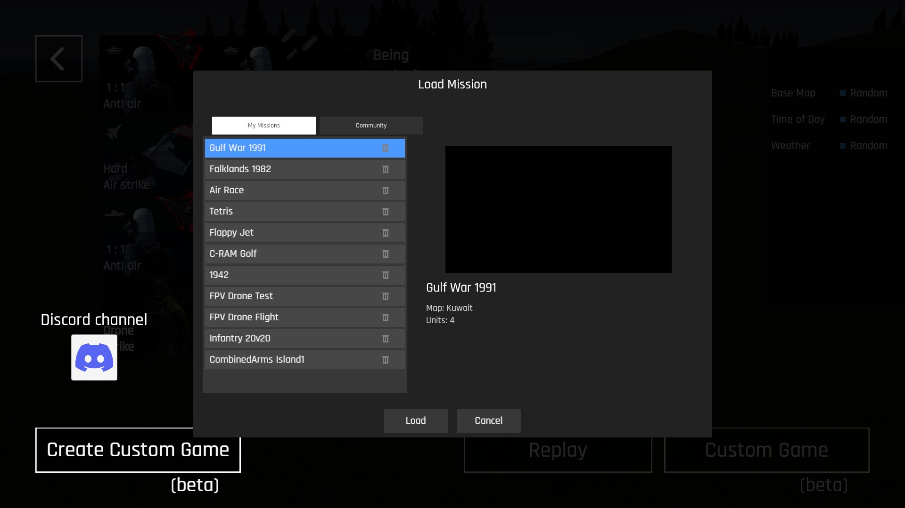

*The custom mission list from the mode select screen. The detail pane shows the Description header, the map and the unit count.*

### Round-tripping through the editor

The Mission Editor converts both ways:

- **Load** parses a script, shows every `spawnUnit` / `spawnObject` as a
  placed object, and applies the map, time and weather.
- **Save** regenerates the script from what is placed. The generated file has
  a long reference comment at the top and one `spawnUnit` line per object.

Hand-written logic (HUDs, waves, mini-games) survives a load, because the
editor runs `SpawnUnits()` in the parse pass and simply skips anything behind
`if (!mission.isGameplay) return;`. It does **not** survive a save from the
editor: saving rebuilds the script from placements only. Treat the editor as a
placement tool and a viewer; keep scripted missions in a text file and load
them by pasting.

### Publishing on mod.io

1. Sign in from the mod.io hub (email plus a one-time code).
2. In the editor, upload the current mission. The mission name becomes the mod
   name; the game stamps a `// Author:` line into the file.
3. The game's mod.io space is curated: an uploaded mission is listed once it
   has been approved.

Missions downloaded from mod.io appear under **Community** in both the mission
list and the editor's Load popup. Loading one into the editor lets you remix
it; saving stores your copy under My Missions.

<!-- screenshot: modio-hub.jpg -->
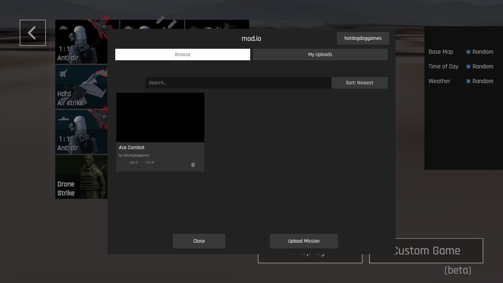

*The in-game mod.io hub.*

### Format version

`// MissionFormatVersion: 1` on the first line is how the game decides whether
it can run a script. A mission with a higher number than the game understands
is shown dimmed with "(requires game update)" instead of being hidden, so
players know an update will unlock it. Always keep the line; the current value
is `1`.

### The Description header

`// Description: ...` is a single line. It is shown in the mission list detail
pane for local saves. For mod.io missions the mod summary is used instead. The
detail pane also shows the map (parsed from `loadMap`) and the number of
`spawnUnit` calls in the file.


---

## Pitfalls and FAQ

### Where do my `console.log` lines go?

To the game's log file. On macOS that is
`~/Library/Logs/Hot dog dog games/C-RAM CIWS Simulator/Player.log`; on Windows
`%USERPROFILE%\AppData\LocalLow\Hot dog dog games\C-RAM CIWS Simulator\Player.log`.
Prefix your messages (`console.log("[MyMission] ...")`) so they are easy to
filter. A script error while loading shows an alert in the editor; an error
during gameplay goes to the log and the rest of `SpawnUnits` does not run, so
wrap experimental code in `try { } catch (e) { console.log("" + e); }` while
developing.

### `SpawnUnits` ran but nothing happened

The Mission Editor (and the mission list) run `SpawnUnits()` in the parse
pass, where `spawnUnit` returns `null`, `CS.Player.instance` may not hold a
unit and nothing you create is wanted. Gate live logic:

```js
function SpawnUnits() {
    mission.spawnUnit(...);
    if (!mission.isGameplay) return;
    setupGame();
}
```

### The editor says "No map info found"

`loadMap` must be called with a literal map name from
[Maps](#maps-and-spawn-points). `"random"` and computed names cannot be shown
in the editor.

### My player type or win condition is ignored

Write `mission.setPlayerType("Aircraft", 4)` and
`mission.setWinCondition("Manual")` with literal arguments. The loader's
text scan is the fallback when an `await` inside `Init` delays the real call.

### The round ends immediately

The default win condition is *eliminate all enemies*. A mission with no
enemies (a race, a mini-game) wins the instant it starts. Use
`mission.manual()` or `mission.setWinCondition("Manual")` and end the round
yourself.

### `Init` code did not run in gameplay

`Init()` runs once, in the parse pass. Its settings are journaled and applied
at round start. Put gameplay-time calls in `SpawnUnits()`.

### `setPlayerStartPosition` put me under the terrain

`getTerrainHeight` inside `Init()` samples whatever map is loaded at parse
time, which is the previous round's map, not the one `loadMap` names. Pass a
literal `y` to `setPlayerStartPosition` (read it once from the editor or from
`getTerrainHeight` during a gameplay pass). Inside `SpawnUnits()` the map is
up and `getTerrainHeight` is correct.

### `OnUnitDead` is never called

There is no death callback for mission scripts. Poll `unit.isAlive` from an
`onUpdate` (see [Recipes](#detecting-a-death)).

### `setTimeout is not defined`

Timers are not provided. Use `JsEventRelay.onUpdate` with your own
accumulators.

### The aircraft died right after a teleport

You wrote `transform.position`. Teleport through `unit.rigidbody.position`,
or use `mission.movePlayer`.

### A primitive blocks the player

`CreatePrimitive` adds a collider. Destroy it for decorations, or set
`isTrigger = true` for volumes.

### Cannot index a C# list

`list[i]` returns `undefined`. Use `list.Count` and `list.get_Item(i)`;
arrays use `.Length` and `get_Item(i)`.

### HP multiplier does nothing on the player

The player's unit resets to its own maximum HP at start. `hpMultiplier` is
for AI units.

### Jets ignore my aircraft

AI aircraft default to ground attack. Switch them to `Dogfight`
([recipe](#making-enemy-jets-dogfight)).

### Things from the last round are still there

GameObjects parented under `CS.Stage.Instance.transform` are destroyed at
round end; objects parented elsewhere survive. JavaScript globals also
survive; reset them at the top of your setup function.

### My HUD is hidden behind the game's HUD

Set `canvas.sortingOrder = 500` or higher.

### Replays do not show my mini-game

Replays play back recorded unit state and do not re-run scripts. HUDs,
cutscenes and JS-made objects are not part of a replay.

### The first round of a session behaved strangely

Very rarely the first custom-mission round after launching the game spawns
the player unit in a bad state. Restart the round; if it recurs, please report
it with your script.

### Can a mission load images, sounds or models?

Not from files. Scripts can only use what the game ships: built-in
primitives, the built-in font, existing units and the map. Audio clips can be
taken from units that are already loaded.

### Is the script sandboxed?

No. `CS.*` is the whole engine. Only load missions from people you trust, the
same way you would treat any mod.


---

## About this repository

This is documentation only; it is not the game. Everything lives on this one
page so it can be read and searched in place (use your browser's find, or
the table of contents above). Example scripts are also available as raw files
under [`examples/src/`](examples/src/), copied from the game's own test
missions; `sync_examples.py` refreshes both the files and the inlined
listings above. [`SHOTLIST.md`](SHOTLIST.md) records how each screenshot
was captured and which ones are stand-ins.

Found a mistake or an API that behaves differently? Open an issue or a pull
request.
